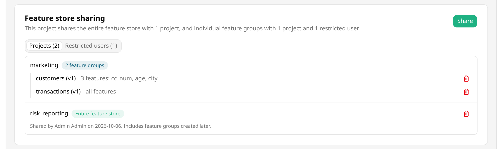
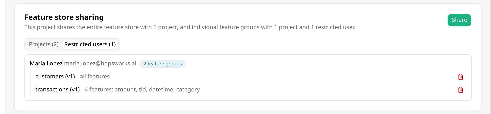
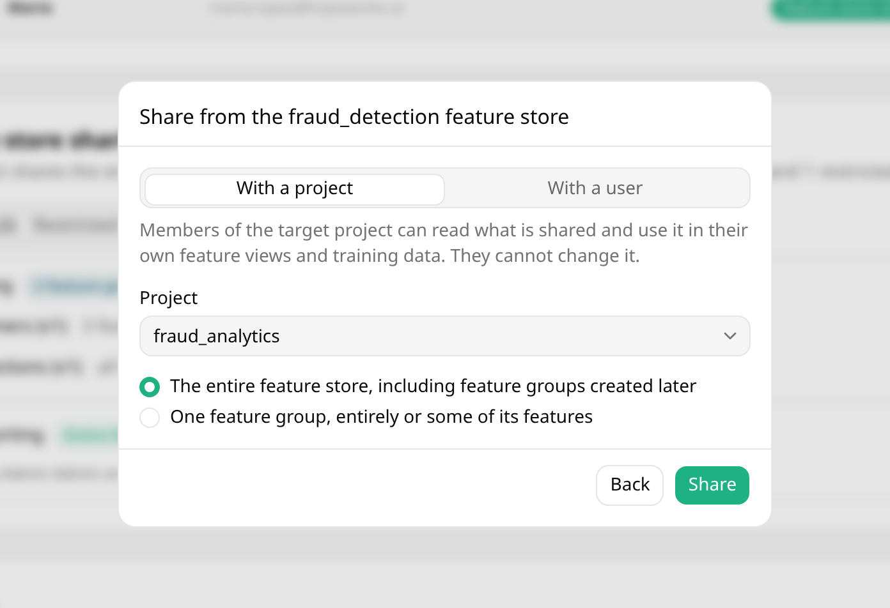
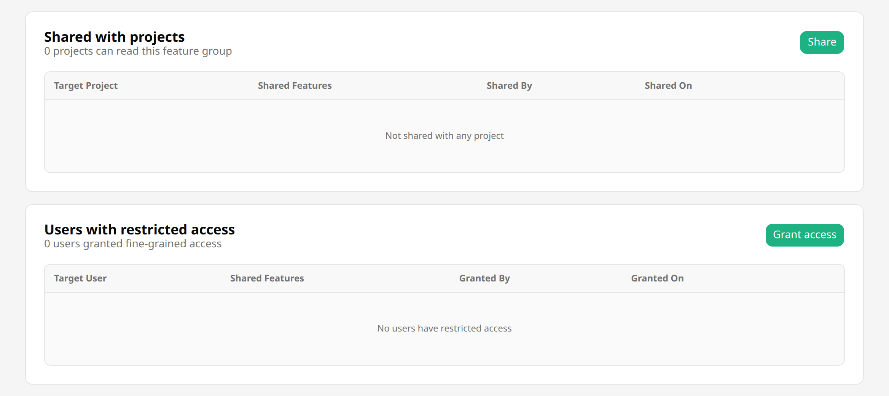
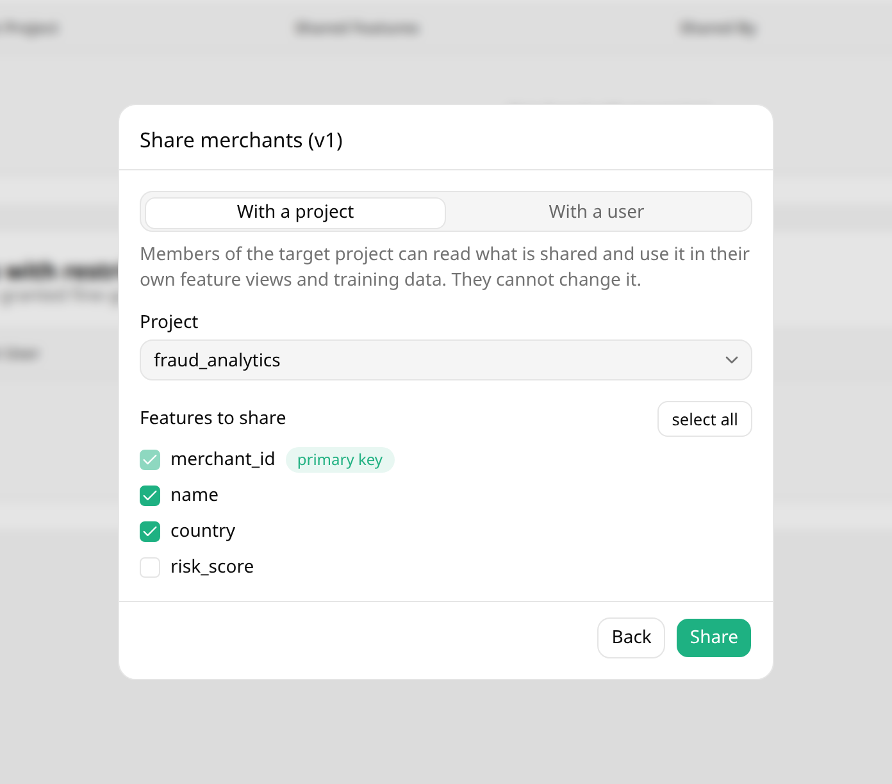
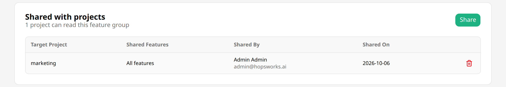
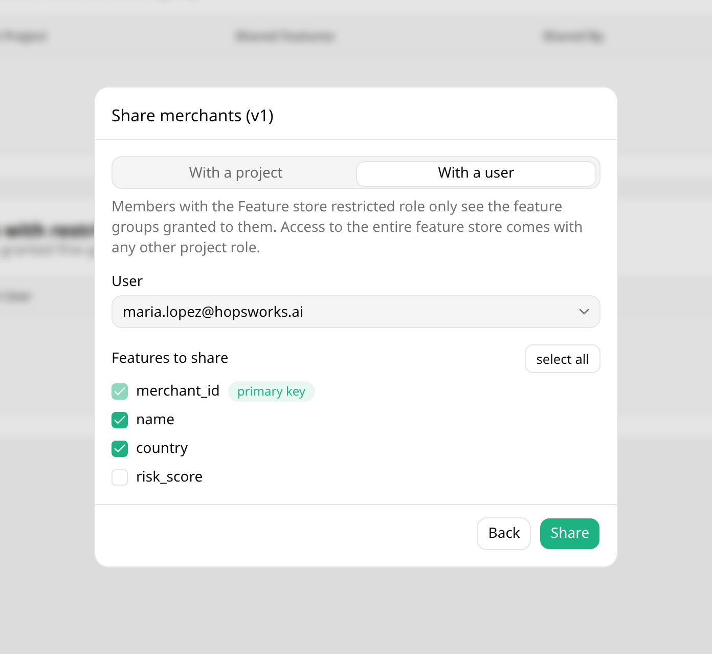
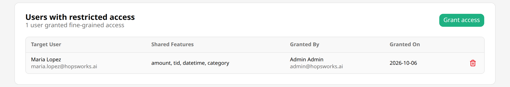
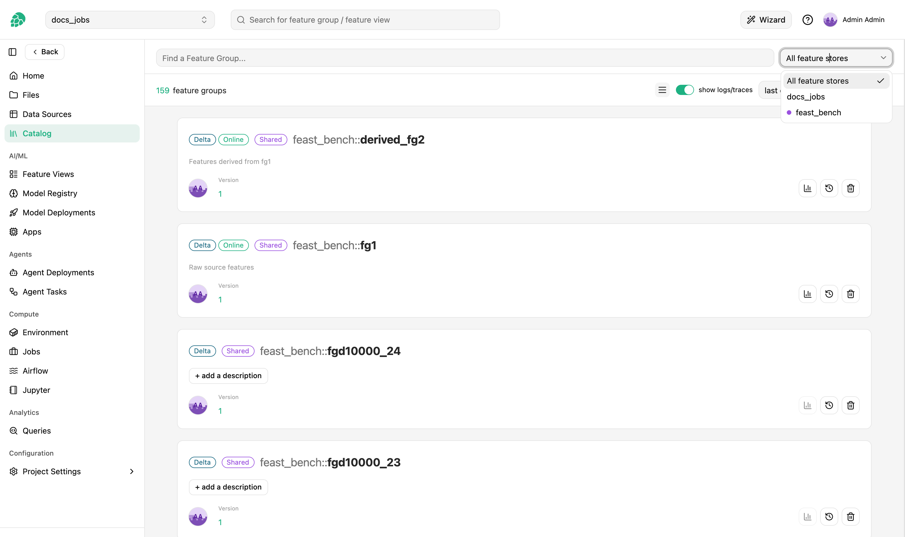

# Sharing

## Introduction

Hopsworks allows artifacts (such as feature groups and feature views) to be shared between projects.
There are two main use cases for sharing features:

- **Cross-team collaboration:** When multiple teams work on the same Hopsworks deployment, each team typically has its own set of projects.
  If team A wants to leverage features built by team B, team B can share their feature groups with team A's project.

- **Environment isolation:** By creating separate projects for different stages of the development lifecycle (development, testing, and production), you can ensure that changes in the development project don't impact production features.
  At the same time, you can share production features to use them when developing new models or additional features.

## Seeing what is shared

Open the project that owns the feature store.
In `Project Settings`, the `Feature store sharing` section lists everything the feature store shares, and a sentence at the top summarizes it.
Only data owners can share, unshare and revoke, so only they get the `Share` button and the trash icons.
Observers see the same lists read-only, and other members see a note instead, because only data owners and observers can read a project's sharing.

The `Projects` tab lists every project the feature store is shared with.
A project marked `Entire feature store` can read every feature group, including feature groups created after the share.
Any other project lists the feature groups shared with it, with either `all features` or the features it can read.

<p align="center">
  <figure>
    
    <figcaption>Feature store sharing section in Project Settings</figcaption>
  </figure>
</p>

The `Restricted users` tab lists every member with the [Feature store restricted][feature-store-restricted] role who has been granted access, with the feature groups and features each of them can read.

<p align="center">
  <figure>
    
    <figcaption>Restricted users granted access to feature groups</figcaption>
  </figure>
</p>

Each feature group name links to that feature group's `Sharing` tab.

## Sharing the entire feature store

You can share your project's entire feature store with another project, granting read-only access to all feature groups.

### Step 1: Open the share dialog

In `Project Settings`, click `Share` in the `Feature store sharing` section.

### Step 2: Share the feature store

In `With a project`, select the target project, keep `The entire feature store, including feature groups created later` selected, and click `Share`.

<p align="center">
  <figure>
    
    <figcaption>Share the entire feature store</figcaption>
  </figure>
</p>

!!! note "Read-only access"
    Shared feature stores are always read-only.
    Members of the target project cannot modify any data in the shared feature store.

A project holds either the entire feature store or a set of individual feature groups, not both, because the entire feature store already includes every feature group.
A project that already has feature groups shared with it is listed in the dialog but cannot be selected; unshare those feature groups first.

After clicking `Share`, the project appears in the `Projects` tab marked `Entire feature store`.

### Using the API to share the feature store

```python
import hopsworks


project = hopsworks.login()
fs = project.get_feature_store()

# Share the whole feature store
fs.share("target_project")

# List projects it's shared with
for share in fs.shared_with():
    print(share["sharedWithProject"]["name"], share["sharedOn"])

# Revoke a share
fs.unshare("target_project")
```

## Sharing a feature group with selected features

For more granular control, you can share individual feature groups and select which features to expose.
This allows you to share specific data without granting access to your entire feature store.

### Step 1: Navigate to the feature group

In the `Feature Groups` section, select the feature group you want to share and click the `Sharing` tab.

<p align="center">
  <figure>
    
    <figcaption>Feature group sharing tab</figcaption>
  </figure>
</p>

You can also start from `Project Settings`: click `Share` in the `Feature store sharing` section, select `One feature group, entirely or some of its features`, and pick the feature group.

### Step 2: Share the feature group

You can share with either a project or an individual user with the [Feature store restricted][feature-store-restricted] role.
Under `Features to share`, all features are selected; clear the ones the target should not read.
The primary key and the event time are always shared, because the target needs them to join the feature group and to make point-in-time correct reads.

=== "Share with a project"

    Click `Share`, select the target project in `With a project`, choose the features, and click `Share`.

    <p align="center">
      <figure>
        
        <figcaption>Share a feature group with a project</figcaption>
      </figure>
    </p>

    The project appears under `Shared with projects` on the feature group's `Sharing` tab, and in the `Projects` tab of `Project Settings`.

    <p align="center">
      <figure>
        
        <figcaption>Projects the feature group is shared with</figcaption>
      </figure>
    </p>

=== "Share with a user"

    Click `Grant access`, select the user in `With a user`, choose the features, and click `Share`.
    The list offers the project members with the [Feature store restricted][feature-store-restricted] role.

    <p align="center">
      <figure>
        
        <figcaption>Grant a restricted user access to a feature group</figcaption>
      </figure>
    </p>

    The user appears under `Users with restricted access` on the feature group's `Sharing` tab, and in the `Restricted users` tab of `Project Settings`.

    <p align="center">
      <figure>
        
        <figcaption>Users with restricted access to the feature group</figcaption>
      </figure>
    </p>

### Using the API to share a feature group

=== "Share with a project"

    ```python
    fg = fs.get_feature_group("feature_group_name", version=1)

    # Share the whole feature group
    fg.share("target_project")

    # Or share only selected columns (primary key + event time are always included)
    fg.share("target_project", features=["amount", "country"])

    # List projects it's shared with
    for share in fg.shared_with():
        print(share["sharedWithProject"]["name"], share["sharedEntirely"])

    # Revoke a share
    fg.unshare("target_project")
    ```

=== "Share with a user"

    A [Feature store restricted][feature-store-restricted] member has no feature store access by default; access must be granted per feature group (or per feature), from within their own project.

    ```python
    fg = fs.get_feature_group("feature_group_name", version=1)

    # Grant access to the whole feature group
    fg.grant_restricted_access("restricted_user@example.com")

    # Or grant access to only selected columns
    fg.grant_restricted_access("restricted_user@example.com", features=["amount"])

    # List who has been granted access
    for grant in fg.get_restricted_access():
        print(grant["grantedToUser"], grant["grantedEntirely"])

    # Revoke access
    fg.revoke_restricted_access("restricted_user@example.com")
    ```

## Unsharing

In the `Feature store sharing` section of `Project Settings`, click the trash icon next to what you want to stop sharing:

- Next to a project marked `Entire feature store`, to unshare the entire feature store from that project.
- Next to a feature group in the `Projects` tab, to unshare that feature group from that project.
- Next to a feature group in the `Restricted users` tab, to revoke that user's access to it.

Feature views and training data built on the unshared data stop working for the project or user that loses access, so the dialog asks you to type `confirm` first.
The same trash icons are on a feature group's `Sharing` tab.

From the API, use `fs.unshare`, `fg.unshare` and `fg.revoke_restricted_access` as shown above.

## Using shared features

Once features have been shared with your project, you can access them through the UI or the API.

### Using the UI

Navigate to the project that has access to shared features.
In the `Feature Groups` section, use the dropdown in the upper right corner to select which feature store to view.

<p align="center">
  <figure>
    
    <figcaption>Selecting a shared feature store in the UI</figcaption>
  </figure>
</p>

### Using the API

To access features from a shared feature store programmatically, retrieve the handle for the shared feature store using the Hopsworks API.

#### Step 1: Get feature store handles

Use the `get_feature_store()` method with the name of the shared feature store:

```python
import hopsworks


project = hopsworks.login()

# Get your project's feature store
project_feature_store = project.get_feature_store()

# Get the shared feature store by name
shared_feature_store = project.get_feature_store(name="name_of_shared_feature_store")
```

#### Step 2: Fetch feature groups

```python
# Fetch a feature group from the shared feature store
shared_fg = shared_feature_store.get_feature_group(
    name="shared_fg_name", version=1
)

# Fetch a feature group from your project's feature store
fg = project_feature_store.get_or_create_feature_group(
    name="feature_group_name", version=1
)
```
