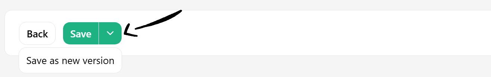
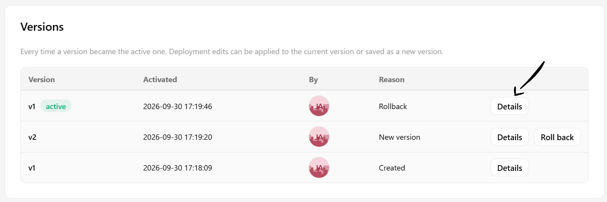
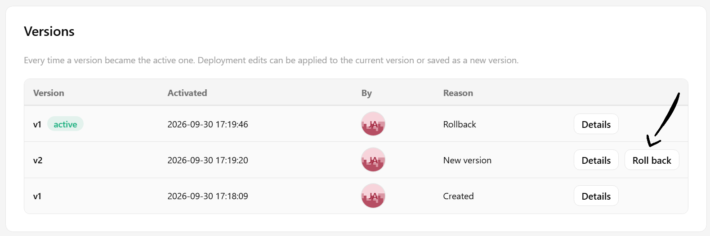

# How To Manage Deployment Versions { #deployment-versions }

## Introduction

In this guide, you will learn how a deployment keeps a numbered history of its configuration, and how to save, inspect and roll back versions.

Every deployment has one or more versions.
A new deployment starts at version 1, and exactly ==one version is active at a time==, the one the deployment runs.
This applies to model deployments and to [Python deployments][python-deployment], which run a script without a model.

When you save changes to a deployment, you choose how they are stored:

- **Save** edits the active version in place, and it keeps its number.
- **Save as new version** stores the configuration as a new version, numbered one above the highest the deployment ever had, and makes it active.

The previous versions are kept with their files, so a **rollback** reactivates an earlier version without copying anything.
Running instances restart only when the active configuration changes, so a save without changes neither restarts the deployment nor creates a version.
Two cases count as a change even when the form is unchanged: a script read from outside the version, from a HopsFS path or a git repository, and a Python environment whose libraries changed since the deployment started.

!!! tip "Restarting a deployment"
    To restart a deployment without saving, you can stop and start it.

Saving in place keeps the version number, so the `DEPLOYMENT_VERSION` environment variable and the `deployment_version` column of logged features stay the same across the change.
Use **Save as new version** when you need to tell the predictions of the old and new configuration apart.

## What a version holds

A version holds the configuration of the predictor and the transformer:

| Configuration | Details |
| ------------- | ------- |
| **Model** | The model and model version, for model deployments. |
| **Artifact files** | The predictor and transformer scripts, and the server configuration file, as described in [Artifact files of a version](#artifact-files-of-a-version). |
| **vLLM** | The vLLM settings for LLM deployments. |
| **Python environments** | The environments the predictor and the transformer run in. |
| **Resources and scaling** | Resources, scaling configuration and environment variables. |
| **Source and observability** | The git source, tracing and feature logging configuration. |

The **API protocol**, **request batching**, **inference logging**, **scheduling configuration** and **Knative mode** belong to the deployment rather than to a version.
They are edited in place whichever way you save, and a rollback does not restore them, because they apply to the endpoint and the infrastructure it runs on rather than to what it serves.

!!! info "Versions edited in place"
    A version that was edited in place with `Save` after it was created comes back as edited, when you roll back to it.
    Use `Save as new version` when you want to be able to return to the current configuration.

## Web UI

### Step 1: Save a new version

Open the deployment and go to its edit page.
After making your changes, open the menu next to the `Save` button at the bottom of the form and click on `Save as new version`.
Clicking on `Save` instead edits the active version in place.

<p align="center">
  <figure>
    
    <figcaption>Save as new version option in the Save menu</figcaption>
  </figure>
</p>

### Step 2: Inspect the versions

The `Versions` card on the deployment overview page lists every time a version became the active one, with when, by whom and why: creation, new version or rollback.
The version the deployment runs is marked as `active`.

Click on `Details` next to a version to see its configuration, including its model, scripts, Python environments, scaling and resources.
The scripts can be downloaded from there, and the model and the Python environments link to their pages.

<p align="center">
  <figure>
    
    <figcaption>Details button in the Versions card</figcaption>
  </figure>
</p>

### Step 3: Roll back

Click on `Roll back` next to an earlier version and confirm.
A running deployment restarts with the configuration of that version.
Rolling back requires the Data owner role in the project, and is disabled while the deployment is starting or stopping.
It stays available while a new version is updating, so a version that fails to come up can be rolled back right away.
The rollback then starts a new rollout with the configuration of the earlier version, and the instances that were serving keep serving until it is ready.
An edit saved in place cannot be undone with a rollback, because it changed the active version itself: stop the deployment or wait for it to fail, then save the previous configuration again.

<p align="center">
  <figure>
    
    <figcaption>Roll back button in the Versions card</figcaption>
  </figure>
</p>

## Code

### Step 1: Connect to Hopsworks

=== "Python"

    ```python
    import hopsworks


    project = hopsworks.login()

    # get Hopsworks Model Serving handle
    ms = project.get_model_serving()

    my_deployment = ms.get_deployment("mydeployment")
    ```

### Step 2: Save a new version

Change the configuration and call `.save()` with `new_version=True`.
Without it, the active version is edited in place.

=== "Python"

    ```python
    my_deployment.predictor.scaling_configuration.min_instances = 2
    my_deployment.predictor.scaling_configuration.max_instances = 2
    my_deployment.save(new_version=True)

    print(my_deployment.version)  # number of the active version
    ```

### Step 3: List the versions

=== "Python"

    ```python
    for version in my_deployment.get_versions():  # newest first
        print(version.version, version.active, version.created, version.created_by)
    ```

### Step 4: Roll back

=== "Python"

    ```python
    my_deployment.rollback(1)
    ```

!!! api "API reference"

    - <code class="doc-symbol doc-symbol-method"></code> [`ModelServing.get_deployment`][hsml.model_serving.ModelServing.get_deployment]
    - <code class="doc-symbol doc-symbol-class"></code> [`Deployment`][hsml.deployment.Deployment]
        - <code class="doc-symbol doc-symbol-method"></code> [`save`][hsml.deployment.Deployment.save]
        - <code class="doc-symbol doc-symbol-method"></code> [`get_versions`][hsml.deployment.Deployment.get_versions]
        - <code class="doc-symbol doc-symbol-method"></code> [`rollback`][hsml.deployment.Deployment.rollback]
    - <code class="doc-symbol doc-symbol-class"></code> [`DeploymentVersion`][hsml.deployment_version.DeploymentVersion]

    <a class="hops-api-cta" href="../../../../python-api/hopsworks/">Browse the full Python API :material-arrow-right:</a>

## Artifact files of a version

The artifact files of each version, such as the predictor and transformer scripts and the server configuration file, are stored under `/Deployments/<deployment-name>/<version>/`.
A script read from a HopsFS path or a git repository is stored in the version as that path or repository, not copied, so a rollback restores the configuration but not the code.

Inside a deployment, the active version number is available in the `DEPLOYMENT_VERSION` environment variable, and the local path to its artifact files in `ARTIFACT_FILES_PATH`.

!!! warning
    All files under `/Models` and `/Deployments` are managed by Hopsworks.
    Manual changes to these files cannot be reverted and can have an impact on existing model deployments.
