# Query Engine (Trino)

The Query Engine in Hopsworks is powered by Trino, a distributed SQL query engine that allows you to run interactive analytics on your data. Use it to explore feature groups, run ad-hoc queries, and analyze data across your project.

## Accessing the Query Engine

Open **Queries** under **Analytics** in your project's left sidebar.
The page carries four tabs: **SQL Runner**, **Cluster Overview**, **Catalogs** and **Queries**.

<figure>
  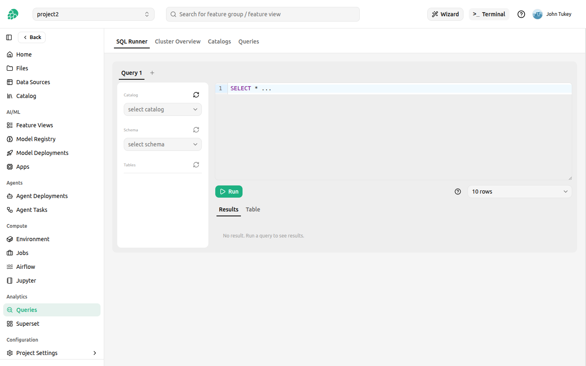
  <figcaption>The Query Engine, open on the SQL Runner tab</figcaption>
</figure>

## SQL Runner

The SQL runner is where you write and execute SQL queries against your data.

**To run a query:**

1. Pick a **Catalog** and a **Schema** in the **Explorer**.
   The tables in that schema are then listed below, and you can write the query against bare table names instead of qualifying every one.
2. Write the query in the editor, or click a table to start from `SELECT * FROM <table>`.
3. Choose a row limit, which is appended to the query as a `LIMIT`.
4. Click **Run query**, or press `Ctrl/Cmd + Enter`.

The results appear below the editor, with each column's type under its name.
The header reports the state of the run, how long it took, how many rows it processed and how many it returned.
The editor auto-completes catalogs, schemas, tables and columns with `Ctrl + Space`, and **Add query** opens a second tab so several queries can be kept side by side.

<figure>
  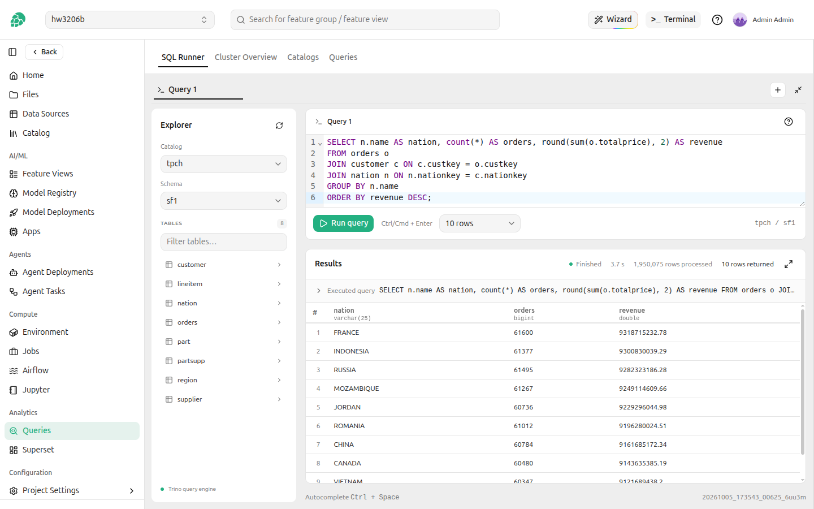
  <figcaption>SQL runner</figcaption>
</figure>

The expand icon in the results header opens the results in a full-size dialog, with the same run status, so a wide table can be read without scrolling sideways.

<figure>
  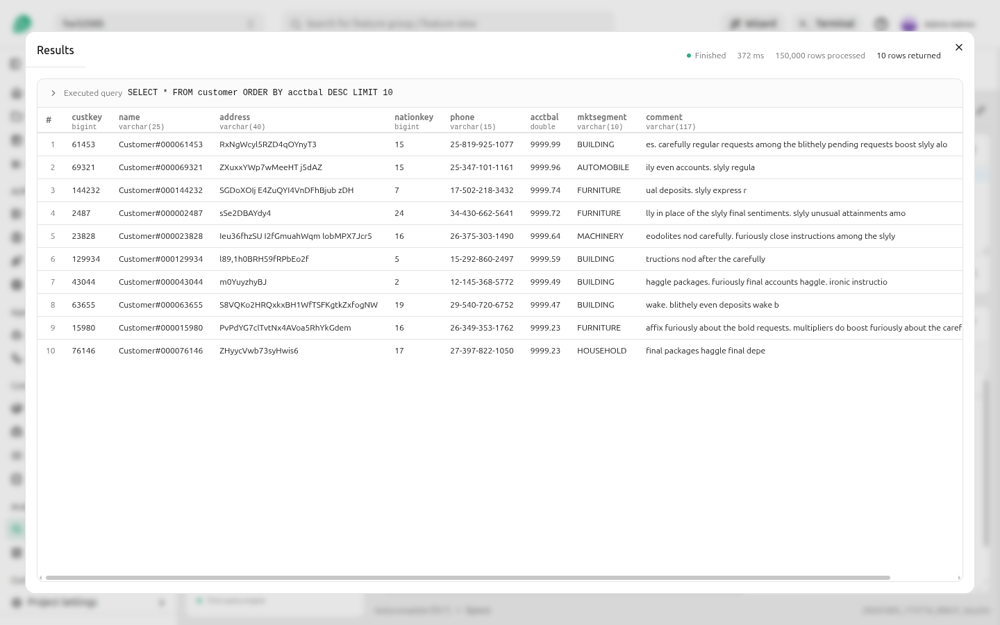
  <figcaption>Results in full</figcaption>
</figure>

### Statements

The SQL runner runs one statement at a time, and a trailing semicolon is removed before the statement is sent.
A statement that changes data or the catalog reports what it did instead of a table of results: `CREATE TABLE succeeded`, or for `INSERT`, `UPDATE`, `DELETE`, `MERGE` and `CREATE TABLE ... AS SELECT` the number of rows it wrote, such as `INSERT succeeded (2 rows)`.

<figure>
  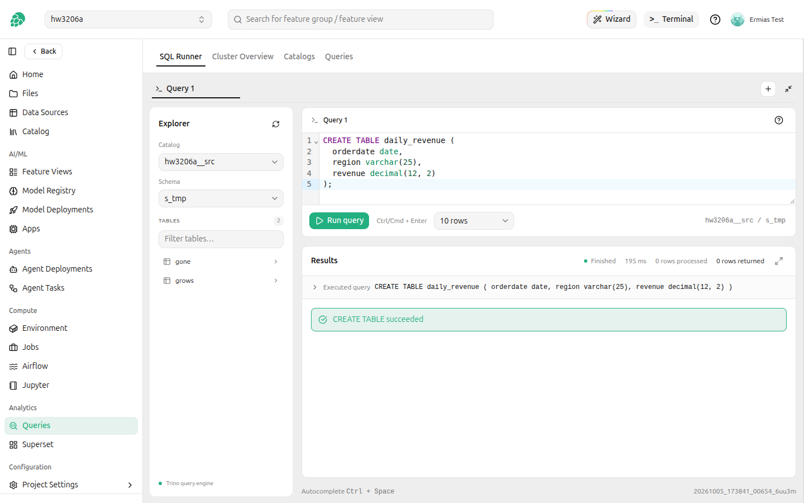
  <figcaption>A statement that returns no rows</figcaption>
</figure>

Every statement runs in a session of its own.
Statements that only change the session (`USE`, `SET SESSION`, `RESET SESSION`, `SET ROLE`, `SET PATH`, `SET TIME ZONE`, `PREPARE`, `DEALLOCATE`, and the transaction statements) therefore succeed and change nothing for the next statement, and the SQL runner says so.
Choose the catalog and schema in the **Explorer** instead of with `USE`.

<figure>
  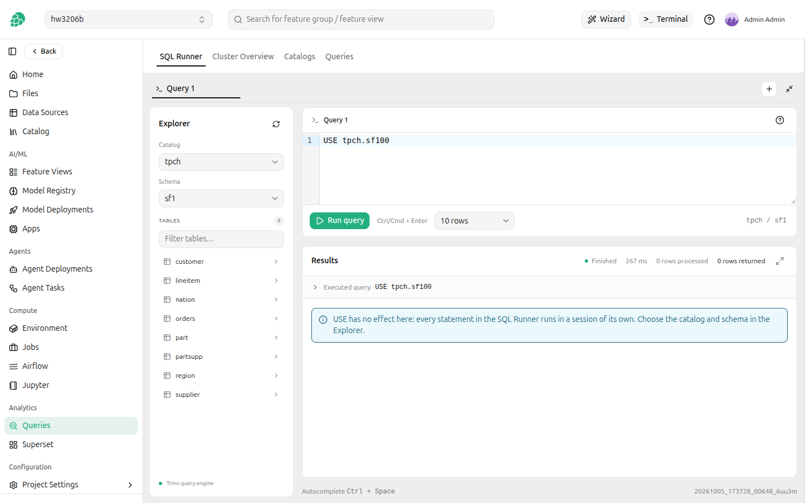
  <figcaption>A session statement</figcaption>
</figure>

### Records

End a statement with `\G` instead of `;` to see each row as a record, one column and value per line, the way the Trino CLI prints it.
`\G` is not SQL: like a trailing semicolon, it is removed before the statement is sent.
Records suit wide rows and long values; the records view shows the first 200 rows, so end the statement with `;` to see more in the grid.

<figure>
  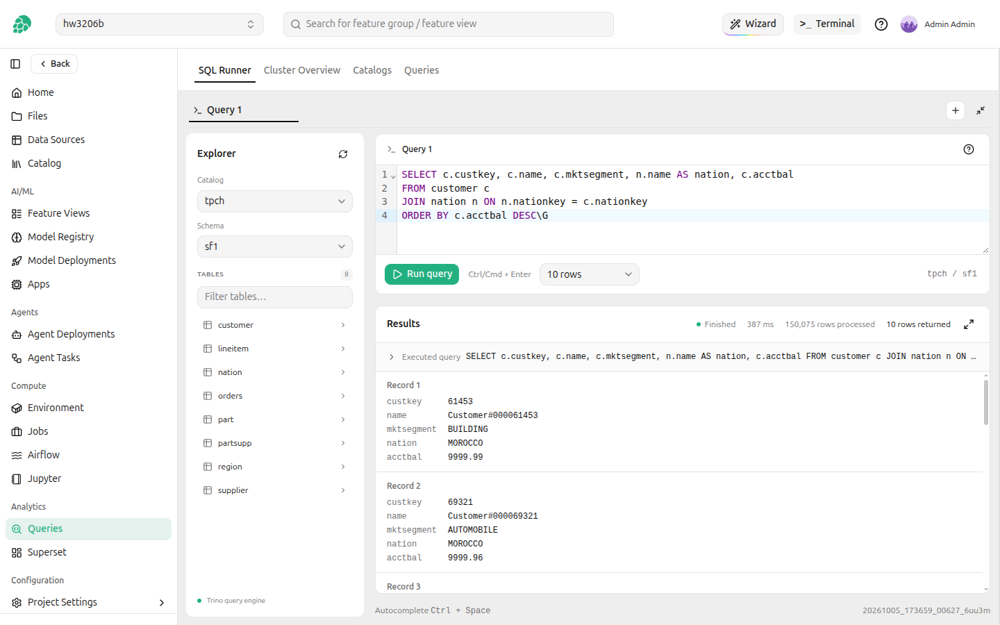
  <figcaption>Results as records</figcaption>
</figure>

### Query plans

`EXPLAIN` shows the plan Trino would run for a statement.
A plain `EXPLAIN` shows the plan as text, the way Trino prints it.
`EXPLAIN (FORMAT GRAPHVIZ)` opens on a **Graph** view that draws the operators and the data flowing between them, grouped by fragment, which can be zoomed and moved around; **Text** beside it shows the Graphviz source.
`EXPLAIN (FORMAT JSON)` and `EXPLAIN (TYPE IO)` are shown as indented JSON.

<figure>
  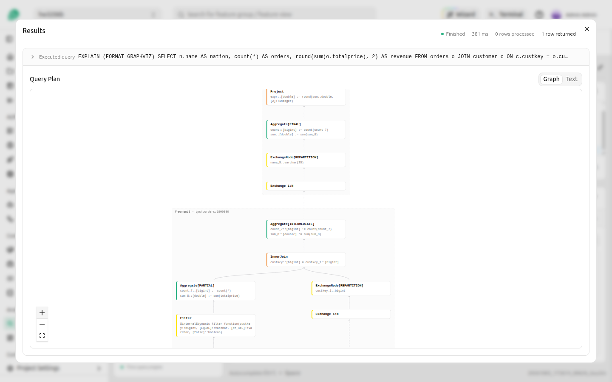
  <figcaption>A query plan as a graph</figcaption>
</figure>

### SQL Statement Syntax Help

The help icon in the editor opens the syntax of every SQL statement Trino supports, from `ALTER` to `VALUES`, including the clauses of `SELECT` such as time travel with `FOR TIMESTAMP | VERSION AS OF`, `TABLESAMPLE`, `UNNEST` and `JSON_TABLE`.
It also lists the keyboard shortcuts and the statements that have no effect in the SQL runner.

<figure>
  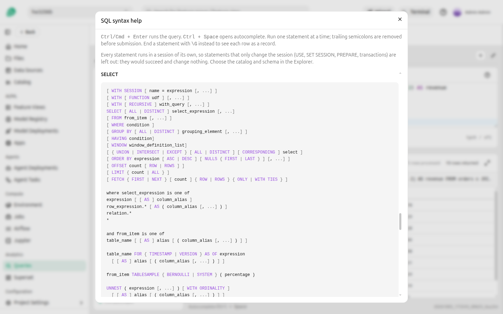
  <figcaption>SQL statement syntax</figcaption>
</figure>

## Cluster Overview

The cluster overview reports the query engine's version, environment and uptime, then a tile per metric, each with a sparkline of its recent history:

- **Running queries**, **Queued queries** and **Blocked Queries**
- **Active workers** and **Worker Parallelism**
- **Runnable drivers**, **Input Rows/s** and **Input Bytes/s**
- **Reserved Memory**

Together they say whether the cluster is busy and whether a slow query is competing for capacity.

<figure>
  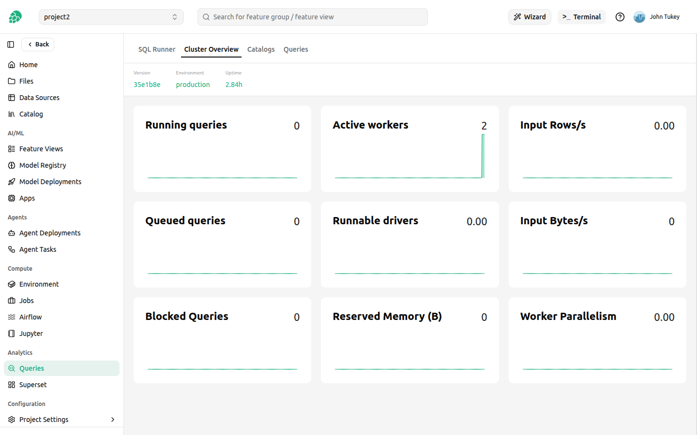
  <figcaption>Query Engine cluster overview</figcaption>
</figure>

## Managing Catalogs

The Catalogs tab is where a project makes an external data source queryable from the SQL runner.
Creating a catalog from a data source or by hand, referencing credentials, testing the connection, and when a change reaches the query engine are all covered in [Trino Catalogs][trino-catalogs].

## Queries

The Queries tab lists the queries the project has run, filterable by state and sortable, with the query text alongside each entry.
A card carries its id and state with a progress bar, the user and source that submitted it, the resource group, its split counts, wall, total and CPU time, and its reserved, peak and cumulative memory.
A query that is still running is listed the same way and updates in place.

Click a query id to open its details.

<figure>
  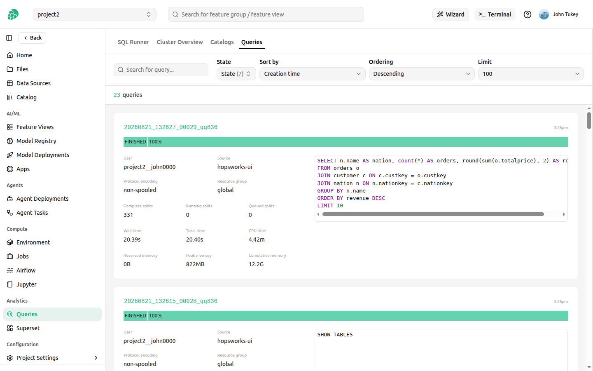
  <figcaption>The project’s query history</figcaption>
</figure>

## Query Details

Clicking on a query opens the detailed view with comprehensive execution information.

### Overview

The overview tab shows query metadata, execution timeline, and performance metrics including:

- Query text
- Execution time
- Data processed
- Rows returned
- Resource consumption

<figure>
  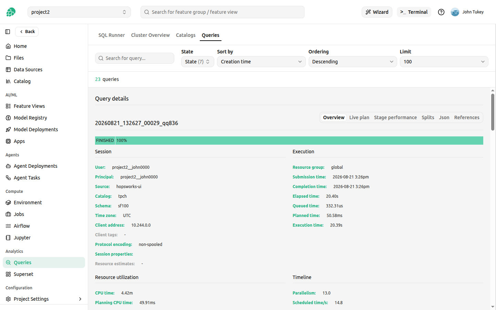
  <figcaption>Query details</figcaption>
</figure>

### Live Plan

The live plan draws the query's stages and the operators inside them, with each stage's state and its CPU time, memory, drivers and tasks, updating while the query runs.
The graph is usually taller than the page, so it can be laid out **Vertical** or **Horizontal**, panned by dragging, and zoomed by scrolling.

<figure>
  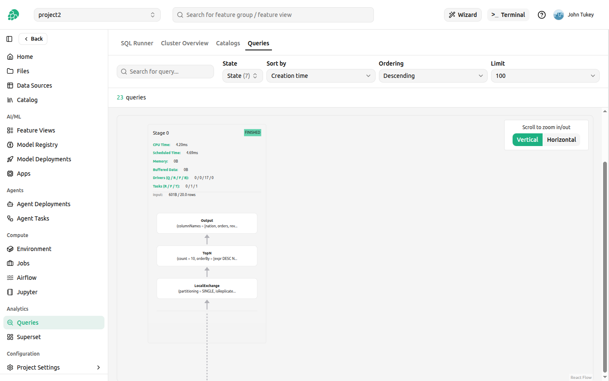
  <figcaption>Query details: live plan</figcaption>
</figure>

### Stage performance

This view takes one stage at a time, chosen with the **Stage** selector, and draws its pipelines operator by operator.
Each operator reports its throughput, output rows and bytes, driver count, and CPU, wall and blocked time, which is what locates a bottleneck inside a stage rather than merely between stages.

<figure>
  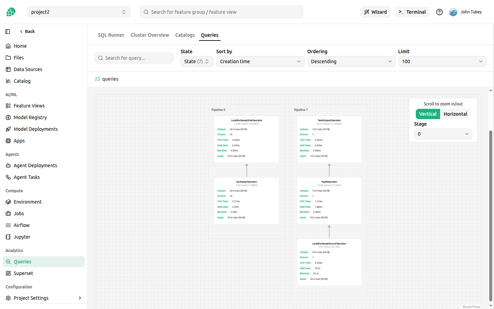
  <figcaption>Query details: stage performance</figcaption>
</figure>

### Splits

Splits show how Trino parallelizes query execution. Each split represents a portion of data processed by a worker. View split-level metrics to understand query parallelism and data distribution.

<figure>
  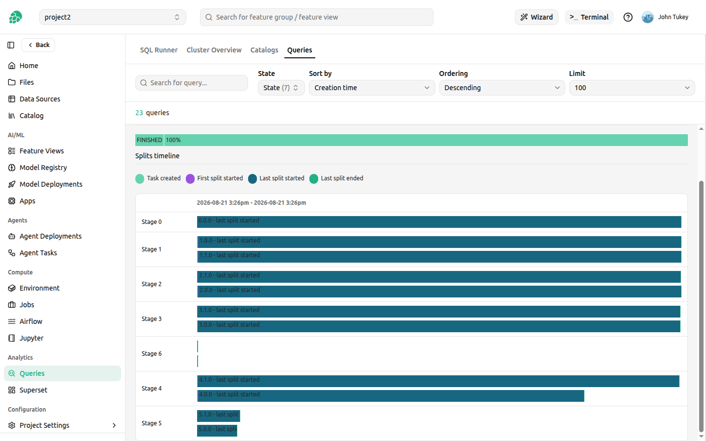
  <figcaption>Query details: split</figcaption>
</figure>

### References

The references tab lists the tables the query read, each with the user it was authorized as and whether the query named it directly, and the routines it called.

<figure>
  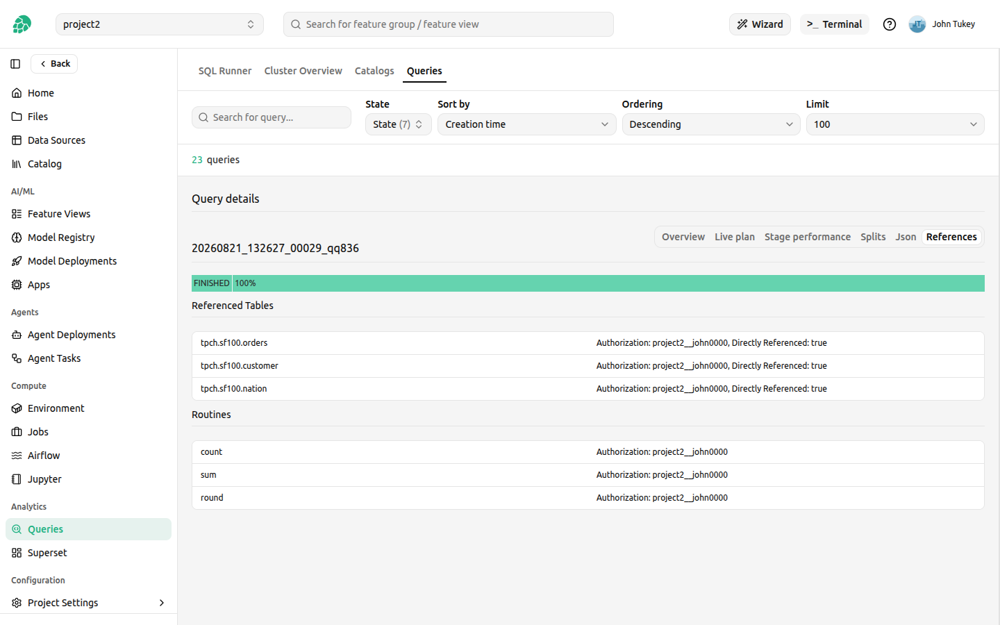
  <figcaption>Query details: references</figcaption>
</figure>

### JSON

The JSON view provides the complete query execution plan and statistics in JSON format, useful for programmatic analysis or debugging.

<figure>
  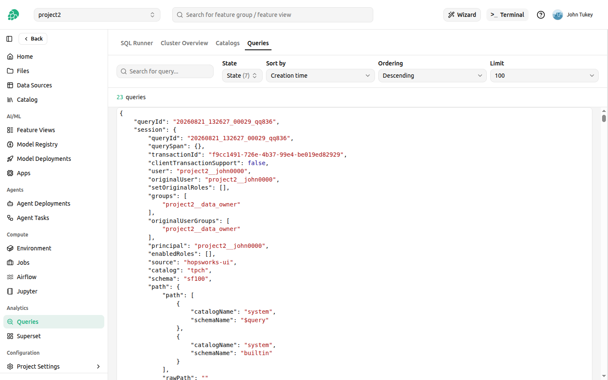
  <figcaption>Query details: json</figcaption>
</figure>

## Best Practices

- **Limit result sets**: Use `LIMIT` clauses for exploratory queries to reduce resource usage
- **Filter early**: Apply `WHERE` clauses to reduce data scanned
- **Monitor query performance**: Check the Queries tab to identify slow or failed queries
- **Use the live plan**: For complex queries, review the execution plan to optimize performance
- **Check cluster status**: Ensure adequate resources are available before running large queries
