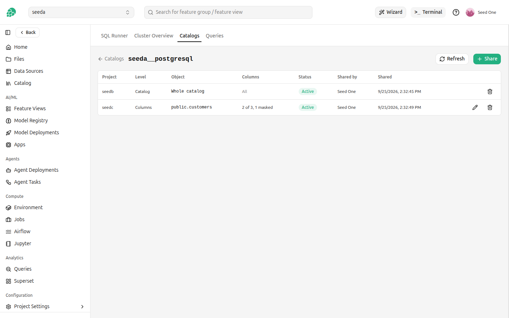
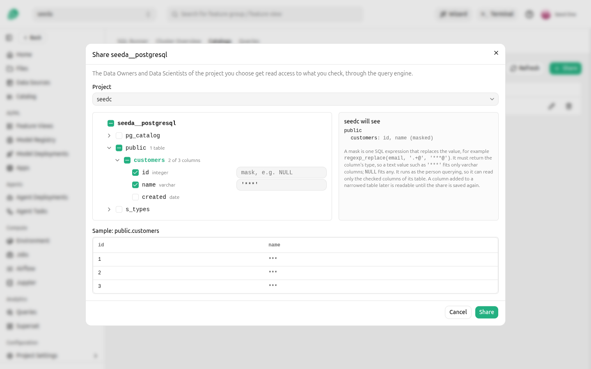
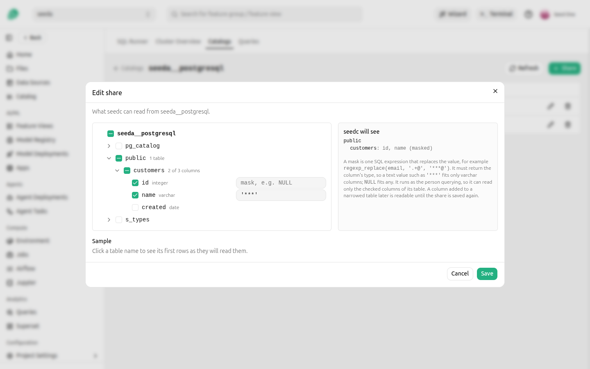
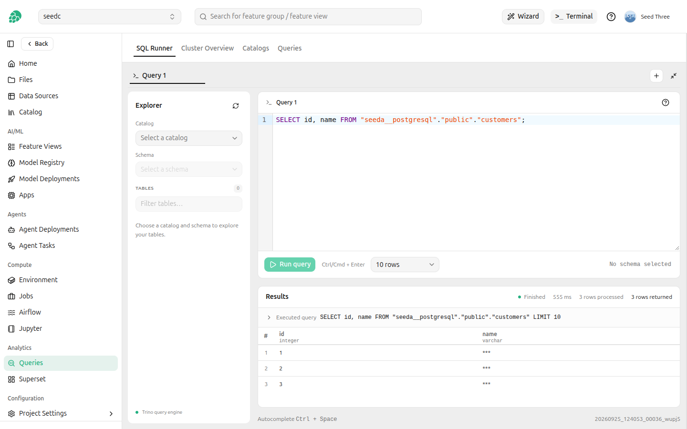
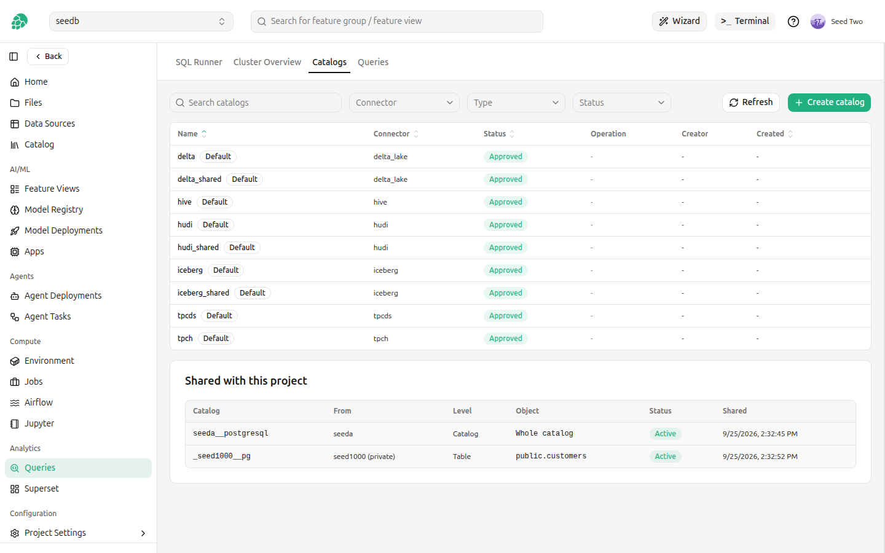
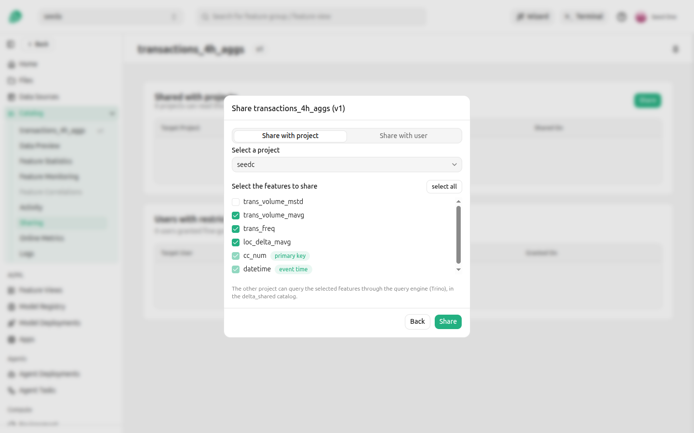
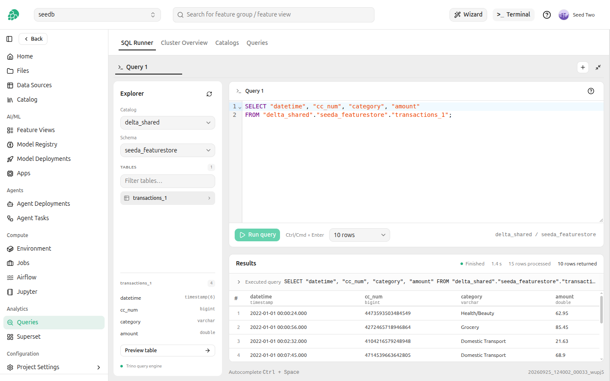
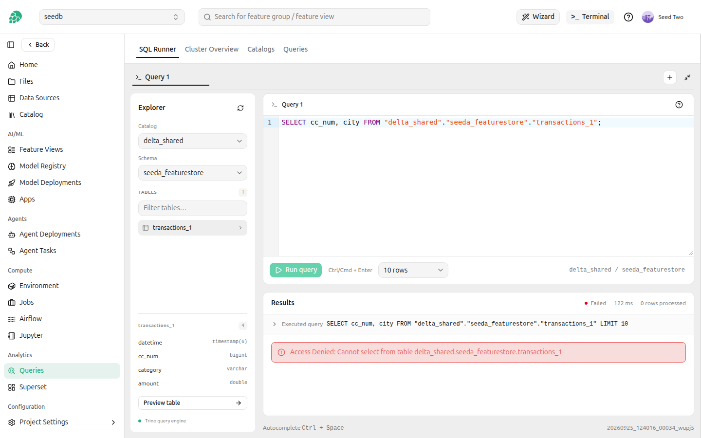

# Sharing Catalogs and Feature Groups

The query engine enforces who can read what, so data one project owns is not visible to another project until it is shared.
Two kinds of share reach the query engine:

- A **catalog share** gives another project read access to one of your Trino catalogs: the whole catalog, or chosen schemas and tables, down to some columns of a table, optionally with masked values.
- A **feature group share**, made from the feature store, also makes the shared feature group queryable through the query engine in the receiving project.

A share always grants read access, and always to the receiving project's Data Owners and Data Scientists.
It grants tables only: the receiving project cannot run the catalog's functions, such as `system.query` of a JDBC catalog, which would run any SQL on the source database as the catalog's database user.
Changes take effect within seconds, without restarting the query engine.

## Sharing a catalog

A project catalog is shared by a Data Owner of the project, and a private catalog by its owner, from any of their projects.
A catalog can be shared once it is **Approved** and while it is not being deleted, because a catalog the query engine has not loaded has nothing to share yet.
It cannot be shared with the project that owns it.
While a catalog is shared, its connector cannot change, because a narrowed share denies the hidden columns of the connector the query engine runs, and the engine switches connector only at its next restart.
Revoke its shares first; its other properties can be edited as usual.

Click the share icon on the catalog's row in **Query Engine** → **Catalogs** to open its sharing page.
The page lists every project the catalog is shared with, what it shares with each, and whether each share is live.

<figure>
  
  <figcaption>A catalog shared whole with one project, and one table with two of its three columns, one of them masked, with another</figcaption>
</figure>

Click **Share** and choose the project.
A project holds one share of a catalog, which covers everything it receives from the catalog, so a project the catalog is shared with already is not offered: edit its share instead.
Then check what to share in the tree of the catalog:

- Check the catalog to share every schema and table in it, including ones created later.
- Check a schema to share every table in it, including tables created in it later.
- Expand a schema and check some of its tables to share only those tables.
- Expand a table and uncheck some of its columns to share only the checked columns. A checked column can carry a mask.

Unchecking something inside a checked schema or catalog keeps the rest of it: uncheck `sales.salaries` in a checked schema `sales`, and every other table of `sales` stays shared.
A partly checked box shares only what is checked under it, so a table created later in a partly checked schema is not shared.

The panel beside the tree shows what the receiving project will see.
Click a table name to see its first rows as they will read them, with unchecked columns left out and masks applied.
The sample is read as you, before anything is saved.

<figure>
  
  <figcaption>Sharing one table, with one column left out and one column masked</figcaption>
</figure>

The schemas, tables and columns offered are the ones you can see in the catalog yourself, read through the catalog's own connection.

### Sharing some columns of a table

Expand a table in the tree to choose its columns.
An unchecked column cannot be read by the receiving project, and a query that selects it, or selects `*`, is refused.
The table's other ways of revealing a column are closed too: the connector's hidden columns, such as `$path` and `$partition`, or Elasticsearch's `_source`, which holds the whole document, and the table's metadata tables, such as `<table>$partitions`, are denied on a narrowed table.

Tables of a Kafka, Redis, MongoDB, Cassandra or Thrift catalog cannot be narrowed to some columns, because those connectors can hide columns that are defined outside the query engine and cannot all be denied.
Share such a table whole, or leave it out.

The receiving project reads only the columns you checked.
Hopsworks reads the table's columns each time it updates the rules, and at least every five minutes by default, and denies every column you did not check, so a column added to the table later, or renamed at the source, is not shared.
Between the change at the source and the next update, the new column is readable.
A renamed column loses its mask with its old name and is denied under the new one.
The sharing page marks such a share with the number of new columns and names them; edit the share and check them to share them.
While the query engine is restarting, a narrowed table the rules already held keeps what they denied before, as well as the columns recorded when the share was saved, until it is back.
A narrowed table the rules did not hold yet, because its share is new or was wider, or because it was left out before, stays out until the query engine is back, and a narrowed table whose columns cannot be read is left out of the share until they can.

Iceberg and Delta Lake tables can also be read as of an earlier version, with `FOR VERSION AS OF` or `FOR TIMESTAMP AS OF`, and such a read has the columns the table had then.
Hopsworks denies those columns too: every column the table has had at a version that can still be read, so a column dropped or renamed at the source stays denied under its old name.
This covers Iceberg and Delta Lake catalogs, and the Iceberg and Delta Lake tables of a Lakehouse catalog.
Hive and Hudi tables cannot be read as of an earlier version.
An Iceberg table whose metadata file is outside HopsFS, larger than 64 MiB, or not readable by the catalog's owner has its earlier columns read one snapshot at a time, 50 snapshots per update, and is left out of the share until all of them have been read; the Hopsworks log names the table.

<figure>
  
  <figcaption>Editing a share: a table with two columns shared, one of them masked, and one left out</figcaption>
</figure>

### Masking a column

A shared column can carry a mask, which replaces the value the receiving project reads.
A mask is one SQL expression over the row, for example `'***'` or `regexp_replace(email, '.+@', '***@')`, and it must return the column's own type.

A mask runs as the person querying, not as you, so it can use only what they can read: the checked columns of the same table.
A mask that refers to an unchecked column is refused when you save the share.
A mask that reads another table is accepted, because it is checked as you, but it fails at query time for anyone in the receiving project who cannot read that table.
It cannot contain `;` or a comment, and it is limited to 2000 characters.
The mask is checked against the table when the share is saved, so an expression the query engine cannot evaluate is reported then rather than when someone queries the table.

<figure>
  
  <figcaption>The receiving project reads the masked column as <code>***</code></figcaption>
</figure>

You always read your own catalog unmasked, and a share never narrows your own access: in a project a private catalog is shared with, its owner keeps the access described in [Private catalogs][private-catalogs].

### Editing a share

Click the edit icon on a share to change what it covers: add or remove schemas and tables, narrow tables to some columns, or go from chosen schemas and tables to the whole catalog.
Saving reads the narrowed tables' columns again, and the change is live within seconds.

### The status of a share

A share is live once the query engine has loaded the rules that include it, which takes a few seconds.
The sharing page shows where each share stands and refreshes itself while a change is being applied.

| Status | Meaning |
| --- | --- |
| Applying | Saved, and being made live. |
| Active | Live: the receiving project can read what it covers. |
| Revoking | Being removed. The receiving project loses access when this finishes. |
| Failed | Could not be made live. The status carries the reason; edit the share and save it to retry. |

### Objects that no longer exist

A share names schemas and tables, and an object it names may be dropped at the source later.
The share keeps it, and the sharing page lists it as **Not found**.
If an object with the same name is created again, the share applies to it.
To remove an object that is gone for good, click **Remove them from the share**, or edit the share and uncheck the object, which the tree shows as not found at the source.

### Revoking a share

Click the delete icon on a share to revoke it.
The receiving project loses access to everything the share covered as soon as the revoke is live, within seconds, and the share disappears from the page once it is.
The catalog cannot be shared with the same project again until the revoke has finished.

### What a share does not restrict

A share grants reading, but the query engine does not check table procedures against it.
Anyone in the receiving project can run `ALTER TABLE ... EXECUTE` on a shared table of an Iceberg or Delta Lake catalog, for example `optimize`, `expire_snapshots` or `rollback_to_snapshot`, and change the table with the catalog's own credentials.
`rollback_to_snapshot` returns the table to an earlier version and drops every write made since.
A table with a masked column is the exception: the query engine refuses table procedures on it.
Share such a catalog only with projects you trust with its tables, or set the connector's own `iceberg.security` or `delta.security` property to `read_only` on the catalog, which refuses table procedures to everyone, you included, and leaves reading unchanged.

Deleting a catalog revokes all of its shares at once, and so does deleting the receiving project.

### Shares your project received

The **Catalogs** tab lists, under **Shared with this project**, every catalog share your project received, who it comes from, and what it covers.
It shows how many columns of a table are masked, but not the mask expressions, which can hold values such as a salt.
A shared catalog is queried by its own name, like any other catalog, with the SQL runner or any Trino client.

<figure>
  
  <figcaption>A project catalog shared whole, and one table of another user's private catalog</figcaption>
</figure>

## Sharing feature groups through the query engine

A feature group shared with another project, as described in [Sharing a feature group with selected features][sharing-a-feature-group-with-selected-features], is also queryable by that project through the query engine.
Where it is read from depends on whether the whole feature group was shared or a subset of its features.

| Shared | Catalog | Readable |
| --- | --- | --- |
| The whole feature group, or the whole feature store | The catalog named after the feature group's format: `delta`, `hudi`, `iceberg` or `hive` | Every feature |
| A subset of the features | The shared catalog of its format: `delta_shared`, `hudi_shared` or `iceberg_shared` | The shared features only |

The schema is the owning project's feature store, `<project>_featurestore`, and the table is `<feature group>_<version>`.

The share dialog says which catalog the other project will read from, or that the share is not queryable through the query engine.

<figure>
  
  <figcaption>A subset of the features is read through <code>delta_shared</code></figcaption>
</figure>

### A subset of the features

A subset share is read through the shared catalog of the feature group's format.
The primary key and the event time are always shared, and the receiving project reads the other shared features alongside them.

```sql
SELECT datetime, cc_num, category, amount
FROM delta_shared.fraud_featurestore.transactions_1;
```

<figure>
  
  <figcaption>Only the shared features are listed, and the preview selects them by name</figcaption>
</figure>

Everything else in the table is denied: the unshared features, the connector's hidden columns such as `$path`, and the table's metadata tables such as `transactions_1$history`.
A query that selects an unshared feature, or selects `*`, is refused.

<figure>
  
  <figcaption>Selecting a feature that was not shared is refused</figcaption>
</figure>

The shared catalogs are visible only to projects that received a subset share, and a project sees only the feature groups shared with it there.
A subset share is not readable through the catalog named after the format, and a whole share is not readable through the shared catalog.

Adding features to a shared feature group does not widen the share: a new feature stays unreadable by the receiving project until you share it.
The access rules are updated before the request that adds the features returns.
A column that reaches the table some other way, such as a Delta write that merges a new column into the schema, is denied too, once Hopsworks next reads the table's columns: at least every five minutes by default, and on every share change.
If the table's columns cannot be read, the share is left out of the rules until they can.
The columns an Iceberg or Delta Lake feature group had at an earlier version are denied as well, as described in [Sharing some columns of a table][sharing-some-columns-of-a-table].
Unsharing the feature group, or deleting it, removes access within seconds.

### Feature groups that are not queryable

Two kinds of feature group cannot be read through the query engine by the receiving project:

- A feature group on an external data source, whether shared whole or in part, because its data does not live in the feature store's tables.
- A subset of a feature group stored as a plain Hive table, without Delta, Hudi or Iceberg, because there is no shared catalog for that format.
  Such a feature group shared whole is read through the `hive` catalog.

The share dialog says so for these feature groups, and the feature group remains shared and readable through the feature store APIs.
