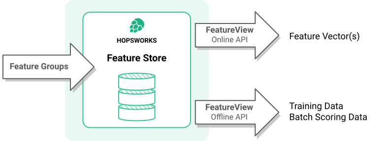

## What is Hopsworks Feature Store?

Hopsworks and its Feature Store are an open source data-intensive AI platform used for the development and operation of machine learning models at scale. The Hopsworks Feature Store provides the HSFS API to enable clients to write features to feature groups in the feature store, and to read features from feature views - either through a low latency Online API to retrieve pre-computed features for operational models or through a high throughput, latency insensitive Offline API, used to create training data and to retrieve batch data for scoring.

##HSFS API

The HSFS (HopsworkS Feature Store) API is how you, as a developer, will use the feature store.
The HSFS API helps simplify some of the problems that feature stores address including:

 - consistent features for training and serving
 - centralized, secure access to features
 - point-in-time JOINs of features to create training data with no data leakage
 - easier connection and backfilling of features from external data sources
 - use of external tables as features
 - transparent computation of statistics and usage data for features.

## Write to feature groups, read from feature views.
You write to feature groups with a feature pipeline program. The program can be written in Python, Spark, Flink, or SQL.

You read from views on top of the feature groups, called feature views. That is, a feature view does not store feature data, but is a logical grouping of features. Typically, you define a feature view because you want to train/deploy a model with exactly those features in the feature view. Feature views enable the reuse of feature data from different feature groups across different models.

