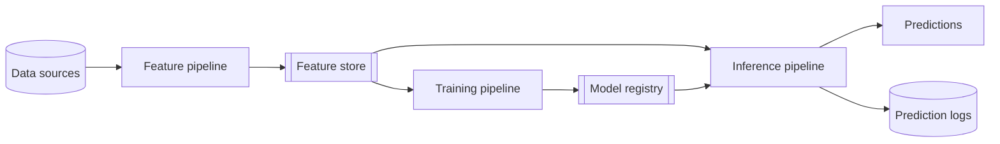

# FTI Pipeline Architecture

Hopsworks is built around a single architecture for AI systems: the decomposition of any AI system into **feature**, **training**, and **inference** (FTI) pipelines.
This page defines that architecture.
Every other concept in this section is a part of it, so read this first.

## The three pipelines

An AI system decomposes naturally into three machine learning pipelines, each with clear inputs and outputs, each developed, tested, and operated independently.

- A **feature pipeline** takes data as input and produces reusable feature data as output.
- A **training pipeline** takes feature data as input, trains a model, and outputs the trained model.
- An **inference pipeline** takes feature data and a model as input and outputs predictions and prediction logs.

The three pipelines are independent programs.
They are composed into a working system through a shared data layer: a [feature store](fs/index.md) and a [model registry](mlops/registry.md).

Feature pipelines ingest both backfill and production data and compute feature data that is stored as tabular data in the feature store.
Feature pipelines can be batch programs or stream processing programs.
Training pipelines read training data from the feature store and store the models they produce in the model registry.
Inference pipelines output predictions using a model, either downloaded from the model registry or served behind an API, together with new feature data that is precomputed in the feature store or computed from data available at prediction request time.

## Why this architecture

The five common AI system architectures (batch, stateless real-time, stateful real-time, RAG, and agentic) are very different from one another.
Moving from one to another, or transferring what you learned building one, is hard.
The FTI decomposition gives you one architecture for all of them.

Modularity is the reason.
Splitting an AI system into independent, small, testable modules lets teams build higher-quality systems faster.
It also splits the work cleanly: feature engineering can involve data engineers, model training is the realm of data scientists, and inference can involve operations.

## The shared data layer

The feature store holds three stores of feature data, each serving a different pipeline.

- A row-oriented online store for low latency access from online inference pipelines and agents.
- A columnar offline store for training models and batch inference.
- A [vector index](mlops/opensearch.md) over embeddings for inference pipelines and agents.

The model registry holds the trained models and their assets, versioned, for inference pipelines to load.

## What an AI system is

An AI system is a set of independent feature pipelines, training pipelines, and inference pipelines connected through a feature store and a model registry.

An AI system is defined by how it computes its predictions, not by the type of application that consumes them.
On that basis, AI systems built with a feature store fall into four classes.

- **Real-time (interactive)** systems make predictions in response to user requests.
    They read precomputed features from the feature store and can also compute features on demand from the request parameters.
- **Agentic workflows** achieve goals with some autonomy using LLMs and tools, drawing context from a vector index, the online and offline stores, and external APIs.
- **Batch** systems run inference on a schedule and write predictions to a downstream store, called an inference store, for an application to consume later.
- **Stream processing** systems use an embedded model to make predictions on streaming data without user input, often machine to machine.

The inference pipeline is what determines the class.
When you know how a system computes its predictions, you know which of these you are building.

## Where to go next

- [Feature Store Architecture](fs/index.md) for the shared data layer in detail.
- [Feature Groups](fs/feature_group/fg_overview.md) for how feature pipelines write feature data.
- [Feature Views](fs/feature_view/fv_overview.md) for how training and inference pipelines read it.
- [AI Systems](mlops/prediction_services.md) for the inference side and how each class is served.
