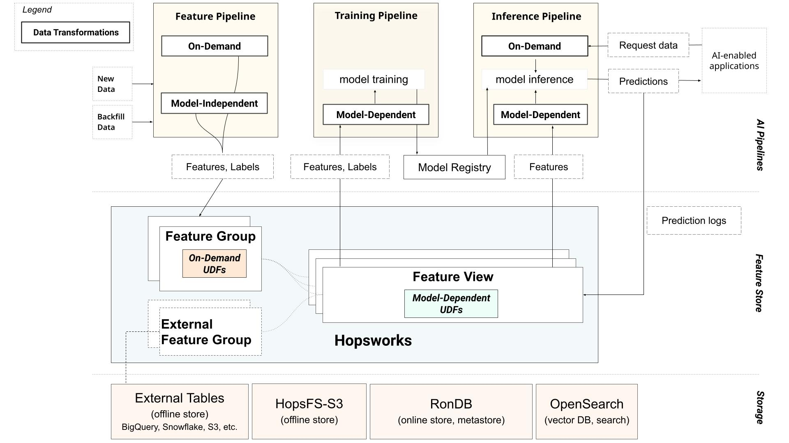

# Data Transformations

[Data transformations](https://www.hopsworks.ai/dictionary/data-transformation) are integral to all AI applications. Transformations such as aggregations, binning, normalizations, and standardizations produce new features that can enhance the performance of an AI application. However, not all transformations in an AI application are equivalent.

Transformations like binning and aggregations typically create reusable features, while transformations like scaling and normalization often produce model-specific features. Additionally, in real-time AI systems, some features can only be computed during inference when the request is received.

This classification of features can be used to create a taxonomy for data transformation that would apply to any scalable and modular AI system that aims to reuse features. The taxonomy helps identify areas that can cause [online-offline](https://www.hopsworks.ai/dictionary/online-offline-feature-skew) skews in the systems, allowing for their prevention. Any modular AI system must provide solutions for online-offline skew.

## Data Transformation Taxonomy for AI Systems

Transformation functions in an AI system can be classified into three types based on the nature of the input features they generate: model-independent, model-dependent, and on-demand transformations. 

**Model-dependent transformations** create reusable features that can be utilized across various machine-learning models. These transformations are commonly used by data engineers and include techniques such as grouped aggregations (e.g., minimum, maximum, or average of a variable), windowed counts (e.g., the number of clicks per day), and binning to generate categorical variables. Since the data produced by model-independent transformations are reusable, these features can be stored in a feature store.

**Model-independent transformations** generate features specific to individual models. These transformations are widely used by data scientists and can include transformations that are unique to a particular model or are parameterized by the training dataset, making them model-specific. For instance, text tokenization is a transformation required by all large language models (LLMs) but is unique to each of them. Other transformations, such as converting categorical variables into numerical features or scaling/normalizing/standardizing numerical variables to enhance the performance of gradient-based models, are parameterized by the training dataset. Consequently, the features produced are applicable only to the model trained using that specific training dataset. Since these features are not reusable, there is no need to store them in a feature store.

**On-demand transformations** are exclusive to real-time AI systems, where predictions must be generated in real time based on incoming prediction requests. On-demand transformations compute on-demand features that usually require at least one input parameter that is only available in a prediction request for their computation. These transformations can also combine request-time parameters with precomputed features from feature stores. Some examples include generating *zip_codes* from latitude and longitude received in the prediction request or calculating the *time_since_last_transaction* from a transaction request. The on-demand features produced can also be computed and backfilled into a feature store when the necessary historical data required for their computation becomes available. Backfilling on-demand features into the feature store eliminates the need to recompute them when creating training data.

Each of these transformations is employed within specific areas of a modular AI system and can be illustrated using the figure below.

Model-independent transformations are utilized exclusively in areas where new and historical data arrives, typically within feature engineering programs. Model-dependent transformations are necessary during the creation of training data, in training programs and must also be consistently applied in inference programs prior to making predictions. On-demand transformations are primarily employed in online inference programs, though they can also be integrated into feature engineering programs to backfill data into the feature store.

The presence of model-dependent and on-demand transformations across different modules in a modular AI system introduces the potential for online-offline skew. Any scalable AI system must adopt a modular approach, and any modular AI system must address solutions for mitigating the online-offline skew introduced by these transformations.

## Hopsworks and the Data Transformation Taxonomy

In Hopsworks, an AI system is typically decomposed into different AI pipelines and usually falls into either a feature pipeline, a training pipeline, or an inference pipeline. 

Hopsworks stores reusable feature data, created by model-independent transformations within the feature pipeline, into feature groups (tables containing feature data in both offline and online stores). Model-independent transformations in Hopsworks can be seamlessly performed, and the generated features can be easily inserted into feature groups using a wide range of commonly used data engineering tools. The figure below illustrates the different software tools supported by Hopsworks for creating reusable features through model-independent transformations.

Additionally, Hopsworks provides a simple Python API to create custom transformation functions as either Python or Pandas User-Defined Functions (UDFs). Pandas UDFs enable the vectorized execution of transformation functions, offering significantly higher throughput compared to Python UDFs for large volumes of data. They can also be scaled out across workers in a Spark program, allowing for scalability from gigabytes (GBs) to terabytes (TBs) or more. However, Python UDFs can be much faster for small volumes of data, such as in the case of online inference.

Transformation functions defined in Hopsworks can then be attached to feature groups to create on-demand transformation. On-demand transformations in feature groups are executed automatically whenever data is inserted into them to compute and backfill the on-demand features into the feature group. Backfilling on-demand features removes the need to recompute them while creating training and batch data.

Hopsworks also provides a powerful abstraction known as feature views, which play a crucial role in training and inference pipelines. A feature view is a meta-data-only selection of features, created from potentially different feature groups. It includes the input and output schema required for a model. This means that a feature view describes not only the input features but also the output targets, along with any helper columns necessary for training or inference of the model. This allows feature views to create consistent snapshots of data for both training and inference of a model. Additionally feature views, also compute and save statistics for the training datasets they create.

Hopsworks supports attaching model-dependent transformations to feature views. These transformations get access to the same training dataset statistics during both training and inference. Additionally, feature views through lineage get access to the on-demand transformation used to create on-demand features if any are present in the feature view. 

The integration of on-demand transformations with feature groups and model-dependent transformations with feature views in Hopsworks naturally mitigates online-offline data discrepancies, facilitating the seamless creation of large-scale AI systems.