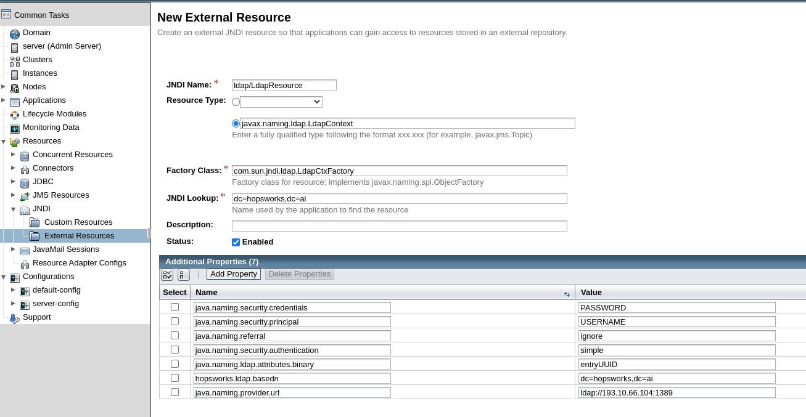

# Configure Server for LDAP and Kerberos

## Introduction
LDAP and Kerberos integration need some configuration in the [Karamel](https://github.com/logicalclocks/karamel-chef) 
cluster definition used to deploy your Hopsworks cluster. This tutorial shows an administrator how to configure the application
server for LDAP and Kerberos integration.

## Prerequisites
An accessible LDAP domain. 
A Kerberos Key Distribution Center (KDC) running on the same domain as Hopsworks (Only for Kerberos).

### Step 1: Server Configuration for LDAP

The LDAP attributes below are used to configure JNDI external resource in Payara. The JNDI resource will communicate 
with your LDAP server to perform the authentication.

```yaml
ldap:
    enabled: true
    jndilookupname: "dc=hopsworks,dc=ai"
    provider_url: "ldap://193.10.66.104:1389"
    attr_binary_val: "entryUUID"
    security_auth: "none"
    security_principal: ""
    security_credentials: ""
    referral: "ignore"
    additional_props: ""
```

- jndilookupname: should contain the LDAP domain.
- attr_binary_val: is the binary unique identifier that will be used in subsequent logins to identify the user.
- security_auth: how to authenticate to the LDAP server.
- security_principal: contains the username of the user that will be used to query LDAP.
- security_credentials: contains the password of the user that will be used to query LDAP.
- referral: whether to follow or ignore an alternate location in which an LDAP Request may be processed.

### Without Karamel/Chef
An already deployed instance can be configured to connect to LDAP without re-running Karamel/Chef. 
Go to the payara admin UI and create a new JNDI external resource. The name of the resource should be __ldap/LdapResource__. 

<figure>
  
  <figcaption>LDAP Resource</figcaption>
</figure>

This can also be achieved by running the below asadmin command.

```bash
asadmin create-jndi-resource \
 --restype javax.naming.ldap.LdapContext \
 --factoryclass com.sun.jndi.ldap.LdapCtxFactory \
 --jndilookupname dc\=hopsworks\,dc\=ai \
 --property java.naming.provider.url=ldap\\://193\.10\.66\.104\\:1389:\
 hopsworks.ldap.basedn=dc\\\=hopsworks\,dc\\\=ai:\
 java.naming.ldap.attributes.binary=entryUUID:\
 java.naming.security.authentication=simple:\
 java.naming.security.principal=<username>:\
 java.naming.security.credentials=<password>:\
 java.naming.referral=ignore \
 ldap/LdapResource
```

### Step 2: Server Configuration for Kerberos

The Kerberos attributes are used to configure [SPNEGO](http://spnego.sourceforge.net/).
SPNEGO is used to establish a secure context between the requester and the application server when using Kerberos 
authentication.  

```yaml
kerberos:
    enabled: true
    krb_conf_path: "/etc/krb5.conf"
    krb_server_key_tab_path: "/etc/security/keytabs/service.keytab"
    krb_server_key_tab_name: "service.keytab"
    spnego_server_conf: '\nuseKeyTab=true\nprincipal=\"HTTP/server.hopsworks.ai@HOPSWORKS.AI\"\nstoreKey=true\nisInitiator=false'
ldap:
    jndilookupname: "dc=hopsworks,dc=ai"
    provider_url: "ldap://193.10.66.104:1389"
    attr_binary_val: "objectGUID"
    security_auth: "none"
    security_principal: ""
    security_credentials: ""
    referral: "ignore"
    additional_props: ""
```

Both Kerberos and LDAP attributes need to be specified to configure Kerberos. The LDAP attributes are explained above.

- krb_conf_path: contains the path to the krb5.conf used by SPNEGO to get information about the default domain and the 
  location of the Kerberos KDC. The file is copied by the recipe in to /srv/hops/domains/domain1/config.
- krb_server_key_tab_path: contains the path to the Kerberos service keytab. The keytab is copied by the recipe in to
  /srv/hops/domains/domain/config with the name set in the **krb_server_key_tab_name** attribute.
- spnego_server_conf: contains the configuration that will be appended to Payara's (application serve used to host hopsworks) 
  login.conf. In particular, it should contain useKeyTab=true, and the principal name to be used in the authentication phase. 
  Initiator should be set to false.

## Conclusion
In this guide you learned how to configure the application server for LDAP and Kerberos.