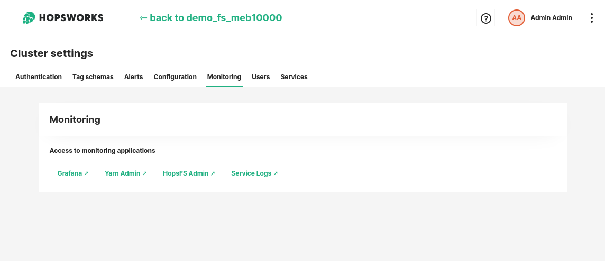
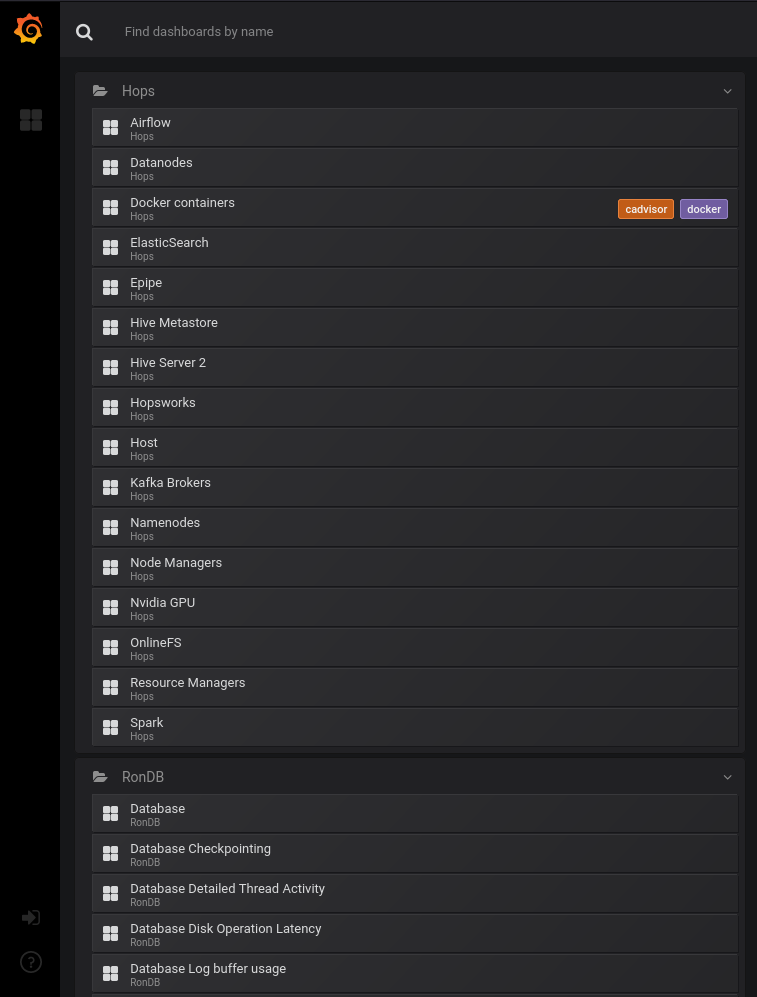

# Services Dashboards 

## Introduction

The Hopsworks platform is composed of different services. Hopsworks uses Prometheus to collect health and performance metrics from the different services and Grafana to display them to the Hopsworks administrators. 

In this guide you will learn how to access the Grafana dashboards to monitor the health of the cluster or to troubleshoot performance issues.

## Prerequisites

To access the services dashboards in Grafana, you need to have an administrator account on the Hopsworks cluster.

## Step 1: Access Grafana 

You can access the admin page of your Hopsworks cluster by clicking on your name, in the top right corner, and choosing _Cluster Settings_ from the dropdown menu.

You can then navigate to the _Monitoring_ tab. The _Monitoring_ tab gives you access to several of the observability tools that are already deployed to help you manage the health of the cluster.

<figure>
  
  <figcaption>Monitoring tab</figcaption>
</figure>

Click on the _Grafana_ link to open the Grafana web application and navigate through the dashboards.

## Step 2: Navigate through the dashboards

In the Grafana web application, you can click on the _Home_ button on the top left corner and navigate through the available dashboards.

Dashboards are organized into three folders:

- **Hops**: This folder contains all the dashboards of the Hopsworks services (e.g. the web application, the file system, resource manager) as well as the dashboards of the hosts (e.g. EC2 instances, virtual machines, servers) on which the cluster is deployed.

- **RonDB**: This folder contains all the dashboard related to the database. The _Database_ dashboard contains a general overview of the RonDB cluster, while the remaining dashboards focus on specific items (e.g. thread activity, memory management, etc).

- **Kubernetes**: If you have integrated Hopsworks with a Kubernetes cluster, this folder contains the dashboards to monitor the health of the Kubernetes cluster.

<figure>
  
  <figcaption>Grafana view</figcaption>
</figure>

The default dashboards are read only and cannot be edited. Additional dashboards can be created by logging in to Grafana. You can log in into Grafana using the username and password specified in the cluster definition.

!!! warning

    By default Hopsworks keeps metrics information only for the past 15 days. This means that, by default, you will not be able to access health and performance metrics which are older than 15 days.

## Conclusion

In this guide you learned how to access the Grafana dashboards to monitor the health and performance of the Hopsworks services.

You can find additional documentation on Grafana itself at: [https://grafana.com/docs/](https://grafana.com/docs/)