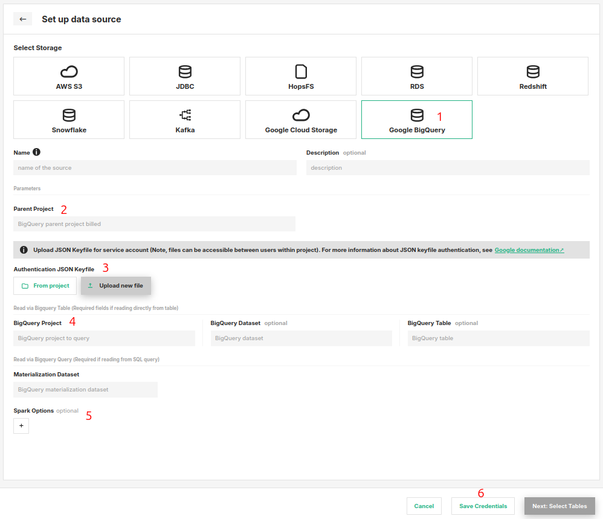

# How-To set up a BigQuery Data Source

## Introduction

A BigQuery data source provides integration to Google Cloud BigQuery.
BigQuery is Google Cloud's managed data warehouse supporting that lets you run analytics and
execute SQL queries over large scale data. Such data warehouses are often the source of raw data for feature
engineering pipelines.

In this guide, you will configure a Data Source in Hopsworks to connect to your BigQuery project by saving the
necessary information.
When you're finished, you'll be able to execute queries and read results of BigQuery using Spark through
HSFS APIs.

The data source uses the Google `spark-bigquery-connector` behind the scenes.
To read more about the spark connector, like the spark options or usage, check [Apache Spark SQL connector for Google BigQuery.](https://github.com/GoogleCloudDataproc/spark-bigquery-connector#usage
'github.com/GoogleCloudDataproc/spark-bigquery-connector')

!!! note
        Currently, it is only possible to create data sources in the Hopsworks UI. You cannot create a data source programmatically.

## Prerequisites

Before you begin this guide you'll need to retrieve the following information about your GCP account:

- **BigQuery Project:** You need a BigQuery project, dataset and table created and have read access to it. Or, if
  you wish to query a public dataset you need its corresponding details.
- **Authentication Method:** Authentication to GCP account is handled by uploading the `JSON keyfile for service
  account` to the Hopsworks Project. You will need to create this JSON keyfile from GCP. For more information on
  service accounts
  and creating keyfile in GCP, read [Google Cloud documentation.](https://cloud.google.com/docs/authentication/production#create_service_account
  'creating service account keyfile')

!!! note
        To read data, the BigQuery service account user needs permission to `create read sesssion` which is available in **BigQuery Admin role**.

## Creation in the UI

### Step 1: Set up new Data Source

Head to the Data Source View on Hopsworks (1) and set up a new data source (2).

<figure markdown>
  
  <figcaption>The Data Source View in the User Interface</figcaption>
</figure>

### Step 2: Enter source details

Enter the details for your BigQuery storage. Start by giving
it a unique **name** and an optional
**description**.

<figure markdown>
  
  <figcaption>BigQuery Creation Form</figcaption>
</figure>

1. Select "Google BigQuery" as the storage.
2. Next, set the name of the parent BigQuery project. This is used for billing by GCP.
3. Authentication: Here you should upload your `JSON keyfile for service
   account` used for authentication. You can choose to either
   upload from your local using `Upload new file` or choose an existing file within project using `From Project`.
4. Read Options:
  In the UI set the below fields,
    1. *BigQuery Project*: The BigQuery project to read
    2. *BigQuery Dataset*: The dataset of the table (Optional)
    3. *BigQuery Table*: The table to read (Optional)

!!! note
    *Materialization Dataset*: Temporary dataset used by BigQuery for writing. It must be set to a dataset where the GCP user has table creation permission. The queried table must be in the same location as the `materializationDataset` (e.g 'EU' or 'US'). Also, if a table in the `SQL statement` is from project other than the `parentProject` then use the fully qualified table name i.e. `[project].[dataset].[table]`
         (Read more details from Google documentation on usage of query for BigQuery spark connector [here](https://github.com/GoogleCloudDataproc/spark-bigquery-connector#reading-data-from-a-bigquery-query)).

5. Spark Options: Optionally, you can set additional spark options using the `Key - Value` pairs.
6. Click on "Save Credentials".

## Next Steps

Move on to the [usage guide for data sources](../usage.md) to see how you can use your newly created BigQuery
connector.
