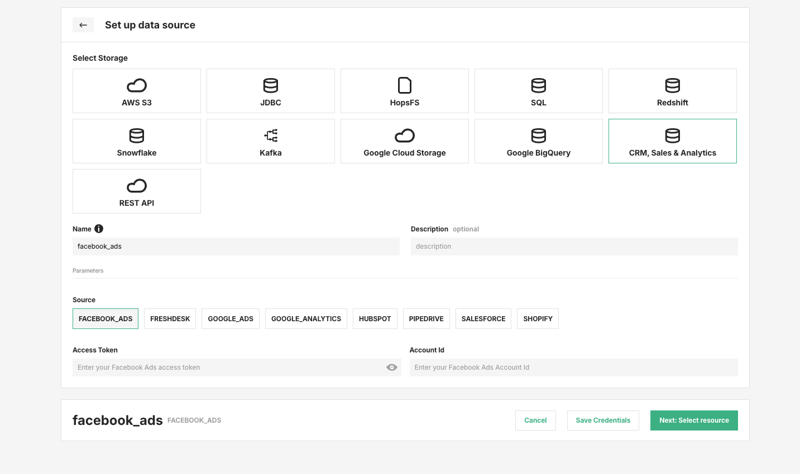
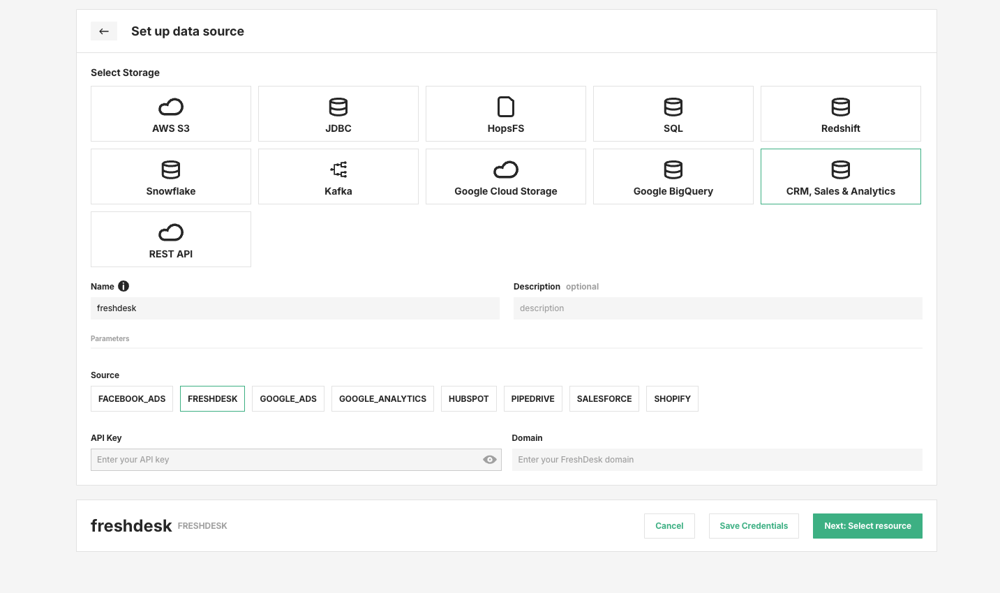
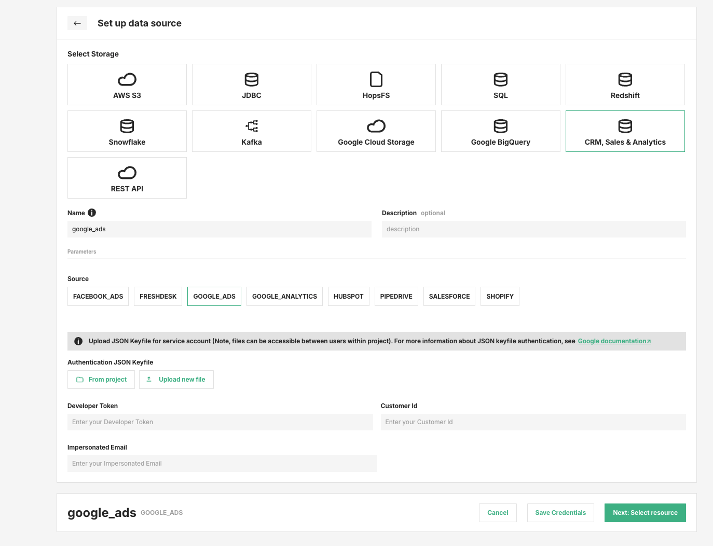
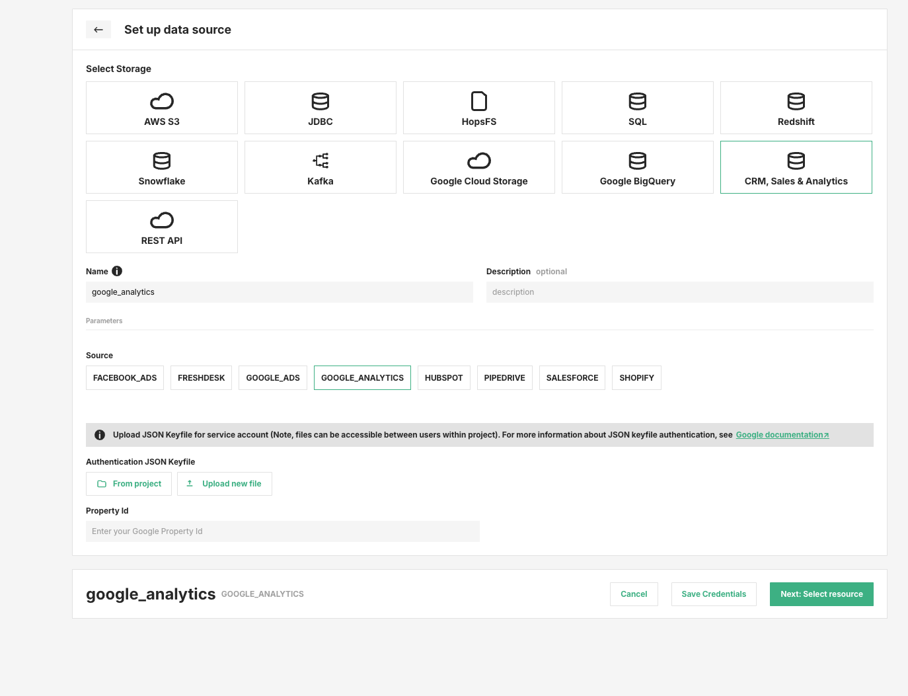
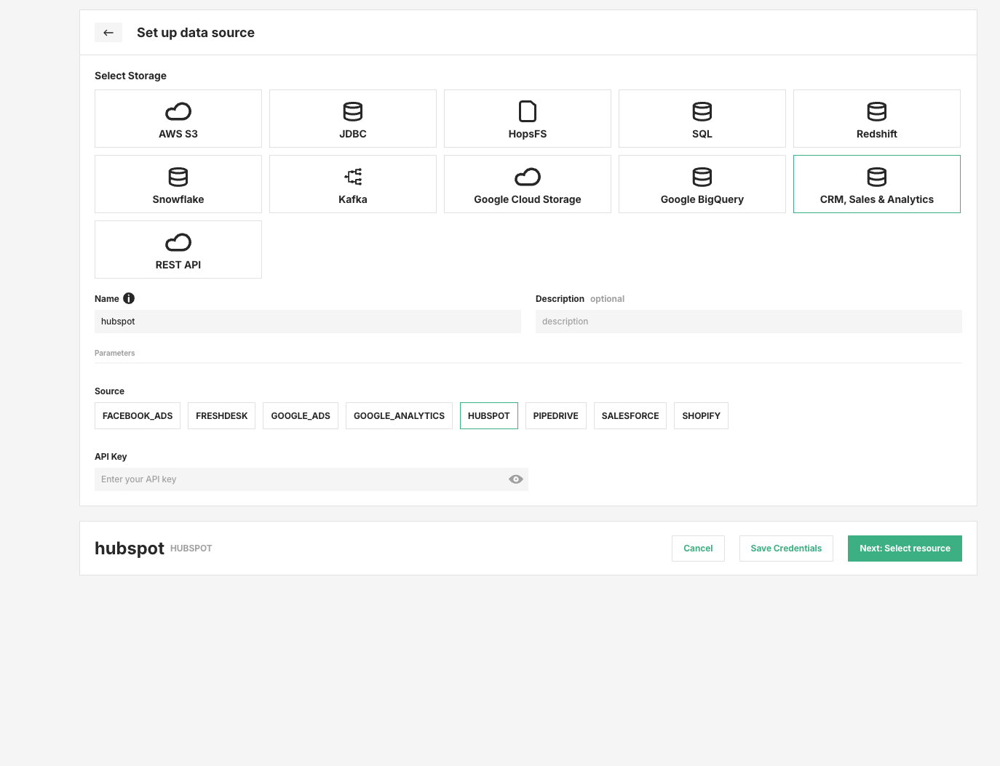
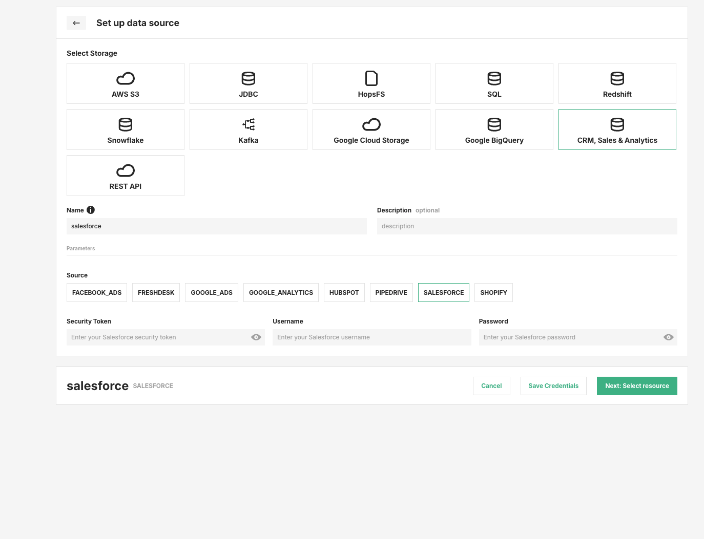
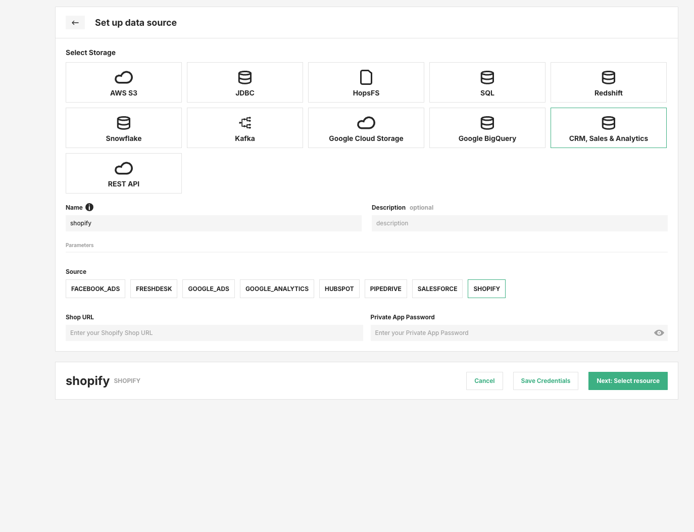

# How-To set up a CRM, Sales & Analytics Data Source

## Introduction

The `CRM, Sales & Analytics` data source lets you connect Hopsworks to supported business applications and marketing platforms.
The following sources are available:

- Facebook Ads
- Freshdesk
- Google Ads
- Google Analytics
- HubSpot
- Pipedrive
- Salesforce
- Shopify

In this guide, you will configure a Data Source in Hopsworks by saving the credentials required by the selected source.

!!! note
    Currently, it is only possible to create data sources in the Hopsworks UI.
    You cannot create a data source programmatically.

## Prerequisites

Before you begin, make sure you have:

- A unique name for the data source in Hopsworks.
- Read credentials for the external system you want to connect.
- Any source-specific identifiers required by that system, such as account, customer, property, or domain identifiers.
- For Google Ads and Google Analytics, a service account JSON keyfile that can be uploaded to the Hopsworks project.

## Creation in the UI

### Step 1: Set up new Data Source

Head to the Data Source View on Hopsworks (1) and set up a new data source (2).

<figure markdown>
  
  <figcaption>The Data Source View in the User Interface</figcaption>
</figure>

### Step 2: Select storage and source

Choose `CRM, Sales & Analytics` as the storage type.
Then enter a unique **Name**, an optional **Description**, and select the source you want to configure.

<figure markdown>
  
  <figcaption>CRM, Sales & Analytics data source selection</figcaption>
</figure>

### Step 3: Enter source-specific credentials

The required fields depend on the selected source.

#### Facebook Ads

Required fields:

- **Access Token**
- **Account Id**

<figure markdown>
  
  <figcaption>Facebook Ads data source form</figcaption>
</figure>

#### Freshdesk

Required fields:

- **API Key**
- **Domain**

<figure markdown>
  
  <figcaption>Freshdesk data source form</figcaption>
</figure>

#### Google Ads

Required fields:

- **Authentication JSON Keyfile**
- **Developer Token**
- **Customer Id**
- **Impersonated Email**

The JSON keyfile can be selected either from an existing project file or uploaded as a new file.

<figure markdown>
  
  <figcaption>Google Ads data source form</figcaption>
</figure>

#### Google Analytics

Required fields:

- **Authentication JSON Keyfile**
- **Property Id**

The JSON keyfile can be selected either from an existing project file or uploaded as a new file.

<figure markdown>
  
  <figcaption>Google Analytics data source form</figcaption>
</figure>

#### HubSpot

Required fields:

- **API Key**

<figure markdown>
  
  <figcaption>HubSpot data source form</figcaption>
</figure>

#### Pipedrive

Required fields:

- **API Key**

<figure markdown>
  
  <figcaption>Pipedrive data source form</figcaption>
</figure>

#### Salesforce

Required fields:

- **Security Token**
- **Username**
- **Password**

<figure markdown>
  
  <figcaption>Salesforce data source form</figcaption>
</figure>

#### Shopify

Required fields:

- **Shop URL**
- **Private App Password**

<figure markdown>
  
  <figcaption>Shopify data source form</figcaption>
</figure>

### Step 4: Save the credentials

After entering the required fields for the selected source:

1. Click **Save Credentials**.
2. Click **Next: Select resource** to continue configuring the data source for downstream use.

## Next Steps

Move on to the [usage guide for data sources](../usage.md) to see how you can use your newly created data source.
