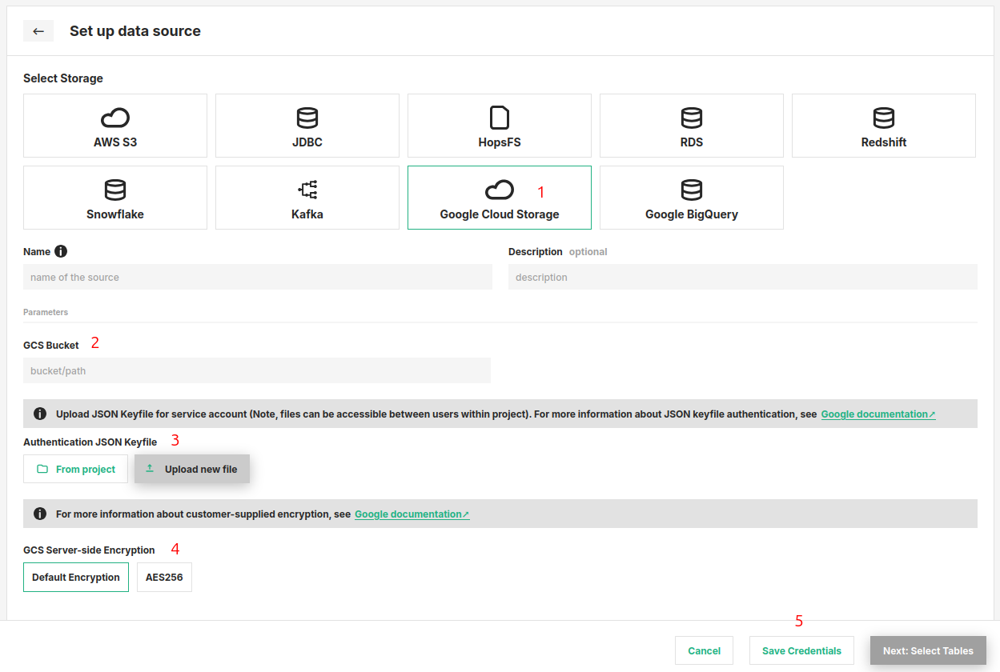

# How-To set up a GCS Data Source

## Introduction

This particular type of Data Source provides integration to Google Cloud Storage (GCS). GCS is 
an object storage service offered by Google Cloud. An object could be simply any piece 
of immutable data consisting of a file of any format, for example a `CSV` or `PARQUET`. These objects are stored in 
containers called as `buckets`.

These types of storages are often the source for raw data from which features can be engineered.

In this guide, you will configure a Data Source in Hopsworks to connect to your GCS bucket by saving the 
necessary information.
When you're finished, you'll be able to read files from the GCS bucket using Spark through HSFS APIs.

The Data Source uses the Google `gcs-connector-hadoop` behind the scenes. For more information, check out [Google Cloud Data Source for Spark and Hadoop](
https://github.com/GoogleCloudDataproc/hadoop-connectors/tree/master/gcs#google-cloud-storage-connector-for-spark-and-hadoop 'google-cloud-storage-connector-for-spark-and-hadoop')

!!! note
    Currently, it is only possible to create data sources in the Hopsworks UI. You cannot create a data source programmatically.

## Prerequisites

Before you begin this guide you'll need to retrieve the following information about your GCP account and bucket:

- **Bucket:** You need a GCS bucket created and have read access to it. The bucket is identified by its name.
- **Authentication Method:** Authentication to GCP account is handled by uploading the `JSON keyfile for service 
  account` to the Hopsworks Project. You will need to create this JSON keyfile from GCP. For more information on 
  service accounts 
  and creating keyfile in GCP, read [Google Cloud documentation.](https://cloud.google.com/docs/authentication/production#create_service_account
  'creating service account keyfile')
- **Server-side Encryption** GCS encrypts the data on server side by default. The connector additionally supports the 
  optional encryption method `Customer Supplied Encryption Key` by GCP. You can choose the encryption option `AES-256` and provide AES-256 key and hash, encoded in 
  standard Base64. The encryption details are stored as [Secrets](../../../projects/secrets/create_secret.md) 
  in the Hopsworks for keeping it secure.
  Read more about encryption on [Google Documentation.](https://cloud.google.com/storage/docs/encryption/customer-supplied-keys)

## Creation in the UI
### Step 1: Set up new Data Source

Head to the Data Source View on Hopsworks (1) and set up a new data source (2).

<figure markdown>
  
  <figcaption>The Data Source View in the User Interface</figcaption>
</figure>

### Step 2: Enter connector details

Enter the details for your GCS connector. Start by giving 
it a unique **name** and an optional 
**description**.

<figure markdown>
  
  <figcaption>GCS Connector Creation Form</figcaption>
</figure>

1. Select `Google Cloud Storage` as the storage.
2. Next, set the name of the GCS Bucket you wish to connect with.
3. Authentication: Here you should upload your `JSON keyfile for service
   account` used for authentication. You can choose to either
   upload from your local using `Upload new file` or choose an existing file within project using `From Project`.
4. GCS Server Side Encryption: You can leave this to `Default Encryption` if you do not wish to provide explicit encrypting keys. Otherwise, 
optionally you can set the encryption setting for `AES-256` and provide the encryption key and hash when selected.
5. Click on `Save Credentials`.

## Next Steps

Move on to the [usage guide for data sources](../usage.md) to see how you can use your newly created GCS 
connector.