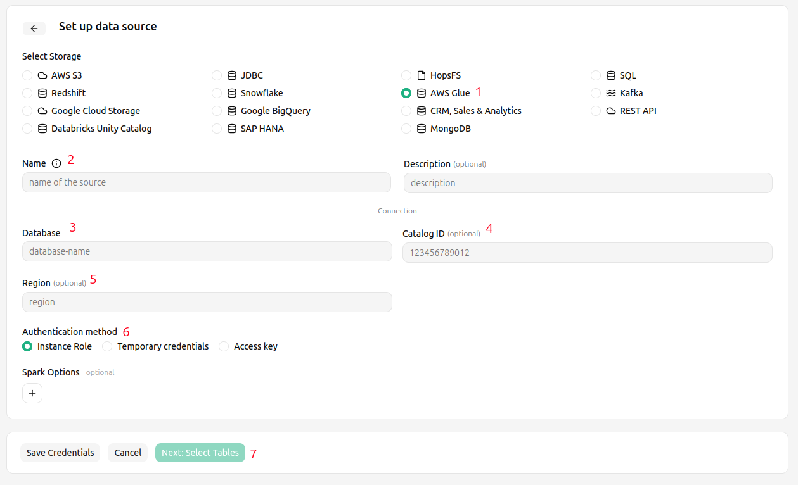
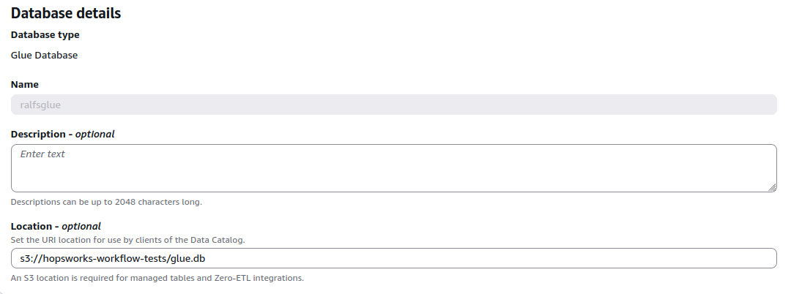

# How-To set up an AWS Glue Data Source { #data-source-glue }

## Introduction

The Glue Data Source integrates with the AWS Glue Data Catalog.
It points at a Glue database backed by Amazon S3, where the data always lives.
For this reason the Glue Data Source provides the same S3 credentials (`access_key`, `secret_key`, `session_token`, `region`) as the [S3 Data Source](s3.md).
This works for any data format — Apache Iceberg, Delta Lake and Apache Hudi, as well as plain file formats such as `csv` and `parquet`.

How the Glue Data Catalog itself is used depends on the format:

- Iceberg: the catalog owns the table's current-metadata pointer, so reads and writes are mediated by the catalog (the table is addressed by `<database>.<table>`).
- Delta and Hudi: the on-path transaction log or timeline stays authoritative; the catalog is a discoverability mirror that is registered on create and synced on write so external engines (Athena, EMR, ...) can find the table by name.
- Plain file formats (`csv`, `parquet`, ...): the Data Source is used only for S3 access; nothing is registered in the catalog.

In this guide, you will configure a Data Source in Hopsworks to save all the authentication information needed in order to set up a connection to your AWS Glue database.
When you're finished, you'll be able to read tables using Spark through Hopsworks APIs, and to create managed feature groups whose offline data is stored in the Glue-registered location on S3.

!!! note
    Currently, it is only possible to create data sources in the Hopsworks UI.
    You cannot create a data source programmatically.

## Prerequisites

Before you begin this guide you'll need to retrieve the following information from your AWS Glue and S3 setup:

- **Database:** You will need the name of the Glue database that contains, or will contain, your tables.
- **Region:** You will need the AWS region in which the Glue Data Catalog and the backing S3 bucket reside.
  The region is identified by its code.
- **Authentication Method:** You can authenticate using Access Key/Secret, or use IAM roles.
  If you want to use an IAM role it either needs to be attached to the entire Hopsworks cluster or Hopsworks needs to be able to assume the role.
  See [IAM role documentation](../../../../setup_installation/admin/roleChaining.md) for more information.
  The credentials must grant access both to the Glue Data Catalog and to the backing S3 bucket.

## Creation in the UI

### Step 1: Set up new Data Source

Head to the Data Source View on Hopsworks (1) and set up a new data source (2).

<figure markdown>
  
  <figcaption>The Data Source View in the User Interface</figcaption>
</figure>

### Step 2: Enter Glue Settings

Enter the details for your Glue connector.

01. Select "AWS Glue" as storage.
02. Give the data source a **name** and an optional **description**.
03. Set the name of the Glue **database** you want to point the connector to.
04. Optionally set the **Catalog ID**, the AWS account ID that owns the Glue Data Catalog.
    Leave it empty to use the catalog of the account the credentials belong to.
05. Optionally set the AWS **region** of the Glue Data Catalog and its backing S3 bucket.
06. Choose the **Authentication method**, see the options below.
07. Optionally add **Spark options** as key-value pairs to pass to the Spark context at runtime.
08. Click on "Save Credentials".

<figure markdown>
  
  <figcaption>Glue Connector Creation Form</figcaption>
</figure>

The credentials must grant access both to the Glue Data Catalog and to the backing S3 bucket.
The available authentication methods are the same as for the [S3 Data Source](s3.md):

#### Instance Role

Choose instance role if you have an EC2 instance profile attached to your Hopsworks cluster nodes with a role which grants access to the Glue Data Catalog and the backing S3 bucket.

#### Temporary Credentials

Choose temporary credentials if you are using [AWS Role chaining](../../../../setup_installation/admin/roleChaining.md) to control the access permission on a project and user role base.
Once you have selected *Temporary Credentials* select the role that gives access to the Glue Data Catalog and the backing S3 bucket.
For this role to appear in the list it needs to have been configured by an administrator, see the [AWS Role chaining documentation](../../../../setup_installation/admin/roleChaining.md) for more details.

!!! warning "Session Duration"
    By default, the session duration that the role will be assumed for is 1 hour or 3600 seconds.
    This means if you want to use the data source for example to write [training data to S3](../usage.md#writing-training-data), the training dataset creation cannot take longer than one hour.

    Your administrator can change the default session duration for AWS data sources, by first [increasing the max session duration of the IAM Role](https://docs.aws.amazon.com/IAM/latest/UserGuide/id_roles_use.html#id_roles_use_view-role-max-session) that you are assuming.
    And then changing the `fs_data_source_session_duration` [configuration variable](../../../../setup_installation/admin/variables.md) to the appropriate value in seconds.

#### Access Key/Secret

The most simple authentication method are Access Key/Secret, choose this option to get started quickly, if you are able to retrieve the keys using the IAM user administration.

## Feature group path

When creating a feature group from this Data Source and the Glue database has a location, the feature group path is generated automatically by appending the new table to that database location, so no path needs to be set.
The database location is the **Location** set on the Glue database in the AWS console.

<figure markdown>
  
  <figcaption>The Location of a Glue database in the AWS console</figcaption>
</figure>

Otherwise, the path must be set explicitly on the data source, for example:

=== "PySpark"

    ```python
    ds = fs.get_data_source("glue")
    ds.path = "s3://mybucket/iceberg-warehouse/myglue.db/fg_1/"
    ```

An explicitly set path always takes precedence over the generated one.

## Direct Spark or PyIceberg access

For direct Spark or PyIceberg access outside the feature group APIs, the Data Source supplies the matching catalog properties.
See [`GlueConnector.catalog_options`][hsfs.storage_connector.GlueConnector.catalog_options] (Spark) and [`GlueConnector.pyiceberg_catalog_options`][hsfs.storage_connector.GlueConnector.pyiceberg_catalog_options] (PyIceberg).

## Next Steps

Move on to the [usage guide for data sources](../usage.md) to see how you can use your newly created Glue connector.
