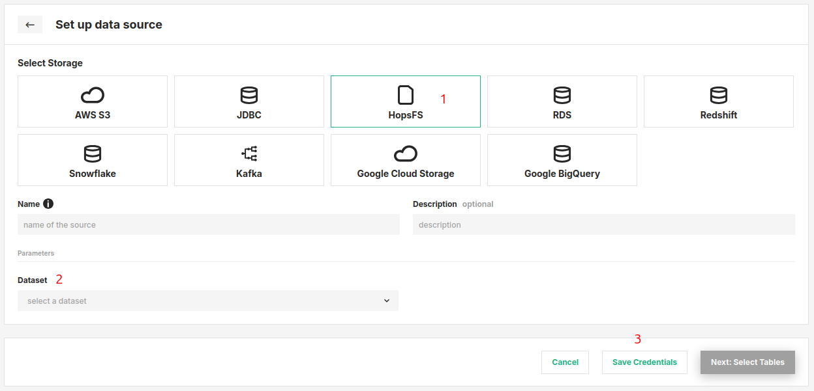

# How-To set up a HopsFS Data Source

## Introduction

HopsFS is a HDFS-compatible filesystem on AWS/Azure/on-premises for data analytics. HopsFS stores its data on object storage in the cloud (S3 in AWs and Blob storage on Azure) and on commodity servers on-premises, ensuring low-cost storage, high availability, and disaster recovery. In Hopsworks, you can access HopsFS natively in programs (Spark, TensorFlow, etc) without the need to define a Data Source. By default, every Project has a Data Source for Training Datasets. When you create training datasets from features in the Feature Store the HopsFS connector is the default Data Source. However, if you want to output data to a different dataset, you can define a new Data Source for that dataset.

In this guide, you will configure a HopsFS Data Source in Hopsworks which points at a different directory on the file system than the Training Datasets directory.
When you're finished, you'll be able to write training data to different locations in your cluster through HSFS APIs.

!!! note
    Currently, it is only possible to create data sources in the Hopsworks UI. You cannot create a data source programmatically.

## Prerequisites

Before you begin this guide you'll need to identify a **directory on the filesystem** of Hopsworks, to which you want to point the Data Source that you are going to create.

## Creation in the UI

### Step 1: Set up new Data Source

Head to the Data Source View on Hopsworks (1) and set up a new data source (2).

<figure markdown>
  
  <figcaption>The Data Source View in the User Interface</figcaption>
</figure>

### Step 2: Enter HopsFS Settings

Enter the details for your HopsFS connector. Start by giving it a **name** and an optional **description**.

1. Select "HopsFS" as the storage.
2. Select the top-level dataset to point the connector to.
3. Click on "Save Credentials".

<figure markdown>
  
  <figcaption>HopsFS Connector Creation Form</figcaption>
</figure>

## Next Steps

Move on to the [usage guide for data sources](../usage.md) to see how you can use your newly created HopsFS connector.
