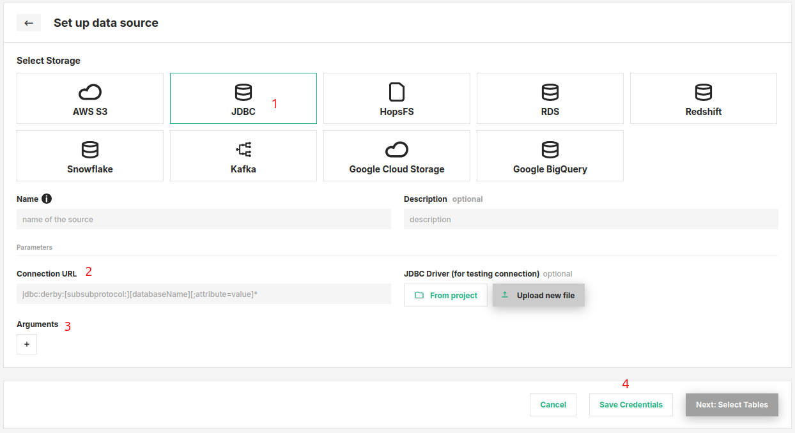

# How-To set up a JDBC Data Source

## Introduction

JDBC is an API provided by many database systems.
Using JDBC connections one can query and update data in a database, usually oriented towards relational databases.
Examples of databases you can connect to using JDBC are MySQL, Postgres, Oracle, DB2, MongoDB or Microsoft SQLServer.

In this guide, you will configure a Data Source in Hopsworks to save all the authentication information needed in order to set up a JDBC connection to your database of choice.
When you're finished, you'll be able to query the database using Spark through HSFS APIs.

!!! note
    Currently, it is only possible to create data sources in the Hopsworks UI.
    You cannot create a data source programmatically.

## Prerequisites

Before you begin this guide you'll need to retrieve the following information from your JDBC compatible database:

- **JDBC Connection URL:** Consult the documentation of your target database to determine the correct JDBC URL and parameters.
  As an example, for MySQL the URL could be:

```
jdbc:mysql://10.0.2.15:3306/[databaseName]?useSSL=false&allowPublicKeyRetrieval=true
```

- **Username and Password:** Typically, you will need to add username and password in your JDBC URL or as key/value parameters.
  So make sure you have retrieved a username and password with the suitable permissions for the database and table you want to query.

## Creation in the UI

### Step 1: Set up new Data Source

Head to the Data Source View on Hopsworks (1) and set up a new data source (2).

<figure markdown>
  
  <figcaption>The Data Source View in the User Interface</figcaption>
</figure>

### Step 2: Enter JDBC Settings

Enter the details for your JDBC enabled database.

<figure markdown>
  
  <figcaption>JDBC Connector Creation Form</figcaption>
</figure>

1. Select "JDBC" as the storage.
2. Enter the JDBC connection url.
   This can for example also contain the username and password.
3. Add additional key/value arguments to be passed to the connection, such as username or password.
   These might differ by database.

   !!! note
       Driver class name is a mandatory argument even if using the default MySQL driver.
       Add it by specifying a property with the name `driver` and class name as value.
       The driver class name will differ based on the database.
       For MySQL databases, the class name is `com.mysql.cj.jdbc.Driver`, as shown in the example image.

4. Click on "Save Credentials".

!!! note
    To be able to use the connector, you need to upload the driver JAR file to the [Jupyter configuration](../../../projects/jupyter/spark_notebook.md) or [Job configuration](../../../projects/jobs/pyspark_job.md) in `Addtional Jars`.
    For MySQL connections the default JDBC driver is already included in Hopsworks so this step can be skipped.

## Next Steps

Move on to the [usage guide for data sources](../usage.md) to see how you can use your newly created JDBC connector.
