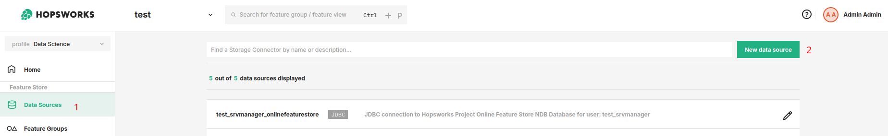
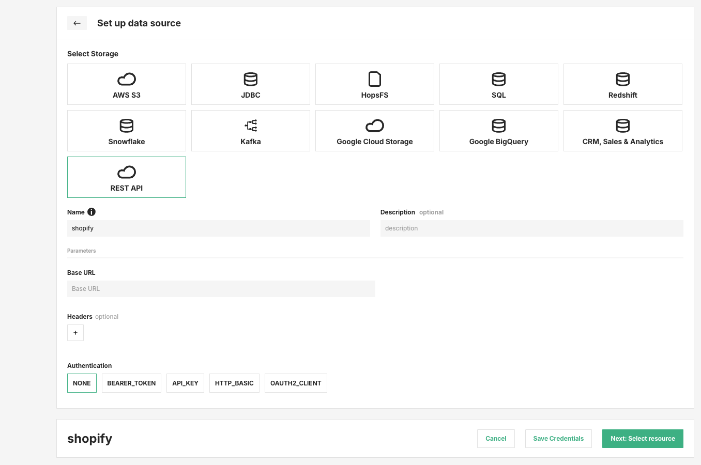

# How-To set up a REST API Data Source

## Introduction

The `REST API` data source lets you connect Hopsworks to external HTTP APIs.
You can use it to store the base connection details, optional headers, and the authentication method required by the target API.

In this guide, you will configure a REST API Data Source in the Hopsworks UI.

!!! note
    Currently, it is only possible to create data sources in the Hopsworks UI.
    You cannot create a data source programmatically.

## Prerequisites

Before you begin, make sure you have:

- A unique name for the data source in Hopsworks.
- The **Base URL** of the target API.
- Any headers you want to send with requests.
- The authentication details required by the target API.

## Creation in the UI

### Step 1: Set up new Data Source

Head to the Data Source View on Hopsworks (1) and set up a new data source (2).

<figure markdown>
  
  <figcaption>The Data Source View in the User Interface</figcaption>
</figure>

### Step 2: Enter REST API settings

Select `REST API` as the storage type.
Then provide the common connection settings shown in the form:

1. **Name:** A unique name for the data source.
2. **Description:** Optional description.
3. **Base URL:** The base endpoint for the external API.
4. **Headers:** Optional header key-value pairs. Use the `+` button to add headers.
5. **Authentication:** Select the authentication mode required by the API.

The following authentication modes are available in the UI:

- `NONE`
- `BEARER_TOKEN`
- `API_KEY`
- `HTTP_BASIC`
- `OAUTH2_CLIENT`

<figure markdown>
  
  <figcaption>REST API data source form</figcaption>
</figure>

!!! note
    The screenshot shows the form with `NONE` selected.
    When you choose another authentication mode, the form will prompt for the additional credentials required by that method.

### Step 3: Save the credentials

After entering the connection details:

1. Click **Save Credentials**.
2. Click **Next: Select resource** to continue configuring the data source for downstream use.

## Next Steps

Move on to the [usage guide for data sources](../usage.md) to see how you can use your newly created REST API data source.
