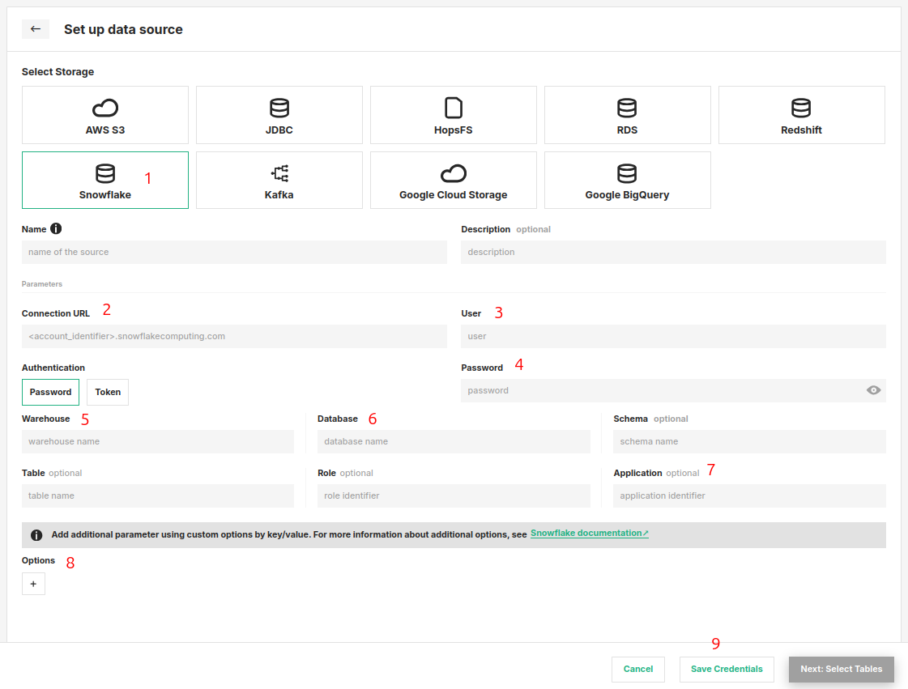

# How-To set up a Snowflake Data Source

## Introduction

Snowflake provides a cloud-based data storage and analytics service, used as a data warehouse in many enterprises.

Data warehouses are often the source of raw data for feature engineering pipelines and Snowflake supports scalable feature computation with SQL.
However, Snowflake is not viable as an online feature store that serves features to models in production, with its columnar database layout its latency is too high compared to OLTP databases or key-value stores.

In this guide, you will configure a Data Source in Hopsworks to save all the authentication information needed in order to set up a connection to your Snowflake database.
When you're finished, you'll be able to query the database using Spark through HSFS APIs.

!!! note
    Currently, it is only possible to create data sources in the Hopsworks UI.
    You cannot create a data source programmatically.

## Prerequisites

Before you begin this guide you'll need to retrieve the following information from your Snowflake account and database, the following options are **mandatory**:

- **Snowflake Connection URL:** Consult the documentation of your target snowflake account to determine the correct connection URL.
  This is usually some form of your [Snowflake account identifier](https://docs.snowflake.com/en/user-guide/admin-account-identifier.html).
For example:

```plaintext
<account_identifier>.snowflakecomputing.com
```

OR:

```plaintext
https://<orgname>-<account_name>.snowflakecomputing.com
```

The account and organization details can be viewed in the Snowsight UI under **Admin > Account** or by querying it in
SQL, as explained in [Snowflake
documentation](https://docs.snowflake.com/en/user-guide/organizations-gs.html#viewing-the-name-of-your-organization-and-its-accounts).
Below is an example of how to view the account and organization to get the account identifier from the Snowsight UI.
<figure markdown>
  
  <figcaption>Viewing Snowflake account identifier</figcaption>
</figure>

!!! note "Authentication methods"
    The Snowflake data source supports username and password, token-based and key-pair based authentication options. General information on snowflake key pair authentication and setup is at [Snowflake key-pair authentication](https://docs.snowflake.com/en/user-guide/key-pair-auth).

- **Username and Password:** Login name for the Snowflake user and password.
  This is often also referred to as `sfUser` and `sfPassword`.
- **Warehouse:** The warehouse to use for the session after connecting
- **Database:** The database to use for the session after connecting.
- **Schema:** The schema to use for the session after connecting.

These are a few additional **optional** arguments:

- **Role:** The role field can be used to specify which [Snowflake security role](https://docs.snowflake.com/en/user-guide/security-access-control-overview.html#system-defined-roles) to assume for the session after the connection is established.
- **Application:** The application field can also be specified to have better observability in Snowflake with regards to which application is running which query.
  The application field can be a simple string like “Hopsworks” or, for instance, the project name, to track usage and queries from each Hopsworks project.

## Creation in the UI

### Step 1: Set up new Data Source

Head to the Data Source View on Hopsworks (1) and set up a new data source (2).

<figure markdown>
  
  <figcaption>The Data Source View in the User Interface</figcaption>
</figure>

### Step 2: Enter Snowflake Settings

Enter the details for your Snowflake connector.
Start by giving it a **name** and an optional **description**.

01. Select "Snowflake" as storage.
02. Specify the hostname for your account in the following format `<account_identifier>.snowflakecomputing.com` or `https://<orgname>-<account_name>.snowflakecomputing.com`.
03. Login name for the Snowflake user.
04. **Authentication** Choose between user account Password, Token or Private Key options.
    In case of private key, upload your snowflake user Private Key file and set Passphrase if applicable.
05. The warehouse to connect to.
06. The database to use for the connection.
07. Add any additional optional arguments.
    For example, you can specify `Schema`, `Table`, `Role`, and `Application`.
08. Optional additional key/value arguments.
09. Click on "Save Credentials".

<figure markdown>
  
  <figcaption>Snowflake Connector Creation Form</figcaption>
</figure>

## Next Steps

Move on to the [usage guide for data sources](../usage.md) to see how you can use your newly created Snowflake connector.
