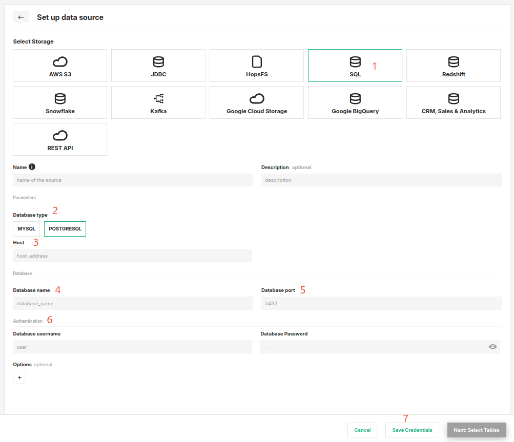

# How-To set up an SQL Data Source

## Introduction

The SQL Data Source connects Hopsworks to a Relational Database Service such as MySQL or PostgreSQL.
Using this connector, you can query and update data in your relational database from Hopsworks.

In this guide, you will configure a Data Source in Hopsworks to securely store the authentication information needed to set up a connection to your database instance.
When you're finished, you'll be able to query your SQL database using HSFS APIs.

!!! note
    Currently, it is only possible to create data sources in the Hopsworks UI.
    You cannot create a data source programmatically.

## Prerequisites

Before you begin, ensure you have the following information from your database instance:

- **Host:** The endpoint for your database instance.

    Example from AWS:
      1. Go to the AWS Console → `Aurora and RDS`
      2. Click on your DB instance.
      3. Under `Connectivity & security`, you'll find the endpoint, e.g.:
        `mydb.abcdefg1234.us-west-2.rds.amazonaws.com`

- **Database:** The name of the database to connect to.

- **Port:** The port to connect to (e.g. 3306 for MySQL, 5432 for PostgreSQL).

- **Username and Password:** A username and password with the necessary permissions to access the required tables.

## Creation in the UI

### Step 1: Set up a new Data Source

Head to the Data Source View on Hopsworks (1) and set up a new data source (2).

<figure markdown>
  
  <figcaption>The Data Source View in the User Interface</figcaption>
</figure>

### Step 2: Enter SQL Settings

Enter the details for your database.
Start by giving the connector a **name** and an optional **description**.

1. Select "SQL" as the storage.
2. Select the database type (e.g. MySQL or PostgreSQL).
3. Enter the host endpoint.
4. Enter the database name.
5. Specify the port.
6. Provide the username and password.
7. Click on "Save Credentials".

<figure markdown>
  
  <figcaption>SQL Connector Creation Form</figcaption>
</figure>

## Next Steps

Move on to the [usage guide for data sources](../usage.md) to see how you can use your newly created SQL connector.
