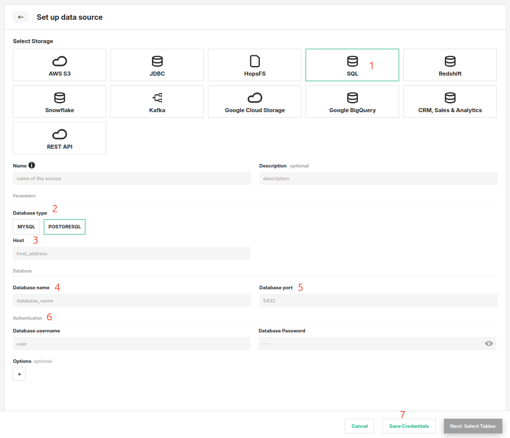

# How-To set up an SQL Data Source

## Introduction

The SQL Data Source connects Hopsworks to a Relational Database Service.
Supported database types are **MySQL**, **PostgreSQL**, and **Oracle**.
Using this connector, you can query and update data in your relational database from Hopsworks.

In this guide, you will configure a Data Source in Hopsworks to securely store the authentication information needed to set up a connection to your database instance.
When you're finished, you'll be able to query your SQL database using HSFS APIs.

!!! note
    Currently, it is only possible to create data sources in the Hopsworks UI.
    You cannot create a data source programmatically.

## Prerequisites

Before you begin, ensure you have the following information from your database instance:

- **Host:** The endpoint for your database instance.

    Example from AWS:
      1. Go to the AWS Console → `Aurora and RDS`
      2. Click on your DB instance.
      3. Under `Connectivity & security`, you'll find the endpoint, e.g.:
        `mydb.abcdefg1234.us-west-2.rds.amazonaws.com`

- **Database:** The name of the database to connect to.
  For Oracle, this is the **service name** (e.g. `ORCL` or a TNS alias).

- **Port:** The port to connect to (e.g. `3306` for MySQL, `5432` for PostgreSQL, `1521` for Oracle).

- **Username and Password:** A username and password with the necessary permissions to access the required tables.

### Optional: Oracle Wallet for mTLS Authentication

If your Oracle database requires mutual TLS (mTLS) authentication — common with Oracle Autonomous Database and Oracle Cloud — you will also need:

- **Wallet file:** A `.zip` file containing the wallet credentials (e.g. `cwallet.sso`, `tnsnames.ora`, `sqlnet.ora`).
- **Wallet password:** The password for the wallet, if using a PKCS12 wallet (`ewallet.p12`).
  Auto-login wallets (`cwallet.sso`) do not require a password.

!!! tip
    You can download the wallet zip from the Oracle Cloud Console under your Autonomous Database's **DB Connection** page.
    Upload the zip file to your Hopsworks project (e.g. to `Resources/`) before creating the data source.

## Creation in the UI

### Step 1: Set up a new Data Source

Head to the Data Source View on Hopsworks (1) and set up a new data source (2).

<figure markdown>
  
  <figcaption>The Data Source View in the User Interface</figcaption>
</figure>

### Step 2: Enter SQL Settings

Enter the details for your database.
Start by giving the connector a **name** and an optional **description**.

1. Select "SQL" as the storage.
2. Select the database type (MySQL, PostgreSQL, or Oracle).
3. Enter the host endpoint.
4. Enter the database name (service name for Oracle).
5. Specify the port.
6. Provide the username and password.
7. For Oracle with mTLS, upload the wallet zip file and provide the wallet password (if required).
8. Click on "Save Credentials".

<figure markdown>
  
  <figcaption>SQL Connector Creation Form</figcaption>
</figure>

## Reading Data

Once the data source is created, you can read data using a SQL query.

### Python Engine

When running outside of Spark (e.g. in a Hopsworks notebook or an external Python client), the Python engine reads data via the Hopsworks Arrow Flight service.
The server handles the database connection — including Oracle wallet-based authentication — so no JDBC driver or wallet files are needed on the client side.

```python
import hopsworks


project = hopsworks.login()
feature_store = project.get_feature_store()
ds = feature_store.get_data_source("my_sql_source")

df = ds.read(query="SELECT * FROM my_schema.my_table", dataframe_type="pandas")
```

### Spark Engine

When running with PySpark, the data is read using the Spark JDBC DataSource with the appropriate JDBC driver.
For Oracle connections with a wallet configured, the wallet zip is automatically downloaded from HopsFS and extracted on the Spark driver.

```python
import hopsworks


project = hopsworks.login()
feature_store = project.get_feature_store()
ds = feature_store.get_data_source("my_sql_source")

df = ds.read(query="SELECT * FROM my_schema.my_table")
```

!!! note
    For Oracle, the JDBC driver JAR (e.g. `ojdbc11.jar`) must be available on the Spark classpath.
    Upload it via the [Jupyter configuration][how-to-run-a-pyspark-notebook] or [Job configuration][how-to-run-a-pyspark-job] in `Additional Jars`.
    The MySQL driver is included in Hopsworks by default.

## Limitations

### Oracle with Spark JDBC

!!! warning "Oracle Spark JDBC limitations"
    When reading Oracle data via Spark, be aware of the following:

    - **Single-partition reads only.**
      All data is fetched through a single JDBC connection from the Spark driver.
      Spark's parallel JDBC read (via `numPartitions` / `partitionColumn`) is not supported.
      For very large tables, consider filtering with a `WHERE` clause in your query.
    - **Wallet available on the driver only.**
      When using wallet-based authentication, the wallet zip is downloaded from HopsFS and extracted on the Spark driver node.
      This is sufficient because reads are single-partition (driver-only).
    - **Timestamp precision.**
      Spark JDBC supports timestamp precision up to seconds only.
      Sub-second precision from Oracle `TIMESTAMP` columns may be truncated.

### Python engine (Arrow Flight)

The Python engine reads data via the Hopsworks Arrow Flight service, which handles the database connection server-side.
There are no client-side limitations specific to Oracle — wallet authentication, connection pooling, and query execution are all managed by the server.

## Next Steps

Move on to the [usage guide for data sources][data-source-usage] to see how you can use your newly created SQL connector.
