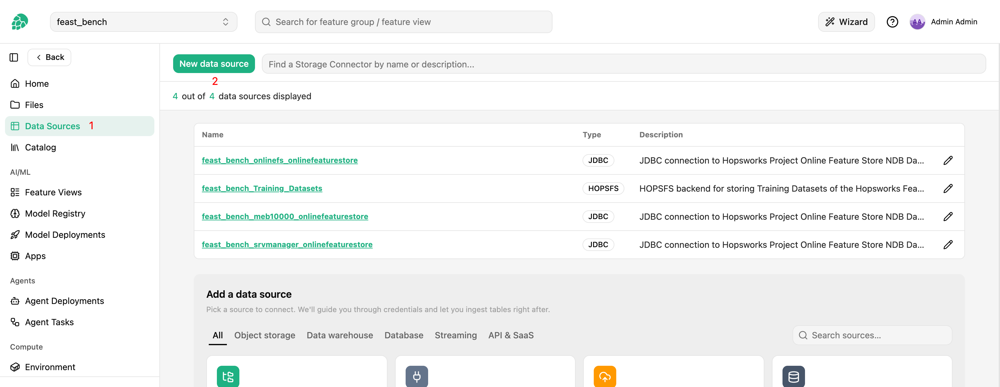
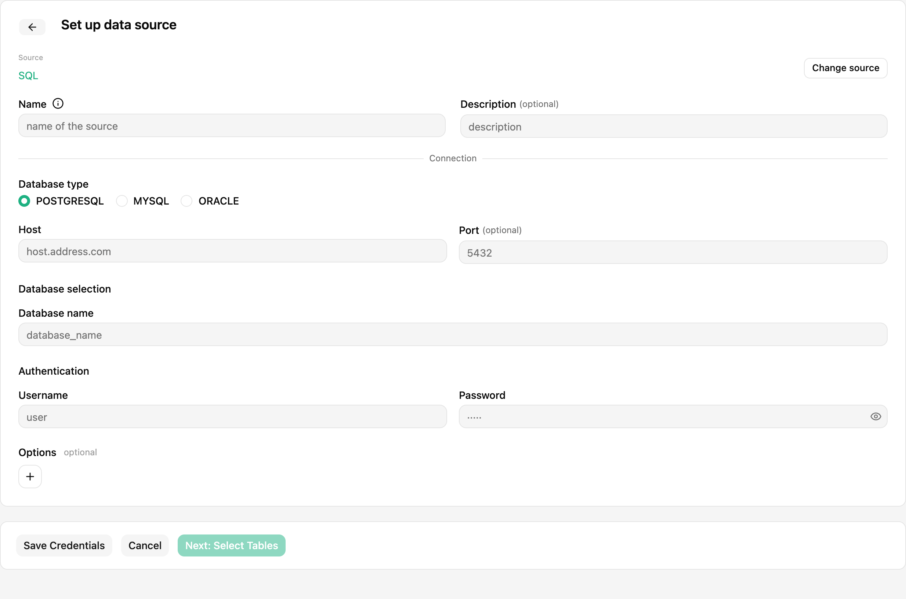

# How-To set up an SQL Data Source

## Introduction

The SQL Data Source connects Hopsworks to a Relational Database Service.
Supported database types are **MySQL**, **PostgreSQL**, **Oracle**, and **Microsoft SQL Server** (including Azure SQL Database).
Using this connector, you can query and update data in your relational database from Hopsworks.

In this guide, you will configure a Data Source in Hopsworks to securely store the authentication information needed to set up a connection to your database instance.
When you're finished, you'll be able to query your SQL database using Hopsworks APIs.

!!! note
    This guide creates the data source in the Hopsworks UI.
    The `hops` CLI creates the same data source with `hops datasource create sql <name> --database-type <type> ...`.

## Prerequisites

Before you begin, ensure you have the following information from your database instance:

- **Host:** The endpoint for your database instance.

    Example from AWS:
      1. Go to the AWS Console → `Aurora and RDS`
      2. Click on your DB instance.
      3. Under `Connectivity & security`, you'll find the endpoint, e.g.:
        `mydb.abcdefg1234.us-west-2.rds.amazonaws.com`

- **Database:** The name of the database to connect to.
  For Oracle, this is the **service name** (e.g. `ORCL` or a TNS alias).
  For SQL Server, this is the database the login connects to by default; every database the login can access can still be browsed.

- **Port:** The port to connect to (e.g. `3306` for MySQL, `5432` for PostgreSQL, `1521` for Oracle, `1433` for SQL Server).

- **Username and Password:** A username and password with the necessary permissions to access the required tables.

### Optional: Oracle Wallet for mTLS Authentication

If your Oracle database requires mutual TLS (mTLS) authentication, which is common with Oracle Autonomous Database and Oracle Cloud, you will also need:

- **Wallet file:** A `.zip` file containing the wallet credentials (e.g. `cwallet.sso`, `tnsnames.ora`, `sqlnet.ora`).
- **Wallet password:** The password for the wallet, if using a PKCS12 wallet (`ewallet.p12`).
  Auto-login wallets (`cwallet.sso`) do not require a password.

!!! tip
    You can download the wallet zip from the Oracle Cloud Console under your Autonomous Database's **DB Connection** page.
    Upload the zip file to your Hopsworks project (e.g. to `Resources/`) before creating the data source.

!!! warning "Leave the host empty when using a wallet"
    A host and a wallet are alternatives, not a pair.
    The wallet's `tnsnames.ora` supplies the host and port, and the database field is the alias to look up there.
    Supplying a host as well makes the driver connect directly, past the wallet, which a wallet-protected database refuses with a connection error that names neither the cause nor the fix.
    Hopsworks therefore refuses to save a data source with both a host and a wallet.

## Creation in the UI

### Step 1: Set up a new Data Source

Head to the `Data Sources` view on Hopsworks (1) and click `New data source` (2).
The `Add a data source` catalog lists the available sources, grouped under `Object storage`, `Data warehouse`, `Database`, `Streaming` and `API & SaaS`.
Pick the `SQL` card to open the creation form.

<figure markdown>
  
  <figcaption>The Data Source View in the User Interface</figcaption>
</figure>

### Step 2: Enter SQL Settings

Enter the details for your database.
Start by giving the connector a **name** and an optional **description**.

1. The form opens with `Source` set to `SQL`.
   Click `Change source` to pick a different one.
2. Select the database type (MySQL, PostgreSQL, Oracle, or SQL Server).
3. Enter the host endpoint.
   Leave it empty when using an Oracle wallet: the wallet supplies the connection details, and the database field names the TNS alias to use.
4. Enter the database name (service name for Oracle).
5. Specify the port.
6. Provide the username and password.
7. For Oracle with mTLS, upload the wallet zip file and provide the wallet password (if required).
8. Click on "Save Credentials".

<figure markdown>
  
  <figcaption>SQL Connector Creation Form</figcaption>
</figure>

## Oracle-Specific Notes

The generic read, external feature group, and training data workflows are covered in the [usage guide for data sources][data-source-usage].
The following notes apply only to Oracle.

### JDBC driver on the Spark classpath

The Oracle JDBC driver JAR (e.g. `ojdbc11.jar`) must be available on the Spark classpath.
Upload it via the [Jupyter configuration][how-to-run-a-pyspark-notebook] or [Job configuration][how-to-run-a-pyspark-job] in `Additional Jars`.
The MySQL, PostgreSQL and SQL Server drivers are included in Hopsworks by default.

### Spark JDBC limitations

!!! warning "Oracle Spark JDBC limitations"
    - **Single-partition reads only.**
      All data is fetched through a single JDBC connection from the Spark driver.
      Spark's parallel JDBC read (via `numPartitions` / `partitionColumn`) is not supported.
      For very large tables, filter with a `WHERE` clause in your query.
    - **Wallet available on the driver only.**
      When using wallet-based authentication, the wallet zip is downloaded from HopsFS and extracted on the Spark driver node.
      This is sufficient because reads are single-partition (driver-only).
    - **Timestamp precision.**
      Spark JDBC supports timestamp precision up to seconds only.
      Sub-second precision from Oracle `TIMESTAMP` columns may be truncated.

### Python engine

The Python engine reads Oracle via the Hopsworks Arrow Flight service, which handles the database connection server-side.
No JDBC driver or wallet files are needed on the client, and the Spark JDBC limitations above do not apply.

## SQL Server-Specific Notes

### Host and port

The **Host** is a host name or an IPv4 address.
For a named instance, enter the server's host name and the port the instance listens on, not `host\instance`: the JDBC driver would connect to the port and the Python engine to the instance, which can be different servers.
For an IPv6-only server, use a host name that resolves to it, because the JDBC driver does not accept an IPv6 address in its URL.

### Databases, schemas and tables

SQL Server names a table `database.schema.table`.
When you browse a SQL Server data source, the database is the top level and the schema (often `dbo`) is the group, so an external feature group over a browsed table reads `[database].[schema].[table]`.
A hand-written query can use the same three-part name, which lets one data source read any database on the server that the login can access.
Write such a query as a plain `SELECT`: Hopsworks reads it as a derived table, where SQL Server does not accept a `WITH` clause.

Azure SQL Database does not support three-part names across databases.
Create one data source per Azure SQL database, with that database in the **Database** field.

### Encryption and certificates

Every connection is encrypted, and the server certificate is validated against the public certificate authorities, including its host name.
For a server with a self-signed certificate, such as a default SQL Server installation, add the argument `trustServerCertificate` with the value `true`.
This applies to Spark, the query engine, the Python engine and DLTHub ingestion alike.
Spark and the query engine use Microsoft's JDBC driver, so other JDBC connection properties can be added as arguments the same way; the Python engine and DLTHub ingestion read only `trustServerCertificate`.
The argument `encrypt=false` therefore turns off encryption for Spark and the query engine only: the Python engine and DLTHub ingestion always encrypt.
The arguments cannot replace the host, port or database (`serverName`, `portNumber`, `databaseName`); the data source's own fields set those.

## Next Steps

Move on to the [usage guide for data sources][data-source-usage] to see how you can use your newly created SQL connector.
You can also make the database queryable from the query engine by adding a [Trino catalog][trino-catalogs] derived from this data source.
