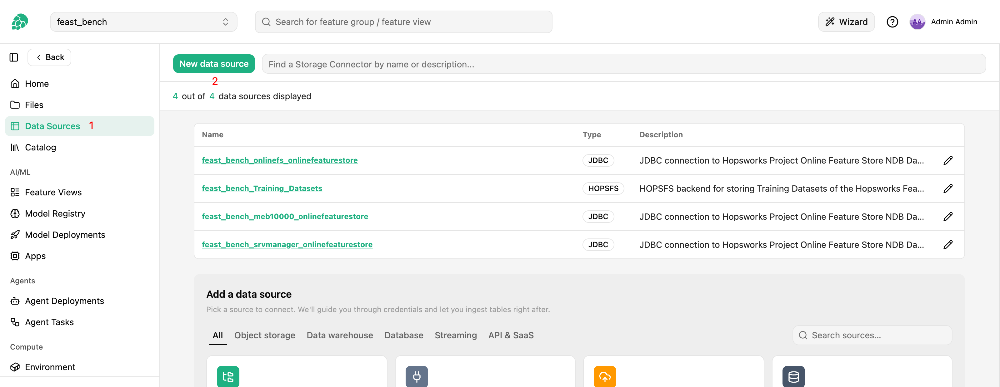

# Data Source Guides

You can define data sources in Hopsworks for batch and streaming data sources.
Data Sources securely store the authentication information about how to connect to an external data store.
They can be used from programs within Hopsworks or externally.

!!!warning

    In the previous versions of Hopsworks, this used to be called a storage connector.

There are four main use cases for Data Sources:

- Simply use it to read data from the storage into a dataframe.
- [External (on-demand) Feature Groups](../../../concepts/fs/feature_group/external_fg.md) can be defined with data sources.
  This way, Hopsworks stores only the metadata about the features, but does not keep a copy of the data itself.
  This is also called the Connector API.
- Write [training data](../../../concepts/fs/feature_view/offline_api.md) to an external storage system to make it accessible by third parties.
- Managed [feature group](../../../user_guides/fs/feature_group/create.md) that stores offline data in an external storage system.
  Currently [S3](../data_source/creation/s3.md), [GCS](../data_source/creation/gcs.md) and [AWS Glue](../data_source/creation/glue.md) connectors are supported.

Data Sources provide two main mechanisms for authentication: using credentials or an authentication role (IAM Role on AWS or Managed Identity on Azure).
Hopsworks supports both a single IAM role (AWS) or Managed Identity (Azure) for the whole Hopsworks cluster or multiple IAM roles (AWS) or Managed Identities (Azure) that can only be assumed by users with a specific role in a specific project.

By default, each project is created with three default Data Sources: A JDBC connector to the online feature store, a HopsFS connector to the Training Datasets directory of the project and a JDBC connector to the offline feature store.

<figure markdown>
  
  <figcaption>The Data Source View in the User Interface</figcaption>
</figure>

## Cloud Agnostic

Cloud agnostic storage systems:

-   :simple-snowflake:{ .lg .middle style="color:#29B5E8" } **Snowflake**

    ---

    Query Snowflake databases and tables using SQL.

    [:octicons-arrow-right-24: Configure](creation/snowflake.md)

-   :simple-apachekafka:{ .lg .middle } **Kafka**

    ---

    Read from a Kafka cluster into a Spark Structured Streaming Dataframe.

    [:octicons-arrow-right-24: Configure](creation/kafka.md)

-   :simple-sap:{ .lg .middle style="color:#0FAAFF" } **SAP HANA**

    ---

    Query SAP HANA tenant databases using SQL.

    [:octicons-arrow-right-24: Configure][data-source-sap-hana]

-   :material-database:{ .lg .middle style="color:var(--hops-accent-text)" } **JDBC**

    ---

    Connect to any JDBC compatible database and query it using SQL.

    [:octicons-arrow-right-24: Configure](creation/jdbc.md)

-   :material-api:{ .lg .middle style="color:var(--hops-accent-text)" } **REST API**

    ---

    Connect to external HTTP APIs with configurable headers and authentication.

    [:octicons-arrow-right-24: Configure](creation/rest_api.md)

-   :material-chart-box-outline:{ .lg .middle style="color:var(--hops-accent-text)" } **CRM, Sales & Analytics**

    ---

    Connect to supported CRM, sales, and analytics platforms.

    [:octicons-arrow-right-24: Configure](creation/crm_sales_analytics.md)

-   :material-folder-network-outline:{ .lg .middle style="color:var(--hops-accent-text)" } **HopsFS**

    ---

    Connect and read from directories of Hopsworks' internal file system.

    [:octicons-arrow-right-24: Configure](creation/hopsfs.md)

## AWS

For AWS the following storage systems are supported:

-   :fontawesome-brands-aws:{ .lg .middle style="color:#FF9900" } **S3**

    ---

    Read file-based storage in S3 such as parquet or CSV.

    [:octicons-arrow-right-24: Configure](creation/s3.md)

-   :fontawesome-brands-aws:{ .lg .middle style="color:#FF9900" } **AWS Glue**

    ---

    Integrate with the Glue Data Catalog over S3, for Iceberg, Delta, Hudi and plain files.

    [:octicons-arrow-right-24: Configure](creation/glue.md)

-   :fontawesome-brands-aws:{ .lg .middle style="color:#FF9900" } **Redshift**

    ---

    Query Redshift databases and tables using SQL.

    [:octicons-arrow-right-24: Configure](creation/redshift.md)

-   :fontawesome-brands-aws:{ .lg .middle style="color:#FF9900" } **RDS (SQL)**

    ---

    Query the Amazon Relational Database Service using SQL.

    [:octicons-arrow-right-24: Configure](creation/sql.md)

## Azure

For Azure the following storage systems are supported:

-   :material-microsoft-azure:{ .lg .middle style="color:#0078D4" } **ADLS**

    ---

    Read file-based storage in ADLS such as parquet or CSV.

    [:octicons-arrow-right-24: Configure](creation/adls.md)

## GCP

For GCP the following storage systems are supported:

-   :simple-googlebigquery:{ .lg .middle style="color:#4285F4" } **BigQuery**

    ---

    Query BigQuery databases and tables using SQL.

    [:octicons-arrow-right-24: Configure](creation/bigquery.md)

-   :simple-googlecloudstorage:{ .lg .middle style="color:#4285F4" } **GCS**

    ---

    Read file-based storage in Google Cloud Storage such as parquet or CSV.

    [:octicons-arrow-right-24: Configure](creation/gcs.md)

## Databricks (AWS only)

For Databricks **on AWS** the following storage systems are supported:

-   :simple-databricks:{ .lg .middle style="color:#FF3621" } **Unity Catalog**

    ---

    Browse catalogs, schemas, and Delta tables, and mount them as external feature groups.

    [:octicons-arrow-right-24: Configure](creation/unity_catalog.md)

Databricks on Azure and Databricks on GCP are not supported yet. See the [Unity Catalog guide](creation/unity_catalog.md) for the specific reasons and the status of follow-up work.

## Next Steps

Move on to the [Configuration and Creation Guides](creation/jdbc.md) to learn how to set up a data source.
