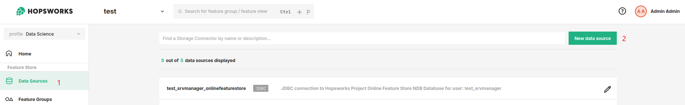

# Data Source Guides

You can define data sources in Hopsworks for batch and streaming data sources. Data Sources securely store the authentication information about how to connect to an external data store. They can be used from programs within Hopsworks or externally.

!!!warning

    In previous version of hopsworks this used to be called a storage connector.

There are four main use cases for Data Sources:

- Simply use it to read data from the storage into a dataframe.
- [External (on-demand) Feature Groups](../../../concepts/fs/feature_group/external_fg.md) can be defined with data sources. This way, Hopsworks stores only the metadata about the features, but does not keep a copy of the data itself. This is also called the Connector API.
- Write [training data](../../../concepts/fs/feature_view/offline_api.md) to an external storage system to make it accessible by third parties.
- Manage [feature group](../../../user_guides/fs/feature_group/create.md) that stores offline data in an external storage system.

Data Sources provide two main mechanisms for authentication: using credentials or an authentication role (IAM Role on AWS or Managed Identity on Azure). Hopsworks supports both a single IAM role (AWS) or Managed Identity (Azure) for the whole Hopsworks cluster or multiple IAM roles (AWS) or Managed Identities (Azure) that can only be assumed by users with a specific role in a specific project.

By default, each project is created with three default Data Sources: A JDBC connector to the online feature store, a HopsFS connector to the Training Datasets directory of the project and a JDBC connector to the offline feature store.

<figure markdown>
  
  <figcaption>The Data Source View in the User Interface</figcaption>
</figure>

## Cloud Agnostic

Cloud agnostic storage systems:

1. [JDBC](creation/jdbc.md): Connect to JDBC compatible databases and query them using SQL.
2. [Snowflake](creation/snowflake.md): Query Snowflake databases and tables using SQL.
3. [Kafka](creation/kafka.md): Read data from a Kafka cluster into a Spark Structured Streaming Dataframe.
4. [HopsFS](creation/hopsfs.md): Easily connect and read from directories of Hopsworks' internal File System.

## AWS

For AWS the following storage systems are supported:

1. [S3](creation/s3.md): Read data from a variety of file based storage in S3 such as parquet or CSV.
2. [Redshift](creation/redshift.md): Query Redshift databases and tables using SQL.

## Azure

For AWS the following storage systems are supported:

1. [ADLS](creation/adls.md): Read data from a variety of file based storage in ADLS such as parquet or CSV.

## GCP

For GCP the following storage systems are supported:

1. [BigQuery](creation/bigquery.md): Query BigQuery databases and tables using SQL.
2. [GCS](creation/gcs.md): Read data from a variety of file based storage in Google Cloud Storage such as parquet or CSV.

## Next Steps

Move on to the [Configuration and Creation Guides](creation/jdbc.md) to learn how to set up a data source.