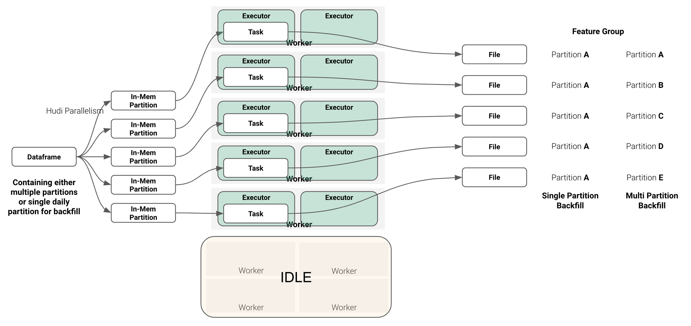

# How to create a Feature Group 

### Introduction

In this guide you will learn how to create and register a feature group with Hopsworks. This guide covers creating a feature group using the HSFS APIs as well as the user interface.

## Prerequisites

Before you begin this guide we suggest you read the [Feature Group](../../../concepts/fs/feature_group/fg_overview.md) concept page to understand what a feature group is and how it fits in the ML pipeline.

## Create using the HSFS APIs

To create a feature group using the HSFS APIs, you need to provide a Pandas, Polars or Spark DataFrame. The DataFrame will contain all the features you want to register within the feature group, as well as the primary key, event time and partition key.

### Create a Feature Group 

The first step to create a feature group is to create the API metadata object representing a feature group. Using the HSFS API you can execute:

#### Batch Write API

=== "PySpark"

    ```python
    fg = feature_store.create_feature_group(name="weather",
        version=1,
        description="Weather Features",
        online_enabled=True,
        primary_key=['location_id'],
        partition_key=['day'],
        event_time='event_time',
        time_travel_format='DELTA',
    )
    ```

The full method documentation is available [here](https://docs.hopsworks.ai/feature-store-api/{{{ hopsworks_version }}}/generated/api/feature_group_api/#featuregroup). If you need to create a feature group with vector similarity search supported, refer to [this guide](../vector_similarity_search.md#extending-feature-groups-with-similarity-search). `name` is the only mandatory parameter of the `create_feature_group` and represents the name of the feature group. 

In the example above we created the first version of a feature group named *weather*, we provide a description to make it searchable to the other project members, as well as making the feature group available online. 

Additionally we specify which columns of the DataFrame will be used as primary key, partition key and event time. Composite primary key and multi level partitioning is also supported. 

The version number is optional, if you don't specify the version number the APIs will create a new version by default with a version number equals to the highest existing version number plus one. 

The last parameter used in the examples above is `stream`. The `stream` parameter controls whether to enable the streaming write APIs to the online and offline feature store. When using the APIs in a Python environment this behavior is the default and it requires the time travel format to be set to 'HUDI'.  

##### Primary key

A primary key is required when using the default table format (Hudi) to store offline feature data. When inserting data in a feature group on the offline feature store, the DataFrame you are writing is checked against the existing data in the feature group. If a row with the same primary key is found in the feature group, the row will be updated. If the primary key is not found, the row is appended to the feature group.
When writing data on the online feature store, existing rows with the same primary key will be overwritten by new rows with the same primary key.

##### Event time

The event time column represents the time at which the event was generated. For example, with transaction data, the event time is the time at which a given transaction happened. 
In the context of feature pipelines, the event time is often also the end timestamp of the interval of events included in the feature computation. For example, computing the feature "number of purchases by customer last week", the event time should be the last day of this "last week" window.

The event time is added to the primary key when writing to the offline feature store. This will make sure that the offline feature store has the entire history of feature values over time. As an example, if a user has made multiple purchases on a website, each of the purchases for a given user (identified by a user_id) will be saved in the feature group, with each purchase having a different event time (the combination of user_id and event_time makes up the primary key for the offline feature store).

The event time **is not** part of the primary key when writing to the online feature store. This will ensure that the online feature store has the most recent version of the feature vector for each primary key.

!!!note "Event time data type restriction"
    The supported data types for the event time column are: `timestamp`, `date` and `bigint`.

##### Partition key

It is best practice to add a partition key. When you specify a partition key, the data in the feature group will be stored under multiple directories based on the value of the partition column(s).
All the rows with a given value as partition key will be stored in the same directory. 

Choosing the correct partition key has significant impact on the query performance as the execution engine (Spark) will be able to skip listing and reading files belonging to partitions which are not included in the query. 
As an example, if you have partitioned your feature group by day and you are creating a training dataset that includes only the last year of data, Spark will read only 365 partitions and not the entire history of data.
On the other hand, if the partition key is too fine grained (e.g. timestamp at millisecond resolution) - a large number of small partitions will be generated. This will slow down query execution as Spark will need to list and read a large amount of small directories/files.

If you do not provide a partition key, all the feature data will be stored as files in a single directory.
The system has a limit of 10240 direct children (files or other subdirectories) per directory. This means that, as you add new data to a non-partitioned feature group, new files will be created and you might reach the limit. If you do reach the limit, your feature engineering pipeline will fail with the following error:

```sh
MaxDirectoryItemsExceededException - The directory item limit is exceeded: limit=10240 items=10240
```

By using partitioning the system will write the feature data in different subdirectories, thus allowing you to write 10240 files per partition.

##### Table format

When you create a feature group, you can specify the table format you want to use to store the data in your feature group by setting the `time_travel_format` parameter. The currently support values are "HUDI", "DELTA", "NONE" (which defaults to Parquet). 

##### Storage connector

During the creation of a feature group, it is possible to define the `storage_connector` parameter, this allows for management of offline data in the desired table format outside the Hopsworks cluster. Currently, only [S3](../storage_connector/creation/s3.md) connectors and "DELTA" `time_travel_format` format is supported.

##### Online Table Configuration

When defining online-enabled feature groups it is also possible to configure the online table. You can specify [table options](https://docs.rondb.com/table_options/#table-options) by providing comments. Additionally, it is also possible to define whether online data is stored in memory or on disk using [table space](https://docs.rondb.com/disk_columns/#disk-columns).

The code example shows the creation of an online-enabled feature group that stores online data on disk using `ts_1` table space and sets several table properties in the comment section.

```
fg = fs.create_feature_group(
    name='air_quality',
    description='Air Quality characteristics of each day',
    version=1,
    primary_key=['city','date'],
    online_enabled=True,
    online_config={'table_space': 'ts_1', 'online_comments': ['NDB_TABLE=READ_BACKUP=1', 'NDB_TABLE=PARTITION_BALANCE=FOR_RP_BY_LDM_X_2']}
)
```

!!! note Table Space
    The table space needs to be provisioned at system level before it can be used. You can do so by adding the following parameters to the values.yaml file used for your deployment with the Helm Charts:

    ```yaml
    rondb:
      resources:
        requests:
          storage:
            diskColumnGiB: 2
    ```


#### Streaming Write API

As explained above, the stream parameter controls whether to enable the streaming write APIs to the online and offline feature store.
For Python environments, only the stream API is supported (stream=True).

=== "Python"

    ```python
    fg = feature_store.create_feature_group(name="weather",
        version=1,
        description="Weather Features",
        online_enabled=True,
        primary_key=['location_id'],
        partition_key=['day'],
        event_time='event_time'
        time_travel_format='HUDI',
    )
    ```

=== "PySpark"

    ```python
    fg = feature_store.create_feature_group(name="weather",
        version=1,
        description="Weather Features",
        online_enabled=True,
        primary_key=['location_id'],
        partition_key=['day'],
        event_time='event_time',
        time_travel_format='HUDI',
        stream=True
    )
    ```

When using the streaming API, the data will be written directly to the online storage (if `online_enabled=True`). However, you can control when the sync to
the offline storage is going to happen. You can do it synchronously after every call to `fg.insert()`, which is the default. Often, you defer writes to a later point in order to batch together multiple writes to the offline storage (useful to reduce the overhead of many small writes):

```python
# run multiple inserts without starting the offline materialization job
job, _ = fg.insert(df1, write_options={"start_offline_materialization": False})
job, _ = fg.insert(df2, write_options={"start_offline_materialization": False})
job, _ = fg.insert(df3, write_options={"start_offline_materialization": False})

# start the materialization job for all three inserts
# note the job object is always the same, you don't need to call it three times
job.run()
```

It is also possible to define the topics used for data ingestion, this can be done by setting the `topic_name` parameter with your preferred value.
By default, feature groups in hopsworks will share a project-wide topic.

#### Best Practices for Writing

When designing a feature group, it is worth taking a look at how this feature group will be queried in the future, in order to optimize it for those query patterns.
At the same time, Spark and Hudi tend to overpartition writes, creating too many small parquet files, which is inefficient and slows down writes.
But they also slow down queries, because file listings take more time and reading many small files is slower than fewer larger files.
The best practices described in this section hold both for the Streaming API and the Batch API.

Four main considerations influence the write and the query performance:

1. Partitioning on a feature group level
2. Parquet file size within a feature group partition
3. Backfilling of feature group partitions
4. The choice of topic for data ingestion

##### Partitioning on a feature group level

**Partitioning on the feature group level** allows Hopsworks and the table format (Hudi or Delta) to push down filters to the filesystem when reading from feature groups. In practice that means, less directories need to be listed and less files need to be read, speeding up queries.

For example, most commonly, filtering is done on the event time column of a feature group when generating training data or batches of data:
```python
query = fg.select_all()

# create a simple feature view
fv = fs.create_feature_view(
    name='transactions_view',
    query=query
)

# set up dates
start_time = "2022-01-01"
end_time = "2022-06-30"

# create a training dataset
version, job = feature_view.create_training_data(
    start_time=start_time,
    end_time=end_time,
    description='Description of a dataset',
)
```

Assuming the feature group was partitioned by a daily event time column, for example, the features are updated with a daily batch job, the feature store will only have to
list and read the files in the directories of those six months that are being queried.

!!! danger "Too granular event time columns"
    An event time column which is too granular, such as a timestamp, shouldn't be used as partition key.
    For example, a streaming pipeline generating features where the event time includes seconds, and therefore almost all
    event timestamps are unique can lead to many partition directories and small files, each of which contains only a few number of rows,
    which are inefficient to query even with pushed down filters.

    A good practice are partition keys with at most daily granularity, if they are based on time.
    Additionally, one can look at the size of a partition directory, which should be in the 100s of MB.

Additionally, if you are commonly training models for different categories of your data, you can add another level of partitioning for this. That is, if the query contains
an additional filter:
```python
query = fg.select_all().filter(fg.country_code == "US")
```

The feature group can be created with the following partition key in order to push down filters also for the `country_code` category:
```python
fg = feature_store.create_feature_group(...
    partition_key=['day', 'country_code'],
    event_time='day',
)
```

##### Parquet file size within a feature group partition

Once you have decided on the feature group level partitioning and you start inserting data to the feature group, there are multiple ways in order to
influence how the table format (Hudi or Delta) will **split the data between parquet files within the feature group partitions**.
The two things that influence the number of parquet files per partition are

1. The number of feature group partitions written in a single insert
2. The shuffle parallelism used by the table format

For example, the inserted dataframe (unique combination of partition key values) will be parallelized according to the following Hudi settings:
!!! example "Default Hudi partitioning"
    ```python
    write_options = {
        'hoodie.bulkinsert.shuffle.parallelism': 5,
        'hoodie.insert.shuffle.parallelism': 5,
        'hoodie.upsert.shuffle.parallelism': 5
    }
    ```
That means, using Spark, Hudi shuffles the data into five in-memory partitions, which each fill map to a task and finally a parquet file (see figure below).
If the inserted Dataframe contains only a single feature group partition, this feature group partition will be written with five parquet files.
If the inserted Dataframe contains multiple feature group partitions, the parquet files will be split among those partition, potentially more parquet files will be added.

<figure markdown>
  
  <figcaption>Mapping in-memory partitions to tasks, workers, executors and feature group partition files for a feature group insert</figcaption>
</figure>

!!! tip "Setting shuffle parallelism"
    In practice that means the shuffle parallelism should be set equal to the number of feature group partitions in the inserted dataframe.
    This will create one parquet file per feature group partition, which in many cases is optimal.

    Theoretically, this rule holds up to a partition size of 2GB, which is the limit of Spark. However, one should bump this up accordingly already for smaller inputs.
    We recommend having shuffle parallelism `hoodie.[insert|upsert|bulkinsert].shuffle.parallelism` such that its at least input_data_size/500MB.

    You can change the write options on every insert, depending also on the size of the data you are writing:
    ```python
    write_options = {
        'hoodie.bulkinsert.shuffle.parallelism': 5,
        'hoodie.insert.shuffle.parallelism': 5,
        'hoodie.upsert.shuffle.parallelism': 5
    }
    fg.insert(df, write_options=write_options)
    ```

##### Backfilling of feature group partitions

Hudi scales well with the number of partitions to write, when performing backfilling of old feature partitions, meaning moving backwards in time with the event-time,
it makes sense to **batch those feature group partitions** together into a single `fg.insert()` call. As shown in the figure above, the number of utilised executors you choose for the insert
depends highly on the number of partitions and shuffle parallelism you are writing. So by writing multiple feature group partitions in a single insert, you can scale up your Spark application
and fully utilise the workers.
In that case you can increase the Hudi shuffle parallelism accordingly.

!!! danger "Concurrent feature group inserts"
    Hopsworks 3.1 and earlier, currently does not support concurrent inserts to feature groups.
    This means that if your feature pipeline writes to one feature group partition at a time,
    you cannot run it multiple times in parallel for backfilling.

    The recommended approach is to unionise the dataframes and insert them with a single `fg.insert()` instead.
    For clients that write with the Stream API, it is enough to defer starting the backfill job until after multiple inserts,
    [as described above](#streaming-write-api).

##### The choice of topic for data ingestion

When creating a feature group that uses streaming write APIs for data ingestion it is possible to define the Kafka topics that should be utilized.
The default approach of using a project-wide topic functions great for use cases involving little to no overlap when producing data. However,
concurrently inserting into multiple feature groups could cause read amplification for the offline materialization job (e.g., Hudi Delta Streamer). Therefore, it is
advised to utilize separate topics when ingestions overlap or there is a large frequently running insertion into a specific feature group.

### Register the metadata and save the feature data

The snippet above only created the metadata object on the Python interpreter running the code. To register the feature group metadata and to save the feature data with Hopsworks, you should invoke the `insert` method:

```python 
fg.insert(df)
```

The save method takes in input a Pandas, Polars or Spark DataFrame. HSFS will use the DataFrame columns and types to determine the name and types of features, primary key, partition key and event time. 

The DataFrame *must* contain the columns specified as primary keys, partition key and event time in the `create_feature_group` call.

If a feature group is online enabled, the `insert` method will store the feature data to both the online and offline storage.

### API Reference 

[FeatureGroup](https://docs.hopsworks.ai/feature-store-api/{{{ hopsworks_version }}}/generated/api/feature_group_api/#featuregroup)

## Create using the UI

You can also create a new feature group through the UI. For this, navigate to the `Feature Groups` section and press the `Create` button at the top-right corner.

<p align="center">
  <figure>
    
  </figure>
</p>

Subsequently, you will be able to define its properties (such as name, mode, features, and more). Refer to the documentation above for an explanation of the parameters available, they are the same as when you create a feature group using the SDK. Finally, complete the creation by clicking `Create New Feature Group` at the bottom of the page.

<p align="center">
  <figure>
    
  </figure>
</p>
