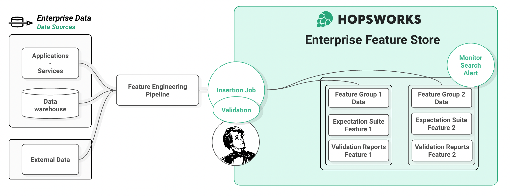

# Data Validation

<figure markdown>
  
  <figcaption>Validation on Insertion with Hopsworks and Great Expectations.</figcaption>
</figure>

## Introduction

Clean, high quality feature data is of paramount importance to being able to train and serve high quality models. Hopsworks offers integration with [Great Expectations](https://greatexpectations.io/) to enable a smooth data validation workflow. This guide is designed to help you integrate a data validation step when inserting new DataFrames into a Feature Group. Note that validation is performed inline as part of your feature pipeline (on the client machine) - it is not executed by Hopsworks after writing features.

## UI

### Create a Feature Group (Pre-requisite)

In the UI, you must create a Feature Group first before attaching an Expectation Suite. You can find out more information about creating a Feature Group [here](create.md). You can attach at most one expectation suite to a Feature Group. Data validation is an optional step and is not required to write to a Feature Group.

### Step 1: Find and Edit Feature Group

Click on the Feature Group section in the navigation menu. Find your Feature Group in the list and click on its name to access the Feature Group page. Select `edit` in the top right corner or scroll to the Expectations section and click on `Edit Expectation Suite`.

### Step 2: Edit General Expectation Suite Settings

Scroll to the Expectation Suite section. Click add Expectation Suite and edit its metadata:

- Choose a name for your expectation suite.
- Checkbox enabled. This controls whether the Expectation Suite will be used to validate a Dataframe automatically upon insertion into a Feature Group. Note that validation is executed by the client. Disabling validation allows you to skip the validation step without deleting the Expectation Suite.
- 'ALWAYS' vs. 'STRICT' mode. This option controls what happens after validation. Hopsworks defaults to 'ALWAYS', where data is written to the Feature Group regardless of the validation result. This means that even if expectations are failing or throw an exception, Hopsworks will attempt to insert the data into the Feature Group. In 'STRICT' mode, Hopsworks will only write data to the Feature Group if each individual expectation has been successful.

### Step 3: Add new expectations

By clicking on `Add expectation` one can choose an expectation type from a searchable dropdown menu. Currently, only the built-in expectations from the Great Expectations framework are supported. For user-defined expectations, please use the Rest API or python client.

All default kwargs associated to the selected expectation type are populated as a json below the dropdown menu. Edit the arguments in the json to configure the Expectation. In particular, arguments such as `column`, `columnA`, `columnB`, `column_set` and `column_list` require valid feature name(s). Click the tick button to save the expectation configuration and append it to the Expectation Suite locally.

!!! info
	Click the `Save feature group` button to persist your changes!

You can use the button `Clear Expectation Suite` to clean up before saving changes if you changed your mind. If the Expectation Suite is already registered, it will instead show a button to delete the Expectation Suite.

### Step 4: Save new data to a Feature Group

Use the python client to write a DataFrame to the Feature Group. Note that if an expectation suite is enabled for a Feature Group, calling the `insert` method will run validation and default to uploading the corresponding validation report to Hopsworks. The report is uploaded even if validation fails and 'STRICT' mode is selected.

### Step 5: Check Validation Results Summary

Hopsworks shows a visual summary of validation reports. To check it out, go to your Feature Group overview and scroll to the expectation section. Click on the `Validation Results` tab and check that all went according to plan. Each row corresponds to an expectation in the suite. Features can have several corresponding expectations and the same type of expectation can be applied to different features.

You can navigate to older reports using the dropdown menu. Should you need more than the information displayed in the UI for e.g., debugging, the full report can be downloaded by clicking on the corresponding button.

### Step 6: Check Validation History

The `Validation Reports` tab in the Expectations section displays a brief history of recent validations. Each row corresponds to a validation report, with some summary information about the success of the validation step. You can download the full report by clicking the download icon button that appears at the end of the row.

## Code

Hopsworks python client interfaces with the Great Expectations library to enable you to add data validation to your feature engineering pipeline. In this section, we show you how in a single line you enable automatic validation on each insertion of new data into your Feature Group. Whether you have an existing Feature Group you want to add validation to or Follow the guide or get your hands dirty by running our [tutorial data validation notebook](https://colab.research.google.com/github/logicalclocks/hopsworks-tutorials/blob/master/integrations/great_expectations/fraud_batch_data_validation.ipynb) in google colab.

First checkout the pre-requisite and hospworks setup to follow the guide below. Create a project, install the hopsworks client and connect via the generated API key. You are ready to load your data in a DataFrame. The second step is a short introduction to the relevant Great Expectations API to build data validation suited to your data. Third and final step shows how to attach your Expectation Suite to the Feature Group to benefit from automatic validation on insertion capabilities.

### Step 1: Pre-requisite

In order to define and validate an expectation when writing to a Feature Group, you will need:

- A Hopsworks project. If you don't have a project yet you can go to [managed.hopsworks.ai](https://managed.hopsworks.ai), signup with your email and create your first project.
- An API key, you can get one by following the instructions [here](../../../setup_installation/common/api_key.md)
- The [hopsworks python library](../../client_installation/index.md) installed in your client

#### Connect your notebook to Hopsworks

Connect the client running your notebooks to Hopsworks.

```python3
import hopsworks

project = hopsworks.login()

fs = project.get_feature_store()
```

You will be prompt to paste your API key to connect the notebook to your project. The `fs` Feature Store entity is now ready to be used to insert or read data from Hopsworks.

#### Import your data

Load your data in a DataFrame using the usual pandas API.

```python3
import pandas as pd

df = pd.read_csv("https://repo.hops.works/master/hopsworks-tutorials/data/card_fraud_data/transactions.csv", parse_dates=["datetime"])

df.head(3)
```

### Step 2: Great Expectation Introduction

To validate the data, we will use the [Great Expectations](https://greatexpectations.io/) library. Below is a short introduction on how to build an Expectation Suite to validate your data. Everything is done using the Great Expectations API so you can re-use any prior knowledge you may have of the library.

#### Create an Expectation Suite

Create (or import an existing) expectation suite using the Great Expectations library. This suite will hold all the validation tests we want to perform on our data before inserting them into Hopsworks.

```python3
import great_expectations as ge

expectation_suite = ge.core.ExpectationSuite(
    expectation_suite_name="validate_on_insert_suite"
)
```

#### Add Expectations in the Source Code

Add some expectation to your suite. Each expectation configuration corresponds to a validation test to be run against your data.

```python3
expectation_suite.add_expectation(
    ge.core.ExpectationConfiguration(
        expectation_type="expect_column_min_to_be_between",
        kwargs={
            "column": "foo_id",
            "min_value": 0,
            "max_value": 1
        }
    )
)

expectation_suite.add_expectation(
    ge.core.ExpectationConfiguration(
        expectation_type="expect_column_value_lengths_to_be_between",
        kwargs={
            "column": "bar_name",
            "min_value": 3,
            "max_value": 10
        }
    )
)
```

#### Using Great Expectations Profiler

Building Expectation Suite by hand can be a major time commitment when you have dozens of Features. Great Expectations offers `Profiler` classes to inspect a sample of your data and infers a suitable Expectation Suite that you will be able to register with Hopsworks.

```python3
ge_profiler = ge.profile.BasicSuiteBuilderProfiler()
expectation_suite_profiler, _ = ge_profiler.profile(ge.from_pandas(df))
```

Once you have built an Expectation Suite you are satisfied with, it is time to create your first validation enabled Feature Group.

### Step 3: Attach an Expectation Suite to your Feature Group to enable Automatic Validation on Insertion.

Writing data in Hopsworks is done using Feature Groups. Once a Feature Group is registered in the Feature Store, you can use it to insert your pandas DataFrames. For more information see [create Feature Group](create.md). To benefit from automatic validation on insertion, attach your newly created Expectation Suite when creating the Feature Group:

```python3
fg = fs.create_feature_group(
  "fg_with_data_validation",
  version=1,
  description="Validated data",
  primary_key=['foo_id'],
  online_enabled=False
  expectation_suite=expectation_suite
)
```

or, if the Feature Group already exist, you can simply run:

```python3
fg.save_expectation-suite(expectation_suite)
```

That is all there is to it. Hopsworks will now automatically use your suite to validate the DataFrames you want to write to the Feature Group. Try it out!

```python3
job, validation_report = fg.insert(df.head(5))
```

As you can see, Hopsworks runs the validation in the client before attempting to insert the data. By default, Hopsworks will try to insert the data even if validation fails to prevent data loss. However it can be configured for production setup to be more restrictive, checkout the [data validation advanced guide](advanced_data_validation.md).

!!!info
	Note that once the Expectation Suite is attached to the Feature Group, any subsequent attempt to insert to this Feature Group will apply the Data Validation step even from a different client or in a scheduled job.

### Step 4: Data Quality Monitoring

Upon running validation, Great Expectations generates a report to help you assess the quality of your data. Nothing to do here, Hopsworks client automatically uploads the validation report to the backend when ingesting new data. It enables you to monitor the quality of the inserted data in the Feature Group over time.

You can checkout a summary of the reports in the UI on your Feature Group page. As you can see, your Feature Group conveniently gather all in one place: your data, the Expectation Suite and the reports generated each time you inserted data!

Hopsworks client API allows you to retrieve validation reports for further analysis.

```python3
# load multiple reports
validation_reports = fg.get_validation_reports()

# convenience method for rapid development
ge_latest_report = fg.get_latest_validation_report()
```

Similarly you can retrieve the historic of validation results for a particular expectation, e.g to plot a time-series of a given expectation observed value over time.

```python3
validation_history = fg.get_validation_history(
    expectationId=1
)
```

You can find the expectationIds in the UI or using `fg.get_expectation_suite` and looking it up in the expectation's meta field.

!!! info
	If Validation Reports or Results are too long, they can be truncated to fit in the database. A full version of the reports can be downloaded from the UI.

## Conclusion

The integration between Hopsworks and Great Expectations makes it simple to add a data validation step to your feature engineering pipeline. Build your Expectation Suite and attach it to your Feature Group with a single line of code. No need to add any code to your pipeline or job scripts, calling `fg.insert` will now automatically validate the data before inserting them in the Feature Group. The validation reports are stored along your data in Hopsworks allowing us to provide basic monitoring capabilities to quickly spot a data quality issue in the UI.

## Going further

If you wish to find out more about how to use the data validation API or best practices for development or production pipelines in Hopsworks, checkout the [advanced guide](advanced_data_validation.md).
