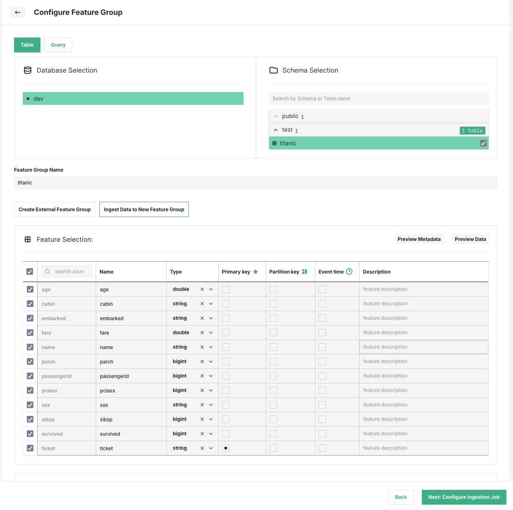
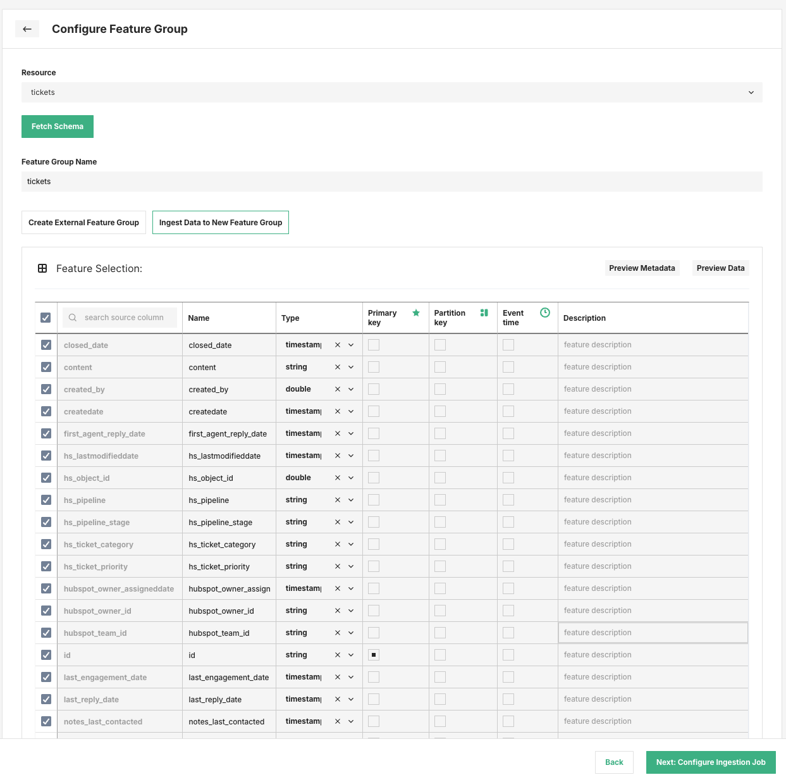
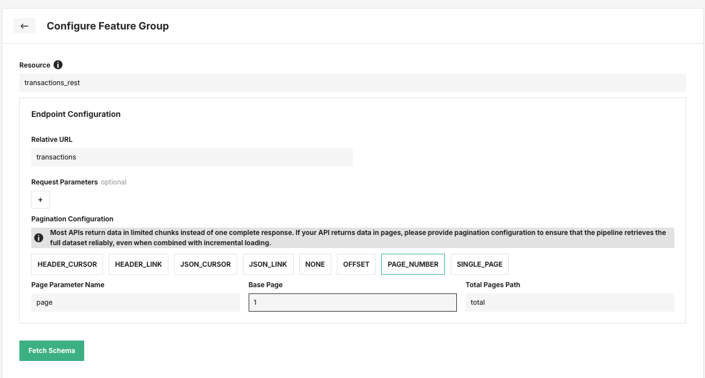
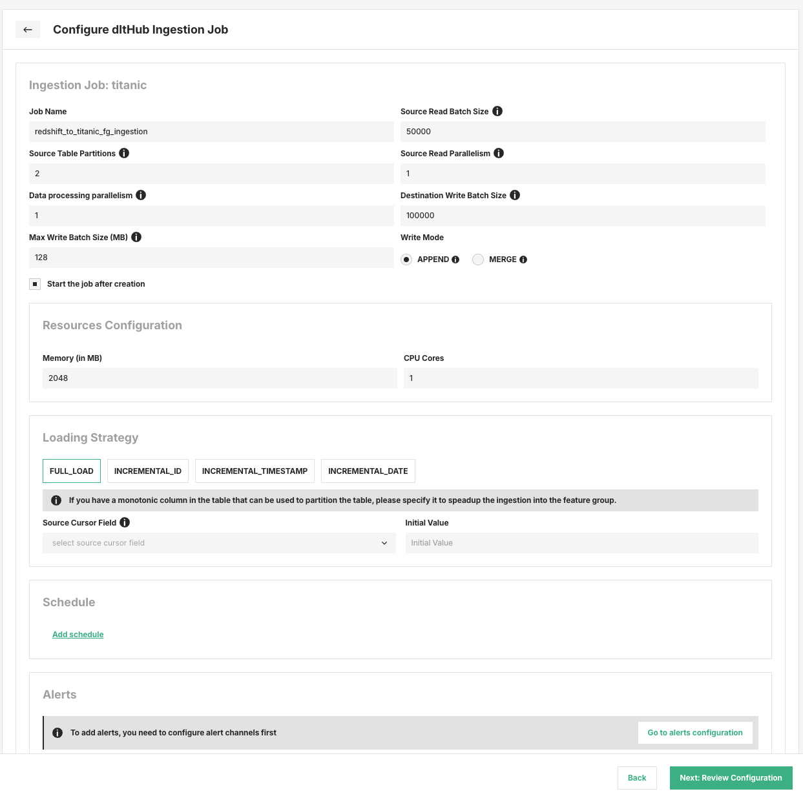
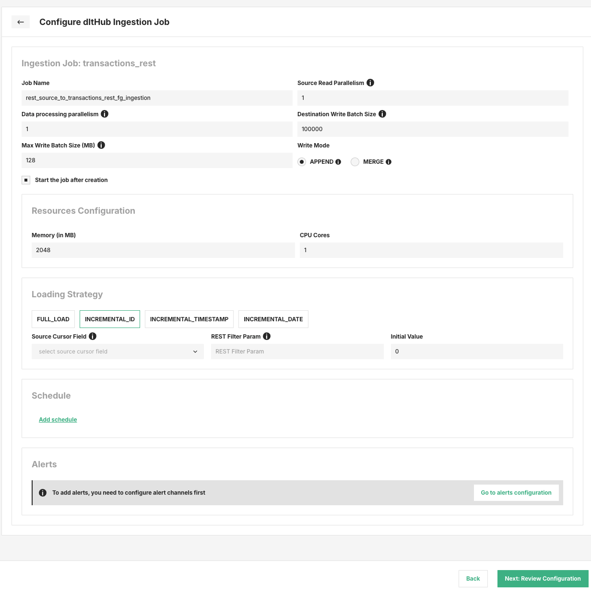
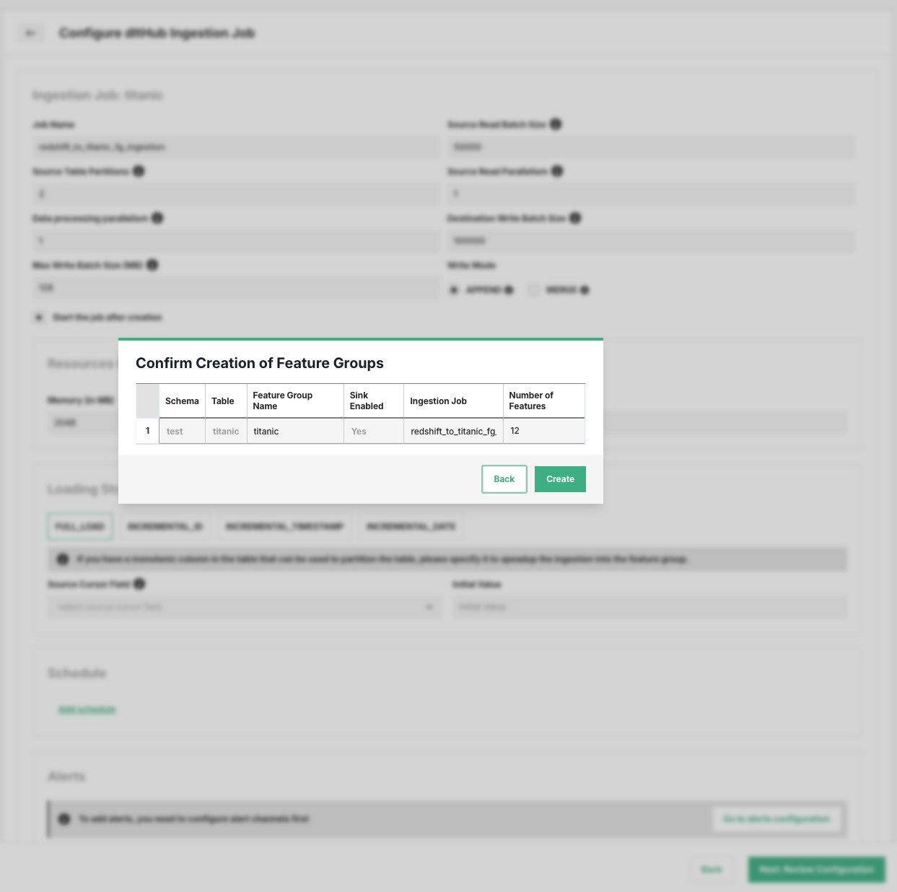

# How to ingest data into a Feature Group with dltHub { #ingest-data-with-dlthub }

## Introduction

Hopsworks can copy data from an existing data source into a new managed feature group using dltHub.
This workflow creates:

- A new feature group in Hopsworks.
- An ingestion job that copies data from the selected source into that feature group.

This is different from creating an external feature group.
An external feature group keeps the data in the source system, while the dltHub ingestion flow copies the data into Hopsworks.

!!! note
    You can configure this workflow both in the Hopsworks UI and with the Hopsworks Python APIs.

## When to use this workflow

Use `Ingest Data to New Feature Group` when you want to:

- Copy data from source into Hopsworks.
- Schedule recurring ingestion jobs.
- Use incremental loading for supported source types.

## Supported source types

This ingestion flow supports multiple data sources:

- SQL-like sources can either create an external feature group or ingest data into a new feature group.
- CRM and REST API sources use the ingestion path only.
- Incremental loading is available for SQL and REST API sources.
- CRM sources currently use full-load ingestion.

## Step 1: Open the Data Source and start Feature Group creation

Navigate to the data source you want to use and start the feature-group creation flow from the UI.

For SQL-based sources, select a database object first and then choose `Ingest Data to New Feature Group`.

<figure markdown>
  
  <figcaption>Select a source table and choose Ingest Data to New Feature Group</figcaption>
</figure>

For CRM sources, choose the source resource and then configure the feature schema for the new feature group.

<figure markdown>
  
  <figcaption>Select a CRM resource and configure the feature group schema</figcaption>
</figure>

For REST API sources, first configure the endpoint before fetching the schema.

### REST endpoint pagination

REST sources require endpoint configuration up front so Hopsworks can fetch the schema correctly.
In this step, define:

- **Resource**: Any unique identifier for the endpoint.
- **Relative URL**: The endpoint path relative to the configured REST data source base URL.
- **Request Parameters**: Optional query parameters sent with the request.
- **Pagination Configuration**: The pagination mode and its parameters, if the API returns paged results.

The REST pagination form supports these modes:

- `NONE`
- `HEADER_CURSOR`
- `HEADER_LINK`
- `JSON_CURSOR`
- `JSON_LINK`
- `OFFSET`
- `PAGE_NUMBER`
- `SINGLE_PAGE`

For example, `PAGE_NUMBER` pagination exposes:

- **Page Parameter Name**: Name of the request parameter that contains the page number.
- **Base Page**: Starting page number used by the API, for example `0` or `1`.
- **Total Pages Path**: Response path containing the total number of pages.

<figure markdown>
  
  <figcaption>REST API pagination configuration using PAGE_NUMBER</figcaption>
</figure>

Other pagination modes expose their own source-specific fields in the form:

- `OFFSET`: offset parameter name, limit parameter name, limit value, total-items path, and has-more path.
- `JSON_CURSOR`: cursor parameter name and cursor path.
- `HEADER_CURSOR`: cursor header key and cursor path.
- `HEADER_LINK`: next-link header key.
- `JSON_LINK`: next URL path.

For more details on how these pagination strategies work in dltHub, see the [dltHub REST API pagination documentation](https://dlthub.com/docs/dlt-ecosystem/verified-sources/rest_api/basic#pagination).

## Step 2: Configure the feature group schema

After fetching metadata from the source, Hopsworks shows the feature selection table.
At this stage you can:

- Set the **Feature Group Name**.
- Include or exclude columns.
- Edit feature names and data types.
- Mark one or more features as **Primary key**.
- Optionally select a **Partition key**.
- Optionally select an **Event time** column.
- Preview metadata and preview data before continuing.

When you are ready, click `Next: Configure Ingestion Job`.

!!! note
    `Create External Feature Group` is not supported for CRM and REST connectors.

!!! note
    For CRM and REST sources, schema fetching reads only a small sample of records from the source.
    Hopsworks uses this sample to infer the feature-group schema before you create the ingestion job.

## Step 3: Configure the dltHub ingestion job

The next page configures the ingestion job that will populate the feature group.

<figure markdown>
  
  <figcaption>Configure the dltHub ingestion job</figcaption>
</figure>

### Common job settings

The following fields are available in the job configuration:

- **Job Name**: Name of the ingestion job created in Hopsworks.
- **Source Read Parallelism**: Number of parallel readers that pull data from the source database or API. Increase it to speed up ingestion if the source can handle the extra load.
- **Data processing parallelism**: Number of parallel processes that prepare and transform data before loading it into the feature group. Increase it if processing is slow and CPU is available.
- **Destination Write Batch Size**: Number of records written to the feature group in each batch during ingestion.
- **Max Write Batch Size (MB)**: Maximum file size, in megabytes, when writing data to the feature group.
- **Write Mode**: Controls whether incoming data is appended as-is or merged with existing rows using the primary key.
- **Start the job after creation**: Starts the ingestion job immediately after the resources are created.
- **Memory (in MB)**: Memory allocated to the ingestion job.
- **CPU Cores**: CPU cores allocated to the ingestion job.
- **Schedule**: Optional recurring schedule for future ingestion runs.
- **Alerts**: Optional alerting configuration for the ingestion job.

### SQL-only settings

For SQL sources, the job configuration also includes:

- **Source Read Batch Size**: Number of records fetched per read from the SQL source.
- **Source Table Partitions**: Number of partitions used when reading from SQL sources. For very large tables, increase this value to split the read into smaller chunks that fit the allocated memory.

These options control how data is read from the source table during ingestion.

### Write modes

Two write modes are available:

- **APPEND**: Appends new data without merging with existing rows. This greatly speeds up writes and uses less memory, but can result in duplicate rows. If you are ingesting a large amount of data, this is the recommended mode and duplicates can be handled later in a separate pipeline step.
- **MERGE**: Merges incoming data with existing rows using the feature-group primary key. This avoids duplicate rows, but slows down ingestion and requires more memory, especially for large ingestions. Use it when ingesting smaller amounts of data.

## Step 4: Choose a loading strategy

The `Loading Strategy` section controls whether the pipeline reads the entire source or only new data.

The following strategies are available in the UI:

- `FULL_LOAD`
- `INCREMENTAL_ID`
- `INCREMENTAL_TIMESTAMP`
- `INCREMENTAL_DATE`

### Full load

`FULL_LOAD` is available for all sources in this workflow.
With a full load, the ingestion job reads the complete dataset from the source and writes it again to the destination feature group.

In practice, this means the target feature group is refreshed from scratch for the same feature-group name and version.
Any data already stored in that feature group version is removed and replaced by the newly ingested data from the source.

Use `FULL_LOAD` when you want the feature group to be a complete copy of the source at the time of ingestion, rather than an incremental continuation of previous runs.
This is useful when:

- The source does not provide a reliable incremental cursor.
- You want to rebuild the feature group from a clean state.
- The source data can change retroactively and you want to re-sync the full table or endpoint.

Because a full load rewrites the destination dataset, it is typically more expensive than incremental ingestion for large sources.
For recurring pipelines, prefer an incremental strategy when the source supports it and when you only need newly added or updated records.

For SQL sources, you can also optionally define:

- **Source Cursor Field**: A field used to efficiently synchronize only new or changed data from the source into the destination feature group.
- **Initial Value**: Starting value for the selected source cursor field.

This can be used to split or optimize the load when the source table has a monotonic column, even though the ingestion mode remains a full refresh of the feature group.

### Incremental loading

Incremental loading is available for SQL and REST API sources.
With incremental loading, the ingestion job does not re-copy the full source on every run.
Instead, it keeps track of a cursor value and only fetches records that are newer than, or come after, the last processed value.

This makes incremental loading the preferred option for recurring ingestion jobs when the source exposes a stable field that can be used to identify new or updated data.
Typical cursor fields are:

- Increasing numeric identifiers.
- Update timestamps.
- Event dates.

Compared to `FULL_LOAD`, incremental loading typically:

- Reduces the amount of data read from the source.
- Shortens ingestion time.
- Lowers resource usage.
- Avoids rebuilding the destination feature group from scratch on every run.

To work reliably, the selected cursor field should be monotonic or consistently ordered for the records you want to ingest.
If the source does not provide such a field, `FULL_LOAD` is usually the safer option.

The common incremental field is:

- **Source Cursor Field**: A field used to efficiently synchronize only new or changed data from the source into the destination feature group.

Depending on the strategy, you must also define:

- **INCREMENTAL_ID**: **Initial Value**, the numeric starting value for incremental reads.
- **INCREMENTAL_TIMESTAMP**: **Initial Value**, the starting Unix timestamp for incremental reads.
- **INCREMENTAL_DATE**: **Initial Date**, the starting date and time for incremental reads.

The initial value defines where the first run starts.
After that, subsequent runs continue from the last successfully processed cursor value.

For REST API sources, incremental loading also requires:

- **REST Filter Param**: The actual API parameter used to request only new data since the last run, for example `start_date`, `updated_at`, or `since`.

Choose the incremental strategy that matches the source cursor type:

- `INCREMENTAL_ID` for sources with increasing numeric identifiers.
- `INCREMENTAL_TIMESTAMP` for sources that expose Unix timestamps.
- `INCREMENTAL_DATE` for sources that filter by date or datetime values.

<figure markdown>
  
  <figcaption>REST API ingestion job with incremental loading</figcaption>
</figure>

## Step 5: Review and create

After configuring the ingestion job, click `Next: Review Configuration`.
The review dialog shows:

- The source schema, table, connector, or resource.
- The final feature group name.
- Whether sink ingestion is enabled.
- The ingestion job name.
- The number of selected features.

You can still edit the feature-group name and ingestion-job name in this step before creating the resources.

<figure markdown>
  
  <figcaption>Review the feature group and ingestion job before creation</figcaption>
</figure>

Click `Create` to create the feature group and the dltHub ingestion job.

## Result

After creation:

- The feature group is registered in Hopsworks.
- The ingestion job is available under project jobs.
- If `Start the job after creation` is enabled, the initial ingestion starts immediately.
- If a schedule is configured, future synchronizations will run automatically.

## Next Steps

- Use the [Feature Group creation guide][create-feature-group] to understand managed feature groups in more detail.
- Use the [External Feature Group guide][create-external-feature-group] if you want to query the source in place without copying data into Hopsworks.
- Use the [Online Ingestion Observability guide][online-ingestion-observability] to monitor ingestion behavior for online-enabled feature groups.

## API support

You can also configure data source ingestion programmatically with the Hopsworks Python APIs.
This is done by creating a sink-enabled feature group and passing a sink job configuration, including loading strategy and, for REST sources, endpoint and pagination settings.

### Example: create a sink-enabled feature group

```python
from hopsworks_common.core import sink_job_configuration

fs = project.get_feature_store()
data_source = fs.get_data_source("my_sql_source").get_tables()[0]
data = data_source.get_data(use_cached=False)

sink_job_conf = sink_job_configuration.SinkJobConfiguration(
    name="sql_to_fg_ingestion",
    write_mode=sink_job_configuration.WriteMode.APPEND,
)

fg = fs.get_or_create_feature_group(
    name="transactions_fg",
    version=1,
    description="Managed feature group populated from a data source.",
    primary_key=[data.features[0]["name"]],
    features=data.features,
    data_source=data_source,
    time_travel_format="DELTA",
    sink_enabled=True,
    sink_job_conf=sink_job_conf,
)
fg.save()

# Run the ingestion job
fg.sink_job.run(await_termination=True)
```

### Example: REST ingestion with incremental loading

```python
from hopsworks_common.core import rest_endpoint, sink_job_configuration
from hsfs.core import data_source as ds

fs = project.get_feature_store()
parent_data_source = fs.get_data_source("my_rest_source")

endpoint_config = rest_endpoint.RestEndpointConfig(
    relative_url="/transactions",
    query_params={"page_size": 100},
    pagination_config=rest_endpoint.PageNumberPaginationConfig(
        base_page=1,
        page_param="page",
        total_path="total",
        stop_after_empty_page=True,
    ),
)

rest_data_source = ds.DataSource(
    table="transactions_rest",
    rest_endpoint=endpoint_config,
    storage_connector=parent_data_source.storage_connector,
)

rest_data = rest_data_source.get_data(use_cached=False)

loading_config = sink_job_configuration.LoadingConfig(
    loading_strategy=sink_job_configuration.LoadingStrategy.INCREMENTAL_DATE,
    source_cursor_field="timestamp",
    initial_value="2024-01-01T00:00:00Z",
    rest_filter_param="start_time",
)

sink_job_conf = sink_job_configuration.SinkJobConfiguration(
    name="rest_to_fg_ingestion",
    loading_config=loading_config,
)

fg = fs.get_or_create_feature_group(
    name="transactions_rest_fg",
    version=1,
    description="Managed feature group populated from a REST source.",
    primary_key=["id"],
    features=rest_data.features,
    data_source=rest_data_source,
    time_travel_format="DELTA",
    sink_enabled=True,
    sink_job_conf=sink_job_conf,
)
fg.save()
```
