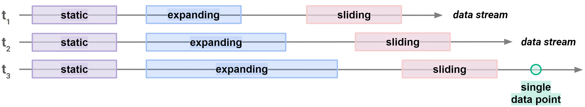
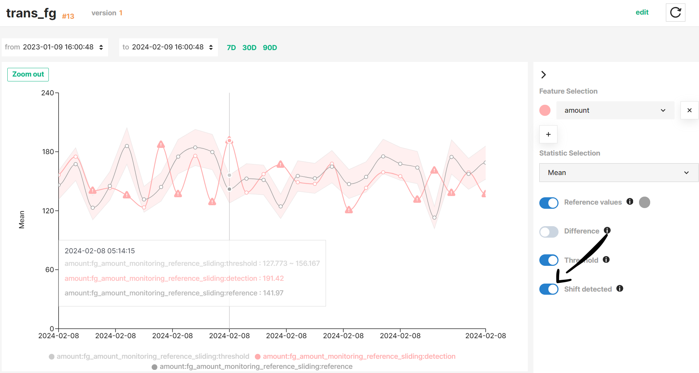
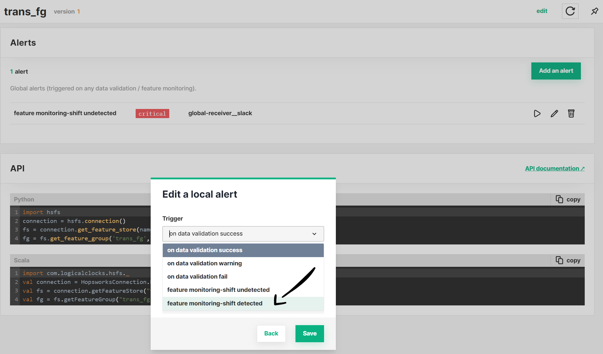

# Feature Monitoring

## Introduction

Feature Monitoring complements the Hopsworks data validation capabilities by allowing you to monitor your data once they have been ingested into the Feature Store.
Hopsworks feature monitoring user interface is centered around three functionalities:

- **Scheduled Statistics**: The user defines a _detection window_ over its data for which Hopsworks will compute the statistics on a regular basis.
  The results are stored in Hopsworks and enable the user to visualise the temporal evolution of statistical metrics on its data.
  This can be enabled for a whole Feature Group or Feature View, or for a particular Feature.
  For more details, see the [Scheduled statistics guide](scheduled_statistics.md).

- **Statistics Comparison**: This variant allows the user to schedule the statistics computation on both a _detection_ and a _reference window_, and compare them on a selected feature using a single scalar metric (e.g., the mean).
  By providing information about how to compare those statistics, you can setup alerts to quickly detect critical change in the data.
  For more details, see the [Statistics comparison guide](statistics_comparison.md).

- **Data Distribution Comparison**: Instead of a single scalar metric, this variant compares the whole distribution of a feature between the _detection_ and _reference windows_ using distance metrics such as PSI or KL divergence.
  This helps detect changes in the shape of the data that a single metric might miss.
  For more details, see the [Distribution comparison guide](distribution_comparison.md).

## Define windows over feature data

Windows define the boundaries of the feature data on which Hopsworks operates.
Both statistics and data distributions are computed over the feature data delimited by a window.
There are different types of windows depending on how they evolve over time.
A window can have either a _fixed_ length (e.g., static window) or _variable_ length (e.g., expanding window).
Moreover, windows can stick to a _specific point in time_ (e.g., static window) or _move_ over time (e.g., sliding or rolling window).

!!! info "Specific values"
    A specific value can be seen as a window of length 1 where the start and end of the window have the same value.

These types of windows apply to both _detection_ and _reference_ windows.
Different types of windows allows for different use cases depending on whether you enable feature monitoring on your Feature Groups or Feature Views.

See more details about _detection_ and _reference_ windows in the [Detection windows](./scheduled_statistics.md#detection-windows) and [Reference windows](./statistics_comparison.md#reference-windows) guides.

## Visualize metrics on a time series

Hopsworks provides an interactive graph to make the exploration of statistics and metrics (e.g., distribution-based distances) more efficient and help you find unexpected trends or anomalous values faster.
See the [Interactive graph guide](interactive_graph.md) for more information.

## Alerting

Moreover, feature monitoring integrates with the Hopsworks built-in system for [alerts](../../../setup_installation/admin/alert.md), enabling you to setup alerts that will notify you as soon as shift is detected in your feature values.
You can setup alerts for feature monitoring at a Feature Group, Feature View, and project level.

!!! tip "Select the correct trigger"
    When configuring alerts for feature monitoring, make sure you select the `feature monitoring-shift detected` or `feature monitoring-shift undetected` trigger.

