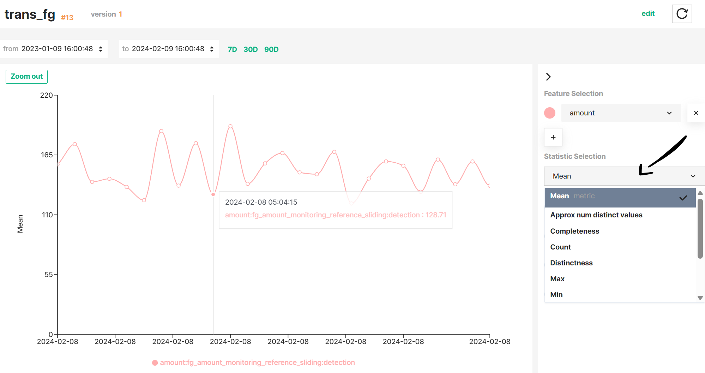
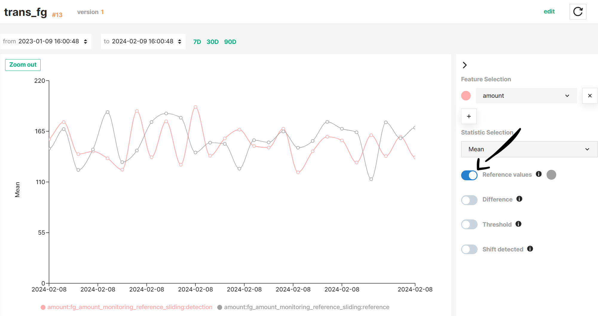
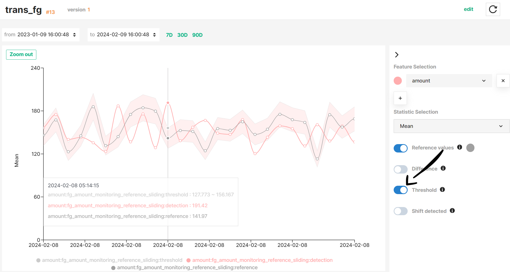
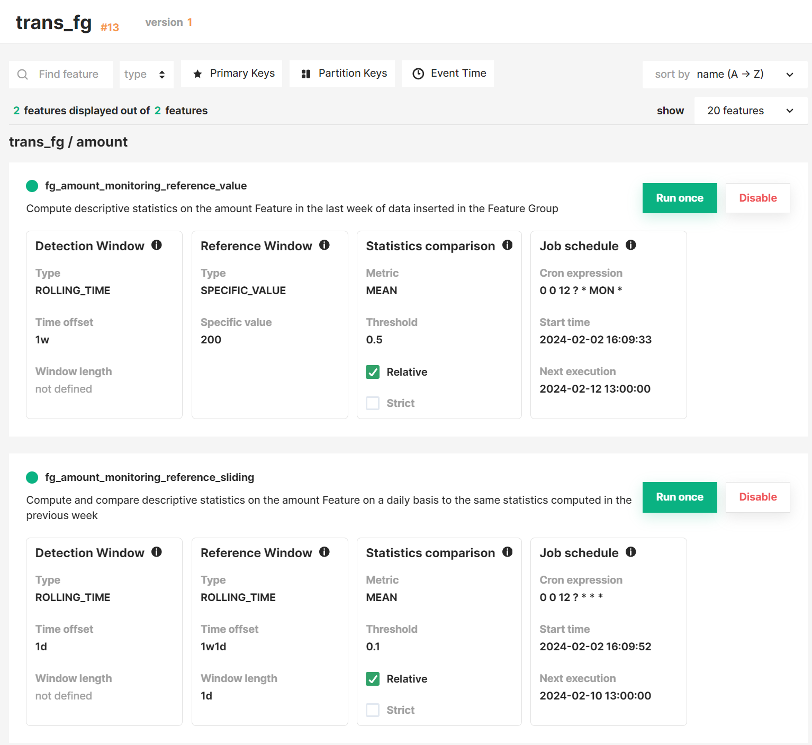

Hopsworks provides an *interactive graph* to help you explore the statistics computed on your feature data more efficiently and help you identify anomalies faster.

### Select a feature monitoring configuration

First, you need to select a feature monitoring configuration to visualize. You can achieve that by clicking on the dropdown menu under ^^Feature Selection^^ on the controls menu.

### Select a statistics metric to visualize

When you select a feature monitoring configuration, the mean values computed over time are visualized by default on the time series graph. You can choose a different statistics metric on the dropdown menu under ^^Statistics Selection^^ on the controls menu.

### Visualize multiple configurations simultaneously

Multiple feature monitoring configurations can be visualized at the same time on the graph. You can add a feature monitoring configuration by clicking on the ==+== button on the controls menu.

!!! note
    The same statistics metric will be visualized for every feature monitoring configuration selected.

### Show reference statistics

In feature monitoring configurations with reference windows, you can also visualize the reference values by enabling the ^^Reference values^^ checkbox on the controls menu. Reference values can be either statistics computed over time or a speficic value shown as an horizontal line. 

!!! note
    The same statistics metric will be visualized for both detection and reference values.

!!! info
    More details about reference windows can be found in [Reference windows](statistics_comparison.md#reference-windows).

### Show threshold bounds

In addition to reference windows, you can define thresholds to automate the identification of data points as anomalous values. A threshold can be absolute, or relative to the statistics values under comparison. You can visualize the threshold bounds by enabling the ^^Threshold bounds^^ checkbox on the controls menu.

!!! info
    More details about statistics comparison options can be found in [Comparison criteria](statistics_comparison.md#comparison-criteria).

### Highlight shifted data points

If a reference window and threshold are provided, data points that fall out of the threshold bounds are considered anomalous values. You can highlight these data points by enabling the ^^Shift detected^^ checkbox on the controls menu. 

### Visualize the computed differences between statistics

Alternatively, you can change the time series to show the differences computed between detection and reference statistics rather than the statistics values themselves. You can achieve that by enabling the ^^Difference^^ checkbox on the controls menu.

### List of configurations

Following the time series graph, you can find an overview of all feature monitoring configurations defined for the corresponding Feature Group or Feature View. This overview includes a summary of the detection and reference windows, statistics comparison criteria and job schedule.

In addition, you can trigger the statistics comparison manually, or disable the schedule of the feature monitoring job by clicking on ^^Run once^^ or ^^Disable^^ buttons, respectively.

!!! note
    Triggering the statistics comparison manually does not affect the schedule of the feature monitoring.

