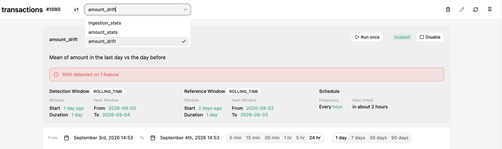
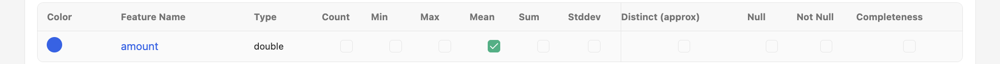
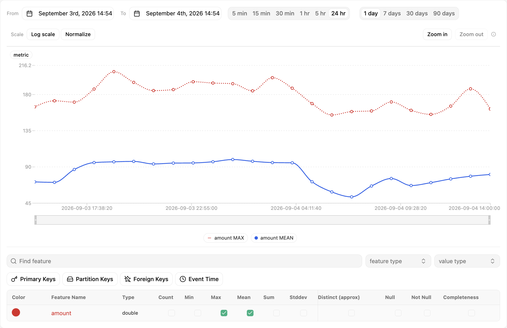
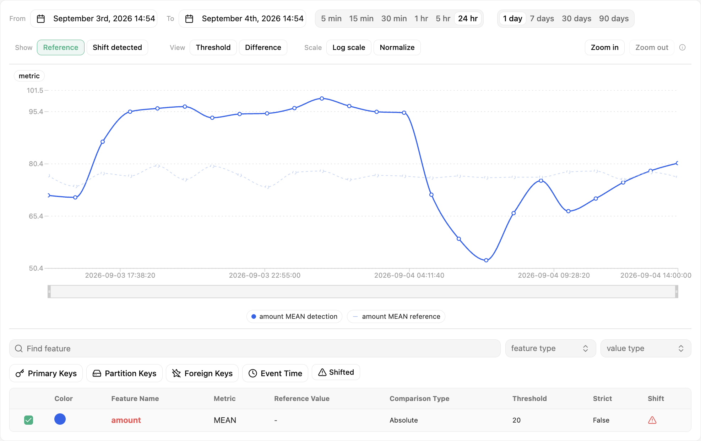
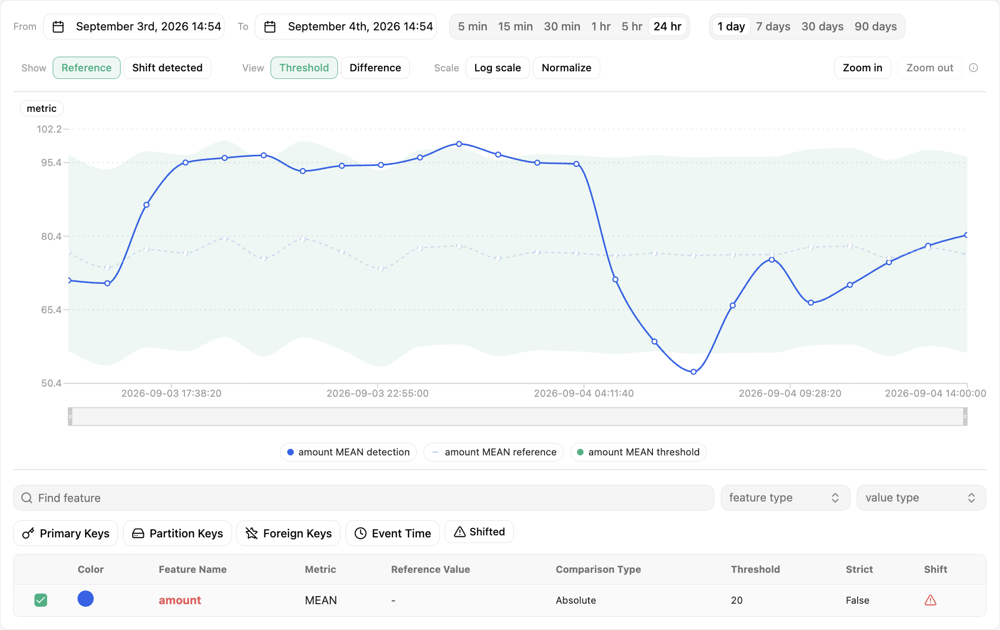
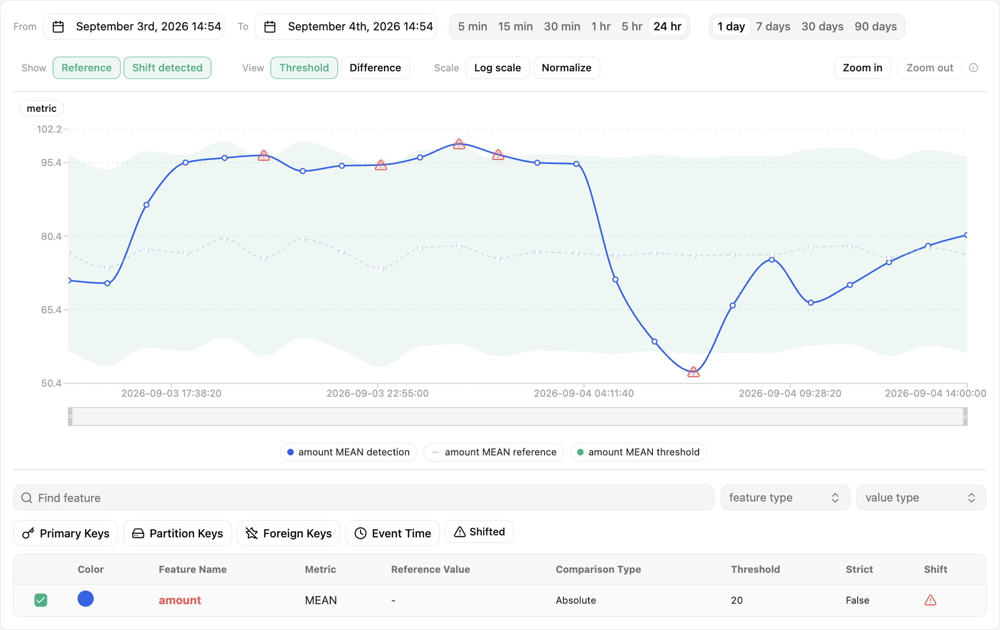
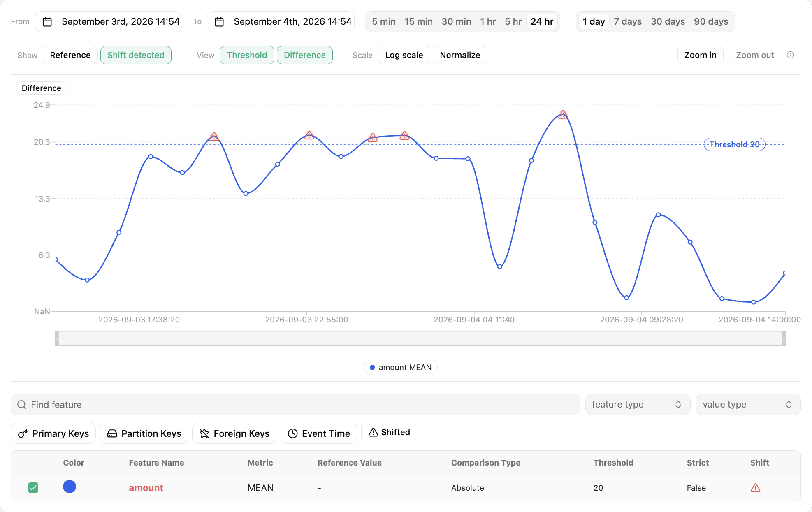
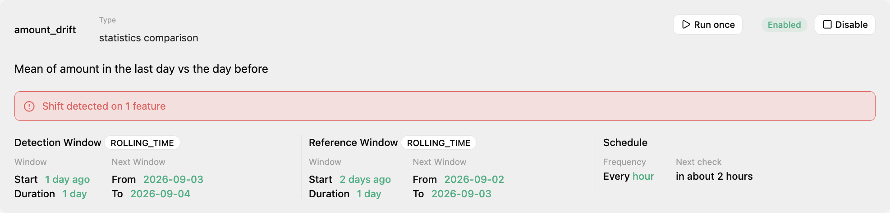
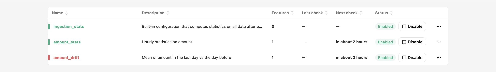

Hopsworks provides an *interactive graph* to help you explore the statistics computed on your feature data more efficiently and help you identify anomalies faster.
The graph lives on the ^^Feature Monitoring^^ tab of a Feature Group or Feature View, one page per feature monitoring configuration.

### Select a feature monitoring configuration

First, you need to select a feature monitoring configuration to visualize.
The dropdown in the page header lists every configuration defined on the Feature Group or Feature View.

### Select a statistics metric to visualize

Below the graph, the feature table has one checkbox per feature and statistics metric.
Ticking a checkbox plots that metric over time.

### Visualize multiple metrics simultaneously

Several metrics can be visualized at the same time on the graph.
Tick more than one checkbox in the feature table, and each metric gets its own colour and legend entry.

### Show reference statistics

In feature monitoring configurations with reference windows, you can also visualize the reference values by enabling ^^Reference^^ under ^^Show^^ above the graph.
Reference values are drawn as a dashed line: statistics computed over time, or a horizontal line for a specific value.

!!! note
    The same statistics metric is visualized for both detection and reference values.

!!! info
    More details about reference windows can be found in [Reference windows](statistics_comparison.md#reference-windows).

### Show threshold bounds

In addition to reference windows, you can define thresholds to automate the identification of data points as anomalous values.
A threshold can be absolute, or relative to the statistics values under comparison.
You can visualize the threshold bounds as a band around the reference line by enabling ^^Threshold^^ under ^^View^^.

!!! info
    More details about statistics comparison options can be found in [Comparison criteria](statistics_comparison.md#comparison-criteria).

### Highlight shifted data points

If a reference window and threshold are provided, data points that fall out of the threshold bounds are considered anomalous values.
You can highlight these data points by enabling ^^Shift detected^^ under ^^Show^^.
The feature table below the graph flags the same features in its ^^Shift^^ column.

### Visualize the computed differences between statistics

Alternatively, you can change the time series to show the differences computed between detection and reference statistics rather than the statistics values themselves.
You can achieve that by enabling ^^Difference^^ under ^^View^^.
The threshold then shows as a horizontal line.

### Configuration summary and controls

The card at the top of a configuration page summarizes the detection and reference windows, the statistics comparison criteria and the job schedule.
From there you can trigger the statistics comparison manually with ^^Run once^^, or pause the schedule of the feature monitoring job with ^^Disable^^.

!!! note
    Triggering the statistics comparison manually does not affect the schedule of the feature monitoring.

### List of configurations

The ^^Feature Monitoring^^ tab itself lists all feature monitoring configurations defined for the Feature Group or Feature View, with their status and next scheduled check.

