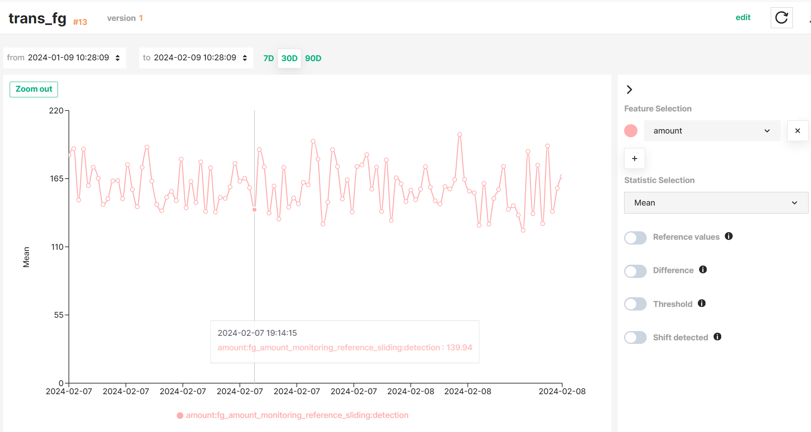
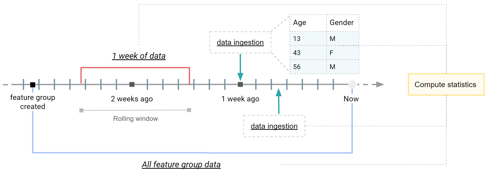

Hopsworks scheduled statistics allows you to monitor your feature data once they have been ingested into the Feature Store.
You can define a ==detection window== over your data for which Hopsworks will compute the statistics on a regular basis.
Statistics can be computed on all or a subset of feature values, and on one or more features simultaneously.

Hopsworks stores the computed statistics and enable you to visualise the temporal evolution of statistical metrics on your data.

!!! tip "Interactive graph"
    See the [Interactive graph guide](interactive_graph.md) to learn how to explore statistics more efficiently.

## Use cases

Scheduled statistics monitoring is a powerful tool that allows you to monitor your data over time and detect anomalies in your feature data at a glance by visualizing the evolution of the statistics properties of your data in a time series.
It can be enabled in both Feature Groups and Feature Views, but for different purposes.

For **Feature Groups**, scheduled statistics enables you to analyze how your Feature Group data evolve over time, and leverage your intuition to identify trends or detect noisy values in the inserted feature data.
See the [Feature Monitoring for Feature Groups](../feature_group/feature_monitoring.md) guide to configure it.

For **Feature Views**, scheduled statistics enables you to analyze the statistical properties of potentially new training dataset versions without having to actually create new training datasets and, thus, helping you decide when your training data show sufficient significant changes to create a new version.
See the [Feature Monitoring for Feature Views](../feature_view/feature_monitoring.md) guide to configure it.

## Detection windows

Statistics are computed in a scheduled basis on a pre-defined detection window of feature data.
Detection windows can be defined on the whole feature data or a subset of feature data depending on the `time_offset` and `window_length` parameters of the `with_detection_window` method.

In [a previous section](index.md#define-windows-over-feature-data) we described different types of windows available.
Taking a Feature Group as an example, the figure above describes how these windows are applied to Feature Group data, resulting in three different applications:

- A _expanding window_ covering the whole Feature Group data from its creation until the time when statistics are computing.
  It can be seen as an snapshot of the **latest version of your feature data**.
- A _rolling window_ covering a variable subset of feature data (e.g., feature data written last week).
  It helps you analyze the properties of **newly inserted feature data**.

### Time basis

A rolling window needs a notion of time to decide which rows fall inside it.
Hopsworks supports two bases, chosen once per configuration and shared by the detection and reference windows:

- _Event time_: rows are selected by the value of an event-time feature, so a window such as "last week" contains the rows whose event time falls in that week regardless of when they were written.
  Backfills and late arrivals land in the window of their event time.
  This is the default for Feature Groups and Feature Views that declare an `event_time`, and it also works on Feature Groups without time travel and on external Feature Groups.
- _Commit time_: rows are selected by the time they were written to the Feature Group, using time travel.
  A window such as "last week" contains the rows committed during that week.
  This is the default when no event-time feature is declared, and it requires a time-travel enabled Feature Group.

An expanding window reads the latest snapshot on either basis, with no time filter.
Statistics computed on an event-time window are stored with the event-time bounds of the window, and statistics computed on a commit-time window with its commit bounds.
The `event_time` parameter of `create_scheduled_statistics` and `create_feature_monitoring` selects the basis; see the guides linked below.

See more details on how to define a detection window for your Feature Groups and Feature Views in the Feature Monitoring Guides for [Feature Groups](../feature_group/feature_monitoring.md) and [Feature Views](../feature_view/feature_monitoring.md).

!!! info "Next steps"
    You can also define a reference window to be used as a baseline to compare against the detection window.
    See more details in the [Statistics comparison guide](statistics_comparison.md).
