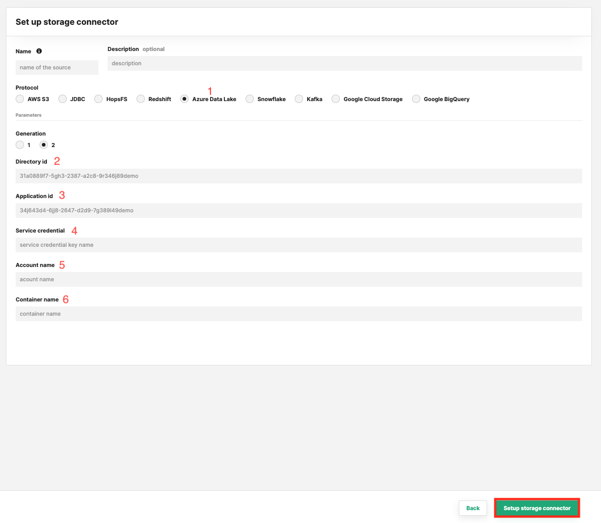
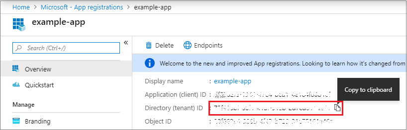
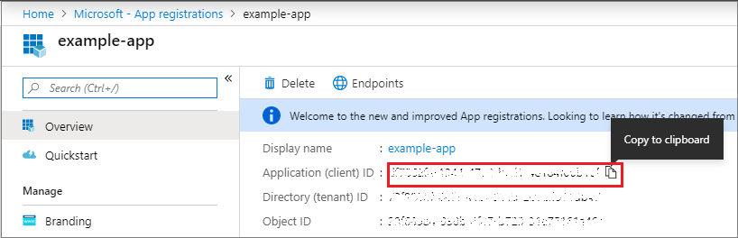
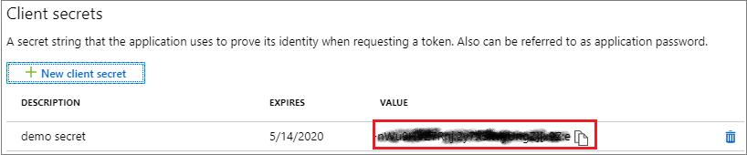

# How-To set up a ADLS Storage Connector

## Introduction

Azure Data Lake Storage (ADLS) Gen2 is a HDFS-compatible filesystem on Azure for data analytics. The ADLS Gen2 filesystem stores its data in Azure Blob storage, ensuring low-cost storage, high availability, and disaster recovery. In Hopsworks, you can access ADLS Gen2 by defining a Storage Connector and creating and granting persmissions to a service principal.

In this guide, you will configure a Storage Connector in Hopsworks to save all the authentication information needed in order to set up a connection to your Azure ADLS filesystem.
When you're finished, you'll be able to read files using Spark through HSFS APIs. You can also use the connector to write out training data from the Feature Store, in order to make it accessible by third parties.

!!! note
    Currently, it is only possible to create storage connectors in the Hopsworks UI. You cannot create a storage connector programmatically.

## Prerequisites

Before you begin this guide you'll need to retrieve the following information from your Azure ADLS account:

- **Data Lake Storage Gen2 Account:** Create an [Azure Data Lake Storage Gen2 account](https://docs.microsoft.com/azure/storage/data-lake-storage/quickstart-create-account) and [initialize a filesystem, enabling the hierarchical namespace](https://docs.microsoft.com/azure/storage/data-lake-storage/namespace). Note that your storage account must belong to an Azure resource group.
- **Azure AD application and service principal:** [Create an Azure AD application and service principal](https://docs.microsoft.com/en-us/azure/active-directory/develop/howto-create-service-principal-portal) that can access your ADLS storage account and its resource group.
- **Service Principal Registration:** Register the service principal, granting it a role assignment such as Storage Blob Data Contributor, on the Azure Data Lake Storage Gen2 account.

!!! info
    When you specify the 'container name' in the ADLS storage connector, you need to have previously created that container - the Hopsworks Feature Store will not create that storage container for you.

## Creation in the UI
### Step 1: Set up new storage connector

Head to the Storage Connector View on Hopsworks (1) and set up a new storage connector (2).

<figure markdown>
  
  <figcaption>The Storage Connector View in the User Interface</figcaption>
</figure>

### Step 2: Enter ADLS Information

Enter the details for your ADLS connector. Start by giving it a **name** and an optional **description**.

<figure markdown>
  
  <figcaption>ADLS Connector Creation Form</figcaption>
</figure>

### Step 3: Azure Create an ADLS Resource

When programmatically signing in, you need to pass the tenant ID with your authentication request and the application ID. You also need a certificate or an authentication key (described in the following section). To get those values, use the following steps:

1. Select Azure Active Directory.
2. From App registrations in Azure AD, select your application.
3. Copy the Directory (tenant) ID and store it in your application code.
    <figure markdown>
    
    <figcaption>You need to copy the Directory (tenant) id and paste it to the Hopsworks ADLS storage connector  "Directory id" text field.</figcaption>
    </figure>

4. Copy the Application ID and store it in your application code.
    <figure markdown>
    
    <figcaption>>You need to copy the Application id and paste it to the Hopsworks ADLS storage connector "Application id" text field.</figcaption>
    </figure>

5. Create an Application Secret and copy it into the Service Credential field.
    <figure markdown>
    
    <figcaption>You need to copy the Application Secret and paste it to the Hopsworks ADLS storage connector "Service Credential" text field.</figcaption>
    </figure>

#### Common Problems

If you get a permission denied error when writing or reading to/from a ADLS container, it is often because the storage principal (app) does not have the correct permissions. Have you added the "Storage Blob Data Owner" or "Storage Blob Data Contributor" role to the resource group for your storage account (or the subscription for your storage group, if you apply roles at the subscription level)? Go to your resource group, then in "Access Control (IAM)", click the "Add" buton to add a "role assignment".

If you get an error "StatusCode=404 StatusDescription=The specified filesystem does not exist.", then maybe you have not created the storage account or the storage container.

#### References

* [How to create a service principal on Azure](https://docs.microsoft.com/en-us/azure/active-directory/develop/howto-create-service-principal-portal)

## Next Steps

Move on to the [usage guide for storage connectors](../usage.md) to see how you can use your newly created ADLS connector.