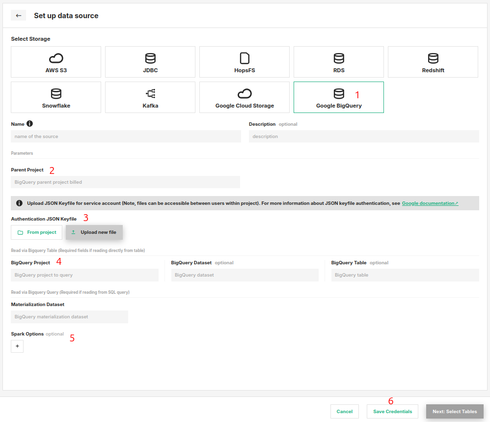

# How-To set up a BigQuery Storage Connector

## Introduction

A BigQuery storage connector provides integration to Google Cloud BigQuery.
BigQuery is Google Cloud's managed data warehouse supporting that lets you run analytics and 
execute SQL queries over large scale data. Such data warehouses are often the source of raw data for feature 
engineering pipelines.

In this guide, you will configure a Storage Connector in Hopsworks to connect to your BigQuery project by saving the
necessary information.
When you're finished, you'll be able to execute queries and read results of BigQuery using Spark through 
HSFS APIs.

The storage connector uses the Google `spark-bigquery-connector` behind the scenes.
To read more about the spark connector, like the spark options or usage, check [Apache Spark SQL connector for Google BigQuery.](https://github.com/GoogleCloudDataproc/spark-bigquery-connector#usage
'github.com/GoogleCloudDataproc/spark-bigquery-connector')

!!! note
        Currently, it is only possible to create storage connectors in the Hopsworks UI. You cannot create a storage connector programmatically.

## Prerequisites

Before you begin this guide you'll need to retrieve the following information about your GCP account:

- **BigQuery Project:** You need a BigQuery project, dataset and table created and have read access to it. Or, if 
  you wish to query a public dataset you need its corresponding details.
- **Authentication Method:** Authentication to GCP account is handled by uploading the `JSON keyfile for service
  account` to the Hopsworks Project. You will need to create this JSON keyfile from GCP. For more information on
  service accounts
  and creating keyfile in GCP, read [Google Cloud documentation.](https://cloud.google.com/docs/authentication/production#create_service_account
  'creating service account keyfile')

## Creation in the UI
### Step 1: Set up new storage connector

Head to the Storage Connector View on Hopsworks (1) and set up a new storage connector (2).

<figure markdown>
  
  <figcaption>The Storage Connector View in the User Interface</figcaption>
</figure>

### Step 2: Enter connector details
Enter the details for your BigQuery connector. Start by giving
it a unique **name** and an optional
**description**.

<figure markdown>
  
  <figcaption>BigQuery Connector Creation Form</figcaption>
</figure>

1. Choose `Google BigQuery` from the connector options.
2. Next, set the name of the parent BigQuery project. This is used for billing by GCP.
3. Authentication: Here you should upload your `JSON keyfile for service 
   account` used for authentication. You can choose to either
   upload from your local using `Upload new file` or choose an existing file within project using `From Project`.
4. Read Options: There are two ways to read via BigQuery, using the **BigQuery Table** or **BigQuery Query** option:
   
      1. The table option reads directly from the BigQuery table reference. In the UI set the below fields, 
         1. *BigQuery Project*: The BigQuery project
         2. *BigQuery Dataset*: The dataset of the table
         3. *BigQuery Table*: The table to read
      2. The second option is to read by executing a SQL query at runtime, by selecting **BigQuery Query** and setting,
         1. *Materiliazation Dataset*: Temporary dataset used by BigQuery for writing
         
5. Spark Options: Optionally, you can set additional spark options using the `Key - Value` pairs
## Next Steps

Move on to the [usage guide for storage connectors](../usage.md) to see how you can use your newly created BigQuery 
connector.