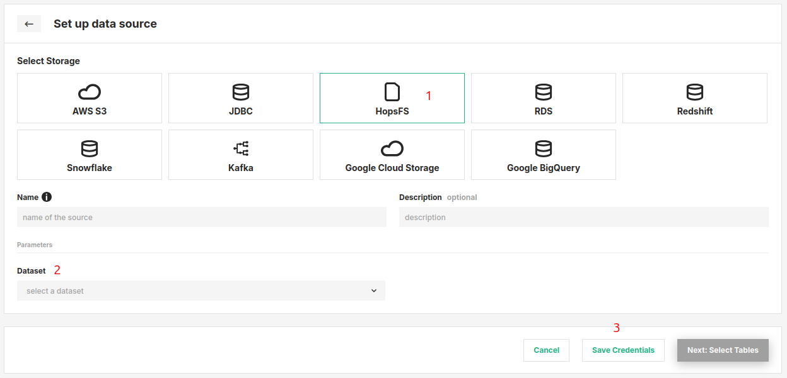

# How-To set up a HopsFS Storage Connector

## Introduction

HopsFS is a HDFS-compatible filesystem on AWS/Azure/on-premises for data analytics. HopsFS stores its data on object storage in the cloud (S3 in AWs and Blob storage on Azure) and on commodity servers on-premises, ensuring low-cost storage, high availability, and disaster recovery. In Hopsworks, you can access HopsFS natively in programs (Spark, TensorFlow, etc) without the need to define a Storage Connector. By default, every Project has a Storage Connector for Training Datasets. When you create training datasets from features in the Feature Store the HopsFS connector is the default Storage Connector. However, if you want to output data to a different dataset, you can define a new Storage Connector for that dataset.

In this guide, you will configure a HopsFS Storage Connector in Hopsworks which points at a different directory on the file system than the Training Datasets directory.
When you're finished, you'll be able to write training data to different locations in your cluster through HSFS APIs.

!!! note
    Currently, it is only possible to create storage connectors in the Hopsworks UI. You cannot create a storage connector programmatically.

## Prerequisites

Before you begin this guide you'll need to identify a **directory on the filesystem** of Hopsworks, to which you want to point the Storage Connector that you are going to create.

## Creation in the UI
### Step 1: Set up new storage connector

Head to the Storage Connector View on Hopsworks (1) and set up a new storage connector (2).

<figure markdown>
  
  <figcaption>The Storage Connector View in the User Interface</figcaption>
</figure>

### Step 2: Enter HopsFS Settings

Enter the details for your HopsFS connector. Start by giving it a **name** and an optional **description**.

1. Select "HopsFS" as connector protocol.
2. Select the top-level directory to point the connector to.
3. Click "Setup storage connector".

<figure markdown>
  
  <figcaption>HopsFS Connector Creation Form</figcaption>
</figure>

## Next Steps

Move on to the [usage guide for storage connectors](../usage.md) to see how you can use your newly created HopsFS connector.