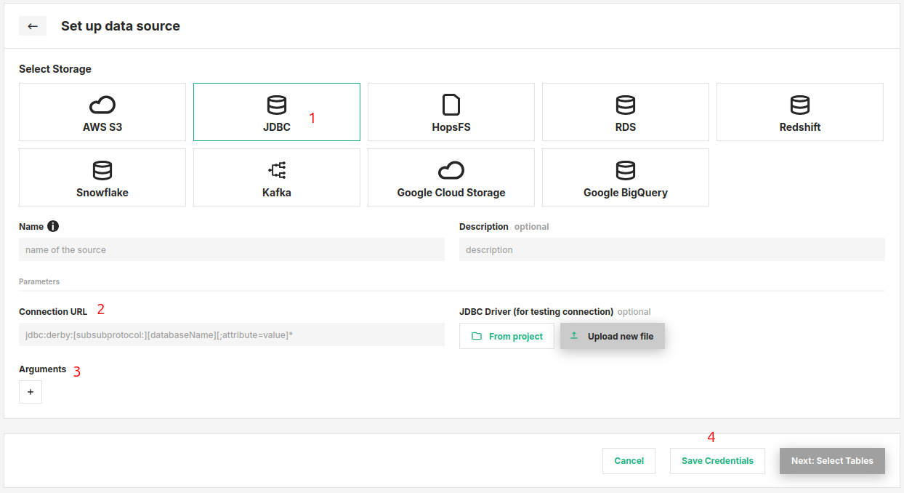

# How-To set up a JDBC Storage Connector

## Introduction

JDBC is an API provided by many database systems. Using JDBC connections one can query and update data in a database, usually oriented towards relational databases. Examples of databases you can connect to using JDBC are MySQL, Postgres, ORacle, DB2, MongoDB or Microsoft SQLServer.

In this guide, you will configure a Storage Connector in Hopsworks to save all the authentication information needed in order to set up a JDBC connection to your database of choice.
When you're finished, you'll be able to query the database using Spark through HSFS APIs.

!!! note
    Currently, it is only possible to create storage connectors in the Hopsworks UI. You cannot create a storage connector programmatically.

## Prerequisites

Before you begin this guide you'll need to retrieve the following information from your JDBC compatible database:

- **JDBC Connection URL:** Consult the documentation of your target database to determine the correct JDBC URL and parameters. As an example, for MySQL the URL could be:

```
jdbc:mysql://10.0.2.15:3306/[databaseName]?useSSL=false&allowPublicKeyRetrieval=true
```

- **Username and Password:** Typically, you will need to add username and password in your JDBC URL or as key/value parameters. So make sure you have retrieved a username and password with the suitable permissions for the database and table you want to query.

## Creation in the UI
### Step 1: Set up new storage connector

Head to the Storage Connector View on Hopsworks (1) and set up a new storage connector (2).

<figure markdown>
  
  <figcaption>The Storage Connector View in the User Interface</figcaption>
</figure>

### Step 2: Enter JDBC Settings

Enter the details for your JDBC enabled database.

1. Select "JDBC" as connector protocol.
2. Enter the JDBC connection url. This can for example also contain the username and password.
3. Add additional key/value arguments to be passed to the connection. These might differ by database. It can be the username and password.
4. Click "Setup storage connector".

<figure markdown>
  
  <figcaption>JDBC Connector Creation Form</figcaption>
</figure>

## Next Steps

Move on to the [usage guide for storage connectors](../usage.md) to see how you can use your newly created JDBC connector.