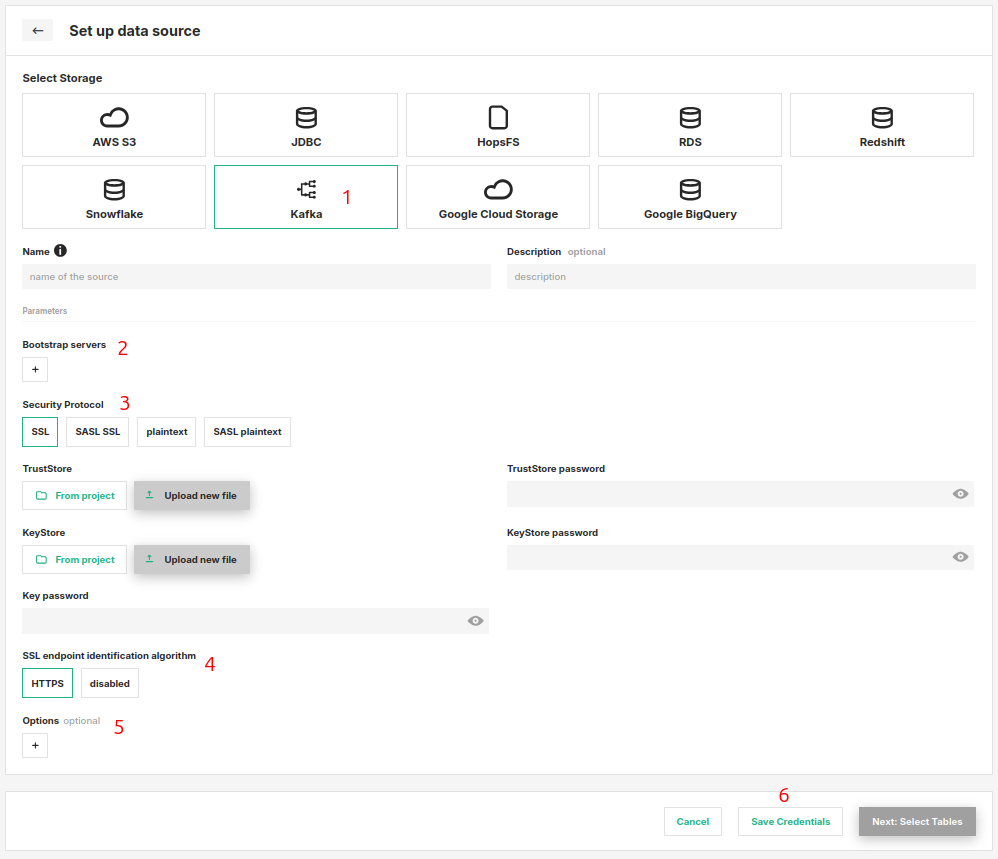

# How-To set up a Kafka Storage Connector

## Introduction

Apache Kafka is a distributed event store and stream-processing platform. It's very popular framework for handling realtime data streams and is often used as a message you for events coming from production systems until they are being processed and either loaded into a data warehouse our aggregated into features for Machine Learning.

In this guide, you will configure a Storage Connector in Hopsworks to save all the authentication information needed in order to set up a connection to your Kafka cluster.
When you're finished, you'll be able to read from Kafka topics in your cluster using Spark through HSFS APIs.

!!! note
    Currently, it is only possible to create storage connectors in the Hopsworks UI. You cannot create a storage connector programmatically.

## Prerequisites

Before you begin this guide you'll need to retrieve the following information from Kafka cluster, the following options are **mandatory**:

- **Kafka Bootstrap servers:** It is the url of one of the Kafka brokers which you give to fetch the initial metadata about your Kafka cluster. The metadata consists of the topics, their partitions, the leader brokers for those partitions etc. Depending upon this metadata your producer or consumer produces or consumes the data.
- **Security Protocol:** The security protocol you want to use to authenticate with your Kafka cluster. Make sure the chosen protocol is supported by your cluster. For an overview of the available protocols, please see the [Confluent Kafka Documentation](https://docs.confluent.io/platform/current/kafka/overview-authentication-methods.html).
- **Certificates:** Depending on the chosen security protocol, you might need TrustStore and KeyStore files along with the corresponding key password. Contact your Kafka administrator, if you don't know how to retrieve these. If you want to setup a storage connector to Hopsworks' internal Kafka cluster, you can download the needed certificates from the integration tab in your project settings.

## Creation in the UI
### Step 1: Set up new storage connector

Head to the Storage Connector View on Hopsworks (1) and set up a new storage connector (2).

<figure markdown>
  
  <figcaption>The Storage Connector View in the User Interface</figcaption>
</figure>

### Step 2: Enter Kafka Settings

Enter the details for your Kafka connector. Start by giving it a **name** and an optional **description**.

1. Select "Kafka" as connector protocol.
2. Add all the bootstrap server addresses and ports that you want the consumers/producers to connect to. The client will make use of all servers irrespective of which servers are specified here for bootstrapping—this list only impacts the initial hosts used to discover the full set of servers.
3. Choose the Security protocol.

    !!! example "TSL/SSL"
        By default, Apache Kafka communicates in `PLAINTEXT`, which means that all data is sent in the clear. To encrypt communication, you should configure all the Confluent Platform components in your deployment to use TLS/SSL encryption.

        TLS uses private-key/certificate pairs, which are used during the TLS handshake process.

        Each broker needs its own private-key/certificate pair, and the client uses the certificate to authenticate the broker.
        Each logical client needs a private-key/certificate pair if client authentication is enabled, and the broker uses the certificate to authenticate the client.

        These are provided in the form of *TrustStore* and *KeyStore* `JKS` files together with a key password. For more information, refer to the official [Apacha Kafka Guide for TSL/SSL authentication](https://docs.confluent.io/platform/current/kafka/authentication_ssl.html).

    !!! example "SASL SSL or SASL plaintext"
        Apache Kafka brokers support client authentication using SASL. SASL authentication can be enabled concurrently with TLS/SSL encryption (TLS/SSL client authentication will be disabled).

        This authentication method often requires extra arguments depending on your setup. Make use of the optional additional key/value arguments (5) to provide these.

        SASL authentication can be enabled concurrently with TLS/SSL encryption (TLS/SSL client authentication will be disabled).
        For more information, please refer to the offical [Apache Kafka Guide for SASL authentication](https://docs.confluent.io/platform/current/kafka/authentication_sasl/index.html).

4. The endpoint identification algorithm used by clients to validate server host name. The default value is `https`. Clients including client connections created by the broker for inter-broker communication verify that the broker host name matches the host name in the broker’s certificate.
5. Optional additional key/value arguments.
6. Click "Setup storage connector".

<figure markdown>
  
  <figcaption>Kafka Connector Creation Form</figcaption>
</figure>

## Next Steps

Move on to the [usage guide for storage connectors](../usage.md) to see how you can use your newly created Kafka connector.