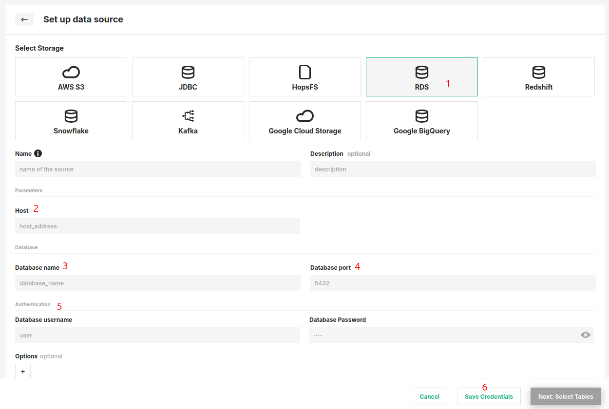

# How-To set up an Amazon RDS JDBC Data Source

## Introduction

Amazon RDS (Relational Database Service) is a managed relational database service that supports several popular database engines, such as MySQL, PostgreSQL, Oracle, and Microsoft SQL Server. Using JDBC connections, you can query and update data in your RDS database from Hopsworks.

In this guide, you will configure a Data Source in Hopsworks to securely store the authentication information needed to set up a JDBC connection to your Amazon RDS instance.
Once configured, you will be able to query your RDS database.

!!! note
    Currently, it is only possible to create data sources in the Hopsworks UI. You cannot create a data source programmatically.

## Prerequisites

Before you begin, ensure you have the following information from your Amazon RDS instance:

- **Host:** You can find the endpoint for your RDS instance in the AWS Console. 

    1. Go to the AWS Console → `Aurora and RDS`
    2. Click on your DB instance.
    3. Under `Connectivity & security`, you'll find the endpoint

Example:

```
mydb.abcdefg1234.us-west-2.rds.amazonaws.com
```

- **Database:** You can specify which database to use

- **Port:** Provide the port to connect to

- **Username and Password:** Obtain the username and password for your RDS database with the necessary permissions to access the required tables.

## Creation in the UI

### Step 1: Set up a new Data Source

Head to the Data Source View on Hopsworks (1) and set up a new Data Source (2).

<figure markdown>
  
  <figcaption>The Data Source View in the User Interface</figcaption>
</figure>

### Step 2: Enter RDS Settings

Enter the details for your Amazon RDS database.

<figure markdown>
  
  <figcaption>RDS Connector Creation Form</figcaption>
</figure>

1. Select "RDS" as the storage.
2. Paste the Host details.
3. Enter the database name.
4. Specify which port to use.
5. Provide the username and password.
6. Click on "Save Credentials".

## Next Steps

Proceed to the [usage guide for data sources](../usage.md) to learn how to use your newly created connector.