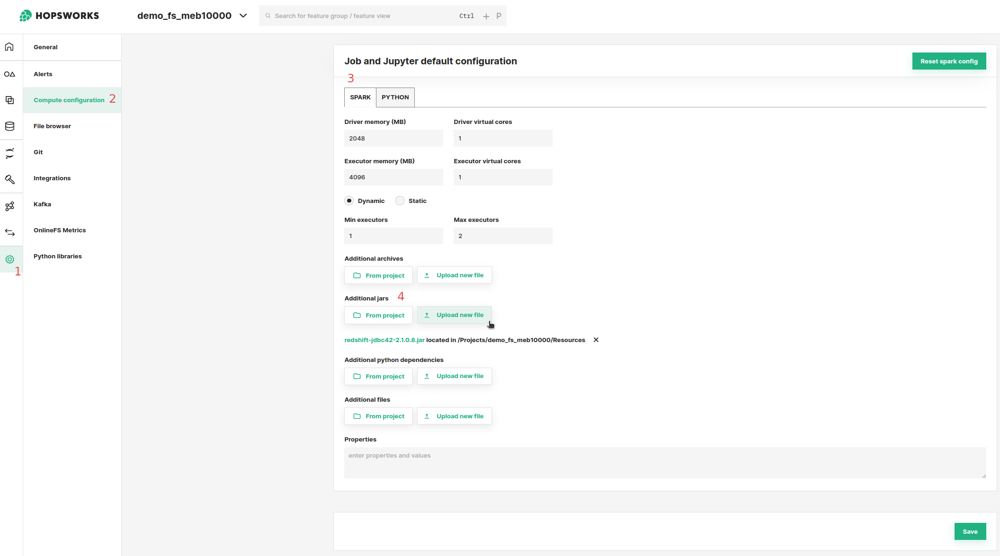

# How-To set up a Redshift Storage Connector

## Introduction

Amazon Redshift is a popular managed data warehouse on AWS, used as a data warehouse in many enterprises. 

Data warehouses are often the source of raw data for feature engineering pipelines and Redshift supports scalable feature computation with SQL. However, Redshift is not viable as an online feature store that serves features to models in production, with its columnar database layout its latency is too high compared to OLTP databases or key-value stores.

In this guide, you will configure a Storage Connector in Hopsworks to save all the authentication information needed in order to set up a connection to your AWS Redshift cluster.
When you're finished, you'll be able to query the database using Spark through HSFS APIs.

!!! note
    Currently, it is only possible to create storage connectors in the Hopsworks UI. You cannot create a storage connector programmatically.

## Prerequisites

Before you begin this guide you'll need to retrieve the following information from your AWS account and Redshift database, the following options are **mandatory**:

- **Cluster identifier:** The name of the cluster.
- **Database endpoint:** The endpoint for the database. Should be in the format of `[UUID].eu-west-1.redshift.amazonaws.com`.
- **Database name:** The name of the database to query.
- **Database port:** The port of the cluster. Defaults to 5349.
- **Authentication method:** There are three options available for authenticating with the Redshift cluster. The first option is to configure a username and a password. 
The second option is to configure an IAM role. With IAM roles, Jobs or notebooks launched on Hopsworks do not need to explicitly authenticate with Redshift, as the HSFS library will transparently use the IAM role to acquire a temporary credential to authenticate the specified user. 
Read more about IAM roles in our [AWS credentials pass-through guide](../../../../setup_installation/admin/roleChaining.md). Lastly, 
  option `Instance Role` will use the default ARN Role configured for the cluster instance.

## Creation in the UI
### Step 1: Set up new storage connector

Head to the Storage Connector View on Hopsworks (1) and set up a new storage connector (2).

<figure markdown>
  
  <figcaption>The Storage Connector View in the User Interface</figcaption>
</figure>

### Step 2: Enter The Connector Information

Enter the details for your Redshift connector. Start by giving it a **name** and an optional **description**.

1. Select "Redshift" as connector protocol.
2. The name of the cluster.
3. The database endpoint. Should be in the format `[UUID].eu-west-1.redshift.amazonaws.com`. For example, if the endpoint info 
   displayed in Redshift is `cluster-id.uuid.eu-north-1.redshift.amazonaws.com:5439/dev` the value to enter 
   here is just `uuid.eu-north-1.redshift.amazonaws.com` 
4. The database name.
5. The database port.
6. The database username, here you have the possibility to let Hopsworks auto-create the username for you.
7. Database Driver (optional): You can use the default JDBC Redshift Driver `com.amazon.redshift.jdbc42.Driver` 
   included in Hopsworks or set a different driver (More on this later).
8. Optionally provide the database group and table for the connector. A database group is the group created 
   for the user if applicable. More information, at [redshift documentation](https://docs.aws.amazon.com/redshift/latest/dg/r_Groups.html)
9. Set the appropriate authentication method. 

<figure markdown>
  
  <figcaption>Redshift Connector Creation Form</figcaption>
</figure>

!!! warning "Session Duration"
    By default, the session duration that the role will be assumed for is 1 hour or 3600 seconds.
    This means if you want to use the storage connector for example to [read or create an external Feature Group from Redshift](../usage.md##creating-an-external-feature-group), the operation cannot take longer than one hour.

    Your administrator can change the default session duration for AWS storage connectors, by first [increasing the max session duration of the IAM Role](https://docs.aws.amazon.com/IAM/latest/UserGuide/id_roles_use.html#id_roles_use_view-role-max-session) that you are assuming. And then changing the `fs_storage_connector_session_duration` [configuration property](../../../../setup_installation/admin/variables.md) to the appropriate value in seconds.

### Step 3: Upload the Redshift database driver (optional)

The `redshift-jdbc42` JDBC driver is included by default in the Hopsworks distribution. 
If you wish to use a different driver, you need to upload it on Hopsworks and add it as a dependency of Jobs and Jupyter Notebooks that need it. First, you need to [download the library](https://docs.aws.amazon.com/redshift/latest/mgmt/jdbc20-download-driver.html). Select the driver version without the AWS SDK.

#### Add the driver to Jupyter Notebooks and Spark jobs

You can now add the driver file to the default job and Jupyter configuration. This way, all jobs and Jupyter instances in the project will have the driver attached so that Spark can access it.

1. Go into the Project's settings.
2. Select "Compute configuration".
3. Select "Spark".
4. Under "Additional Jars" choose "Upload new file" to upload the driver jar file.

<figure markdown>
  
  <figcaption>Attaching the Redshift Driver to all Jobs and Jupyter Instances of the Project</figcaption>
</figure>

Alternatively, you can choose the "From Project" option. You will first have to upload the jar file to the Project using the File Browser. After you have uploaded the jar 
file, you can select it using the "From Project" option. To upload the jar file to the Project through the File Browser, see the example below:

   1. Open File Browser
   2. Navigate to "Resources" directory
   3. Upload the jar file

<figure markdown>
  
  <figcaption>Redshift Driver Upload in the File Browser</figcaption>
</figure>

!!! tip 
    If you face network connectivity issues to your Redshift cluster, a common cause could be the cluster database port 
    not being accessible from outside the Redshift cluster VPC network. A quick and dirty way to enable connectivity is 
    to [Enable Publicly Accessible](https://aws.amazon.com/premiumsupport/knowledge-center/redshift-cluster-private-public/).
    However, in a production setting, you should use [VPC peering](https://docs.aws.amazon.com/vpc/latest/peering/what-is-vpc-peering.html) 
    or some equivalent mechanism for connecting the clusters.

## Next Steps

Move on to the [usage guide for storage connectors](../usage.md) to see how you can use your newly created Redshift connector.
