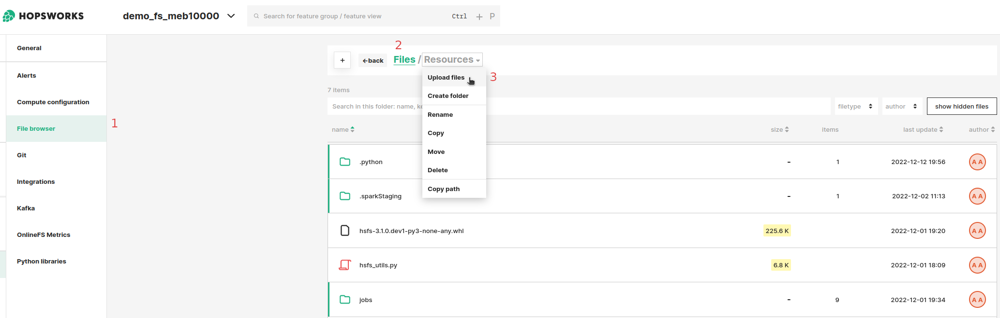

# How-To set up a Redshift Storage Connector

## Introduction

Amazon Redshift is a popular managed data warehouse on AWS, used as a data warehouse in many enterprises. 

Data warehouses are often the source of raw data for feature engineering pipelines and Redshift supports scalable feature computation with SQL. However, Redshift is not viable as an online feature store that serves features to models in production, with its columnar database layout its latency is too high compared to OLTP databases or key-value stores.

In this guide, you will configure a Storage Connector in Hopsworks to save all the authentication information needed in order to set up a connection to your AWS Redshift cluster.
When you're finished, you'll be able to query the database using Spark through HSFS APIs.

!!! note
    Currently, it is only possible to create storage connectors in the Hopsworks UI. You cannot create a storage connector programmatically.

## Prerequisites

Before you begin this guide you'll need to retrieve the following information from your AWS account and Redshift database, the following options are **mandatory**:

- **Cluster identifier:** The name of the cluster.
- **Database driver:** You can use the default JDBC Redshift Driver `com.amazon.redshift.jdbc42.Driver` (More on this later)
- **Database endpoint:** The endpoint for the database. Should be in the format of `[UUID].eu-west-1.redshift.amazonaws.com`.
- **Database name:** The name of the database to query.
- **Database port:** The port of the cluster. Defaults to 5349.
- **Authentication method:** There are two options available for authenticating with the Redshift cluster. The first option is to configure a username and a password. The second option is to configure an IAM role. With IAM roles, Jobs or notebooks launched on Hopsworks do not need to explicitly authenticate with Redshift, as the HSFS library will transparently use the IAM role to acquire a temporary credential to authenticate the specified user. Read more about IAM roles in our [AWS credentials passthrough guide]()

## Creation in the UI
### Step 1: Set up new storage connector

Head to the Storage Connector View on Hopsworks (1) and set up a new storage connector (2).

<figure markdown>
  
  <figcaption>The Storage Connector View in the User Interface</figcaption>
</figure>

### Step 2: Enter The Connector Information

Enter the details for your Redshift connector. Start by giving it a **name** and an optional **description**.

1. Select "Redshift" as connector protocol.
2. The name of the cluster.
3. The name of the database driver class.
4. The database endpoint.
5. The database name.
6. The database port.
7. The database username, here you have the possibility to let Hopwsworks auto-create the username for you.
8. Optionally provide the database group and table to point the connector to.
9. Set the appropriate authentication method.

<figure markdown>
  
  <figcaption>Redshift Connector Creation Form</figcaption>
</figure>

### Step 3: Upload the Redshift database driver

With regards to the database driver, the library to interact with Redshift is not included in Hopsworks - you need to upload the driver yourself. First, you need to [download the library](https://docs.aws.amazon.com/redshift/latest/mgmt/welcome.html). Select the driver version without the AWS SDK.

#### Upload the driver to Hopsworks
You then upload the driver files to the “Resources” directory in your project, see the screenshot below.

1. Open the File Browser.
2. Move into the "Resources" directory.
3. Upload the driver jar file.

<figure markdown>
  
  <figcaption>Redshift Driver Upload in the Filesystem Browser</figcaption>
</figure>

#### Add the driver to Jupyter Notebooks and Spark jobs

You can now add the driver file to the default job and Jupyter configuration. This way, all jobs and Jupyter instances in the project will have the driver attached so that Spark can access it.

1. Go into the Project's settings.
2. Select "Compute configuration".
3. Select "Spark".
4. Select and Upload the jar file in the "additional jars" section of the configuration.

<figure markdown>
  
  <figcaption>Attaching the Redshift Driver to all Jobs and Jupyter Instances of the Project</figcaption>
</figure>

## Next Steps

Move on to the [usage guide for storage connectors](../usage.md) to see how you can use your newly created Redshift connector.