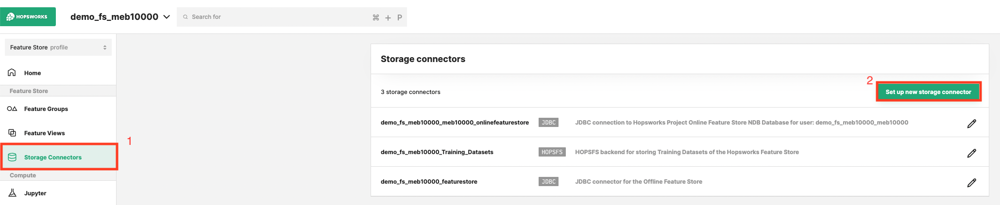
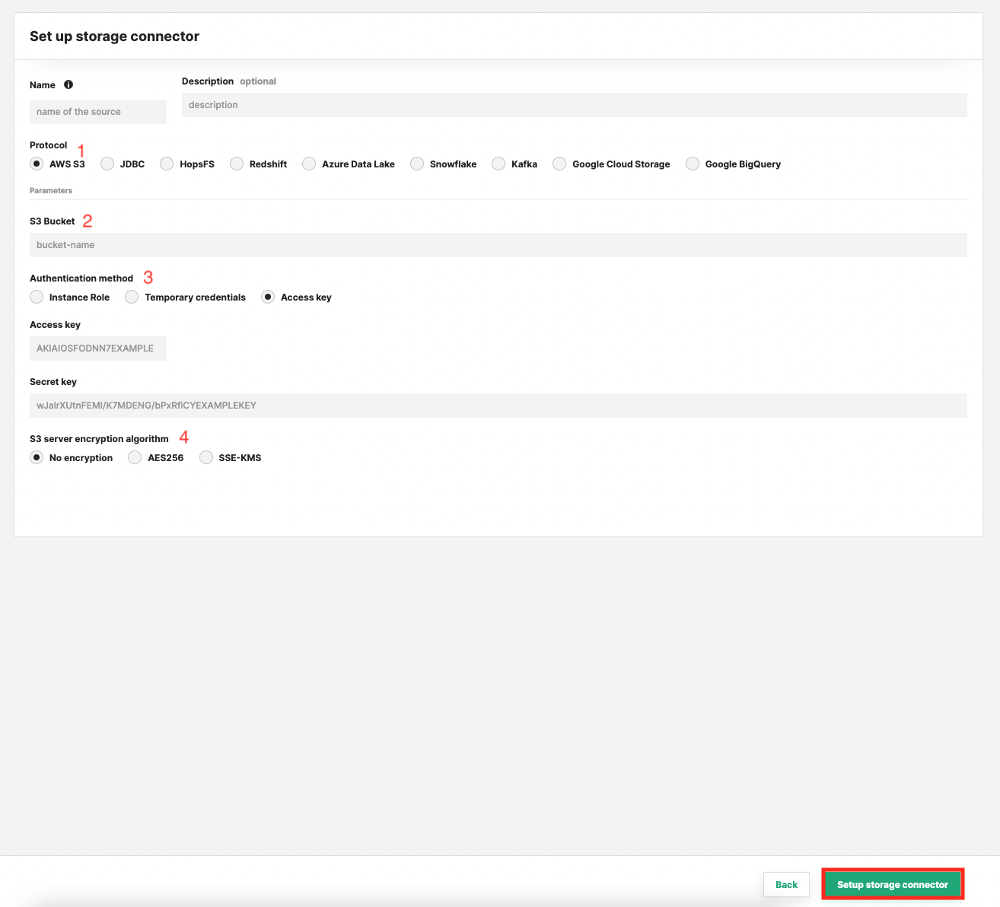

# How-To set up a S3 Storage Connector

## Introduction

Amazon S3 or Amazon Simple Storage Service is a service offered by AWS that provides object storage. That means you can store arbitrary objects associated with a key. These kind of storage systems are often used as Data Lakes with large volumes of unstructured data or file based storage. Popular file formats are `CSV` or `PARQUET`.

There are so called Data Lake House technologies such as Delta Lake or Apache Hudi, building an additional layer on top of object based storage with files, to provide database semantics like ACID transactions among others. This has the advantage that cheap storage can be turned into a cloud native data warehouse. These kind of storages are often the source for raw data from which features can be engineered.

In this guide, you will configure a Storage Connector in Hopsworks to save all the authentication information needed in order to set up a connection to your AWS S3 bucket.
When you're finished, you'll be able to read files using Spark through HSFS APIs. You can also use the connector to write out training data from the Feature Store, in order to make it accessible by third parties.

!!! note
    Currently, it is only possible to create storage connectors in the Hopsworks UI. You cannot create a storage connector programmatically.

## Prerequisites

Before you begin this guide you'll need to retrieve the following information from your AWS S3 account and bucket:

- **Bucket:** You will need a S3 bucket that you have access to. The bucket is identified by its name.
- **Authentication Method:** You can authenticate using Access Key/Secret, or use IAM roles. If you want to use an IAM role it either needs to be attached to the entire Hopsworks cluster or Hopsworks needs to be able to assume the role. See IAM role documentation for more information. TODO: add link
- **Server Side Encryption details:** If your bucket has server side encryption (SSE) enabled, make sure you know which algorithm it is using (AES256 or SSE-KMS). If you are using SSE-KMS, you need the resource ARN of the managed key.

## Creation in the UI
### Step 1: Set up new storage connector

Head to the Storage Connector View on Hopsworks (1) and set up a new storage connector (2).

<figure markdown>
  
  <figcaption>The Storage Connector View in the User Interface</figcaption>
</figure>

### Step 2: Enter Bucket Information

Enter the details for your S3 connector. Start by giving it a **name** and an optional **description**.
And set the name of the S3 Bucket you want to point the connector to.

<figure markdown>
  
  <figcaption>S3 Connector Creation Form</figcaption>
</figure>

### Step 3: Configure Authentication

#### Instance Role
Choose instance role if you have an EC2 instance role attached to your Hopsworks cluster which grants you access to the specified bucket.

#### Temporary Credentials
Using an EC2 instance profile enables your Hopsworks cluster to access AWS resources. This forces all Hopsworks users to share the instance profile role and the resource access policies attached to that role. To allow for per project access policies you could have your users use AWS credentials directly in their programs which is not recommended so you should instead use [Role chaining](https://docs.aws.amazon.com/IAM/latest/UserGuide/id_roles_terms-and-concepts.html#iam-term-role-chaining).

If you or your Hopsworks administrator followed the [AWS Credentials Passthrough Guide]() you should be able to choose "Temporary Credentials" and see the roles, that your user is able to assume. Choose the role that gives you access to the specified bucket.

#### Access Key/Secret
The most simple authentication method are Access Key/Secret, choose this option to get started quickly, if you are able retrieve the keys using the IAM user administration.

### Step 4: Configure Server Side Encryption
Additionally, you can specify if your Bucket has SSE enabled.

#### AES256
For AES256, there is nothing to do but enabling the encryption by toggling the `AES256` option. This is using S3-Managed Keys, also called [SSE-S3](https://docs.aws.amazon.com/AmazonS3/latest/userguide/serv-side-encryption.html). 

#### SSE-KMS
With this option the [encryption key is managed by AWS KMS](https://docs.aws.amazon.com/AmazonS3/latest/userguide/serv-side-encryption.html), with some additional benefits and charges for using this service. The difference is that you need to provide the resource ARN of the key. 

If you have SSE-KMS enabled for your bucket, you can find the key ARN in the "Properties" section of the bucket details on AWS.

## Next Steps

Move on to the [usage guide for storage connectors](../usage.md) to see how you can use your newly created S3 connector.