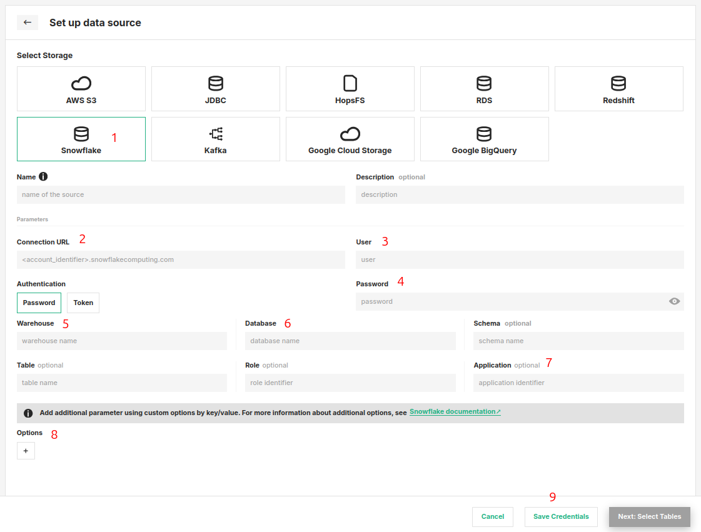

# How-To set up a Snowflake Storage Connector

## Introduction

Snowflake provides a cloud-based data storage and analytics service, used as a data warehouse in many enterprises. 

Data warehouses are often the source of raw data for feature engineering pipelines and Snowflake supports scalable feature computation with SQL. However, Snowflake is not viable as an online feature store that serves features to models in production, with its columnar database layout its latency is too high compared to OLTP databases or key-value stores.

In this guide, you will configure a Storage Connector in Hopsworks to save all the authentication information needed in order to set up a connection to your Snowflake database.
When you're finished, you'll be able to query the database using Spark through HSFS APIs.

!!! note
    Currently, it is only possible to create storage connectors in the Hopsworks UI. You cannot create a storage connector programmatically.

## Prerequisites

Before you begin this guide you'll need to retrieve the following information from your Snowflake account and database, the following options are **mandatory**:

- **Snowflake Connection URL:** Consult the documentation of your target snowflake account to determine the correct connection URL. This is usually some form of your [Snowflake account identifier](https://docs.snowflake.com/en/user-guide/admin-account-identifier.html). For example:

```
<account_identifier>.snowflakecomputing.com
```

!!! warning "Token-based authentication or password based"
    The Snowflake storage connector supports both username and password authentication as well as token-based authentication.

    Currently token-based authentication is in beta phase. Users are advised to use username/password and/or create a service account for accessing Snowflake from Hopsworks.

- **Username and Password:** Login name for the Snowflake user and password. This is often also referred to as `sfUser` and `sfPassword`.
- **Database:** The database to use for the session after connecting.
- **Schema:** The schema to use for the session after connecting.

These are a few additional **optional** arguments:

- **Role:** The role field can be used to specify which [Snowflake security role](https://docs.snowflake.com/en/user-guide/security-access-control-overview.html#system-defined-roles) to assume for the session after the connection is established.
- **Application:** The application field can also be specified to have better observability in Snowflake with regards to which application is running which query. The application field can be a simple string like “Hopsworks” or, for instance, the project name, to track usage and queries from each Hopsworks project.

## Creation in the UI
### Step 1: Set up new storage connector

Head to the Storage Connector View on Hopsworks (1) and set up a new storage connector (2).

<figure markdown>
  
  <figcaption>The Storage Connector View in the User Interface</figcaption>
</figure>

### Step 2: Enter Snowflake Settings

Enter the details for your Snowflake connector. Start by giving it a **name** and an optional **description**.

1. Select "Snowflake" as connector protocol.
2. Specify the hostname for your account in the following format `<account_identifier>.snowflakecomputing.com`.
3. Login name for the Snowflake user.
4. Password for the Snowflake user or Token.
5. The database to connect to.
6. The schema to use for the connection to the database.
7. Additional optional arguments. For example, you can point the connector to a specific table in the database only.
8. Optional additional key/value arguments.
9. Click "Setup storage connector".

<figure markdown>
  
  <figcaption>Snowflake Connector Creation Form</figcaption>
</figure>

## Next Steps

Move on to the [usage guide for storage connectors](../usage.md) to see how you can use your newly created Snowflake connector.