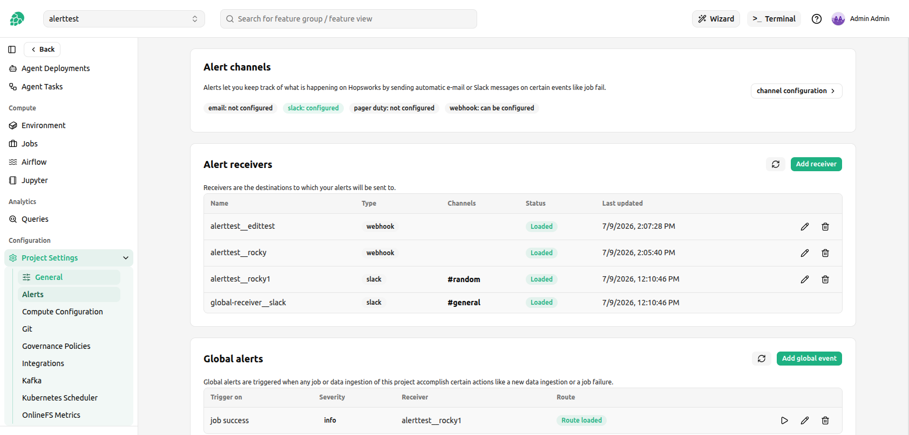
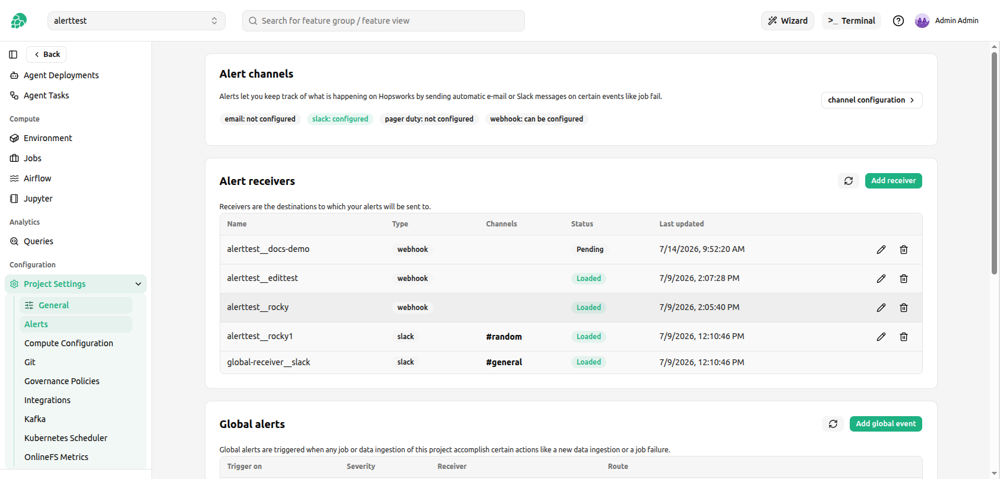
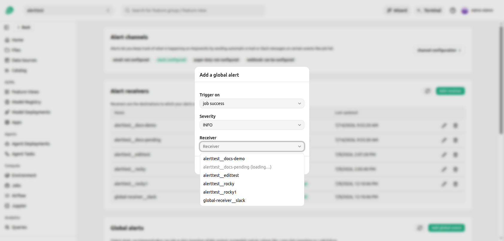
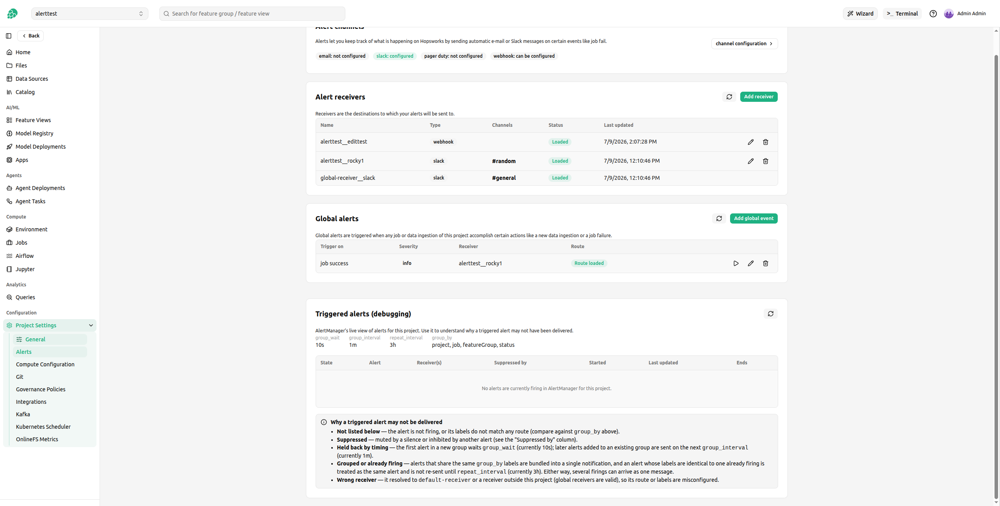

# Alerts

## Introduction

Hopsworks can notify you when something happens in your project, such as a job failing or a feature ingestion succeeding.
Alerts are delivered through Prometheus' [Alert manager](https://prometheus.io/docs/alerting/latest/alertmanager/) to receivers that you define per project.
Email, Slack and PagerDuty alerts require an administrator to first configure the corresponding channel for the cluster, so that Hopsworks knows how to reach the provider.
Webhook receivers can be created directly in a project without any cluster-level channel configuration.
See [Configure Alerts](../../../setup_installation/admin/alert.md) for the administrator setup.

You manage a project's alerts under _Project Settings_ &rarr; _Alerts_.

## Alert receivers

A receiver is a destination that an alert is sent to, for example a Slack channel or a webhook URL.
The _Alert receivers_ table lists the receivers available to the project, both the receivers you created in this project and the global receivers shared across the cluster.

<figure>
  
  <figcaption>Alert receivers with their load status</figcaption>
</figure>

To add a receiver click _Add receiver_, choose a channel, give it a name and fill in the channel details.

### Receiver load status

When you create or edit a receiver, Hopsworks writes the change to the Alert manager configuration and then the Alert manager loads it asynchronously.
The receiver is not usable until it has been loaded, so each receiver shows a _Status_ that tells you whether it is ready.

| Status | Meaning |
| --- | --- |
| Loaded | The receiver is active in the Alert manager and can be used in an alert. |
| Pending | The receiver has been saved but the Alert manager has not loaded it yet. It usually becomes _Loaded_ within a minute. |
| Warning | The receiver has stayed unloaded past the timeout. The Alert manager most likely rejected the configuration, for example because it is malformed. |

A newly created receiver appears immediately in the list as _Pending_ and switches to _Loaded_ once the Alert manager has picked it up.

<figure>
  
  <figcaption>A newly created receiver shown as Pending until the Alert manager loads it</figcaption>
</figure>

If a receiver stays in _Warning_, edit it to correct the configuration or delete it.
The status refreshes on its own after a create or edit, and you can trigger a refresh manually with the _Refresh_ button.

## Creating alerts

Alerts are triggered by events such as a job succeeding or failing, a feature ingestion completing, or feature monitoring detecting a shift.
You create project-wide alerts under _Global alerts_, and you can also attach alerts to an individual job or feature group from its own page.
For each alert you choose a trigger, a severity and the receiver that the notification is sent to.

Only receivers that are _Loaded_ can be selected.
A receiver that is not yet loaded is shown as disabled in the receiver dropdown, because routing an alert to a receiver the Alert manager has not loaded would silently drop the notification.

<figure>
  
  <figcaption>A pending receiver cannot be selected until it is loaded</figcaption>
</figure>

Each configured global alert shows a _Route_ status that mirrors the receiver status, so you can confirm that the route is loaded in the Alert manager.

## Triggered alerts (debugging)

The _Triggered alerts (debugging)_ panel shows the Alert manager's live view of the alerts currently firing for the project.
Use it to understand why a triggered alert may not have been delivered.

The panel shows the routing timing in effect (`group_wait`, `group_interval`, `repeat_interval` and `group_by`) and a table of the alerts the Alert manager currently holds.

<figure>
  
  <figcaption>Live view of alerts firing for the project</figcaption>
</figure>

If an alert you expected is missing or was not delivered, the panel explains the common reasons:

- Not listed below: the alert is not firing, or its labels do not match any route. Compare against the `group_by` shown above.
- Suppressed: the alert is muted by a silence or inhibited by another alert. See the _Suppressed by_ column.
- Held back by timing: the first alert in a new group waits `group_wait`, and later alerts added to an existing group are sent on the next `group_interval`.
- Grouped or already firing: alerts that share the same `group_by` labels are bundled into a single notification, and an alert whose labels match one already firing is not re-sent until `repeat_interval`. Either way several firings can arrive as one message.
- Wrong receiver: the alert resolved to `default-receiver` or to a receiver outside this project, so its route or labels are misconfigured. Global receivers are valid for every project.
