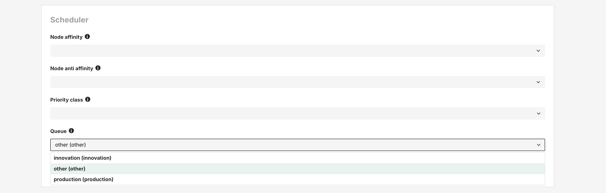

# How To Run A Ray Job

## Introduction

This guide will describe how to configure a job to execute a ray program inside the cluster.

All members of a project in Hopsworks can launch the following types of applications through a project's Jobs service:

- Python
- Apache Spark
- Ray

Launching a job of any type is very similar process, what mostly differs between job types is
the various configuration parameters each job type comes with.
Hopsworks support scheduling to run jobs on a regular basis,
e.g backfilling a Feature Group by running your feature engineering pipeline nightly.
Scheduling can be done both through the UI and the python API,
checkout [our Scheduling guide](schedule_job.md).

!!!warning "Enable Ray"

    Support for Ray needs to be explicitly enabled by adding the following option in the `values.yaml` file for the deployment:

    ```yaml
    global:
      ray:
        enabled: true
    ```

## UI

### Step 1: Jobs overview

The image below shows the Jobs overview page in Hopsworks and is accessed by clicking `Jobs` in the sidebar.

<p align="center">
  <figure>
    
    <figcaption>Jobs overview</figcaption>
  </figure>
</p>

### Step 2: Create new job dialog

Click `New Job` and the following dialog will appear.

<p align="center">
  <figure>
    
    <figcaption>Create new job dialog</figcaption>
  </figure>
</p>

### Step 3: Set the job type

By default, the dialog will create a Spark job.
Make sure `RAY` is chosen.

### Step 4: Set the script

Next step is to select the program to run.
You can either select `From project`, if the file was previously uploaded to Hopsworks, or `Upload new file` which lets you select a file from your local filesystem as demonstrated below.
After that set the name for the job.
By default, the job name is the same as the file name, but you can customize it here.

<p align="center">
  <figure>
    
    <figcaption>Configure program</figcaption>
  </figure>
</p>

### Step 5 (optional): Advanced configuration

Resource allocation for the Driver and Workers can be configured.

!!! notice "Using the resources in the Ray script"
    The resource configurations describe the cluster that will be provisioned when launching the Ray job.
    User can still
    provide extra configurations in the job script using `ScalingConfig`, i.e. `ScalingConfig(num_workers=4, trainer_resources={"CPU": 1}, use_gpu=True)`.

- `Driver memory`: Memory in MBs to allocate for Driver

- `Driver virtual cores`: Number of cores to allocate for the Driver

- `Worker memory`: Memory in MBs to allocate for each worker

- `Worker cores`: Number of cores to allocate for each worker

- `Min workers`: Minimum number of workers to start with

- `Max workers`: Maximum number of workers to scale up to

<p align="center">
  <figure>
    
    <figcaption>Resource configuration for the Ray Job</figcaption>
  </figure>
</p>

Runtime environment and Additional files required for the Ray job can also be provided.

- `Runtime Environment (Optional)`:  A [runtime environment](https://docs.ray.io/en/latest/ray-core/handling-dependencies.html#runtime-environments) describes the dependencies required for the Ray job including files, packages, environment variables, and more.
  This is useful when you need to install specific packages and set environment variables for this particular Ray job.
  It should be provided as a YAML file.
  You can select the file from the project or upload a new one.

- `Additional files`: List of other files required for the Ray job.
  These files will be placed in `/srv/hops/ray/job`.

<p align="center">
  <figure>
    
    <figcaption>Runtime configuration and additional files for Ray job</figcaption>
  </figure>
</p>

### Step 6: (Kueue enabled) Select a Queue

If the cluster is installed with Kueue enabled, you will need to select a queue in which the job should run.
This can be done from `Advance configuration -> Scheduler section`.



### Step 7: Execute the job

Now click the `Run` button to start the execution of the job, and then click on `Executions` to see the list of all executions.

<p align="center">
  <figure>
    
    <figcaption>Start job execution</figcaption>
  </figure>
</p>

### Step 8: Ray Dashboard

When the Ray job is running, you can access the Ray dashboard to monitor the job.
The Ray dashboard is accessible from the
`Executions` page.
Please note that the Ray dashboard is only available when the job execution is running.
In the Ray Dashboard,
you can monitor the resources used by the job, the number of workers, logs, and the tasks that are running.
<p align="center">
  <figure>
    
    <figcaption>Access Ray Dashboard</figcaption>
  </figure>
</p>

### Step 9: Application logs

Once the execution is finished, you can click on `Logs` to see the full logs for execution.

<p align="center">
  <figure>
    
    <figcaption>Access Ray job execution logs</figcaption>
  </figure>
</p>

## Code

### Step 1: Upload the Ray script

This snippet assumes the Ray program is in the current working directory and named `ray_job.py`.
If the file is already in the project, you can skip this step.

It will upload the jar to the `Resources` dataset in your project.

```python

import hopsworks

project = hopsworks.login()

dataset_api = project.get_dataset_api()

uploaded_file_path = dataset_api.upload("ray_job.py", "Resources")

```

### Step 2: Create Ray job

In this snippet we get the `JobsApi` object to get the default job configuration for a `RAY` job, set the python script to run and create the `Job` object.

```python

jobs_api = project.get_job_api()

ray_config = jobs_api.get_configuration("RAY")

ray_config['appPath'] = uploaded_file_path
ray_config['environmentName'] = "ray-training-pipeline"
ray_config['driverCores'] = 2
ray_config['driverMemory'] = 2048
ray_config['workerCores'] = 2
ray_config['workerMemory'] = 4096
ray_config['minWorkers'] = 1
ray_config['maxWorkers'] = 4

job = jobs_api.create_job("ray_job", ray_config)

```

### Step 3: Execute the job

In this snippet we execute the job synchronously, that is wait until it reaches a terminal state, and then download and print the logs.

```python

execution = job.run(await_termination=True)

out, err = execution.download_logs()

f_out = open(out, "r")
print(f_out.read())

f_err = open(err, "r")
print(f_err.read())

```

## Configuration

The following table describes the job configuration parameters for a RAY job.

`conf = jobs_api.get_configuration("RAY")`

| Field | Type | Description | Default |
| --- | --- | --- | --- |
| <nobr>`conf['type']`</nobr> | string | Type of the job configuration | `"rayJobConfiguration"` |
| <nobr>`conf['appPath']`</nobr> | string | Project relative path to script (e.g., `Resources/foo.py`) | `null` |
| <nobr>`conf['defaultArgs']`</nobr> | string | Arguments to pass to the script. Will be overridden if arguments are passed explicitly via `Job.run(args="...")` | `null` |
| <nobr>`conf['environmentName']`</nobr> | string | Name of the project Python environment to use | `"pandas-training-pipeline"` |
| <nobr>`conf['driverCores']`</nobr> | float | Number of CPU cores to be allocated for the Ray head process | `1.0` |
| <nobr>`conf['driverMemory']`</nobr> | int | Number of MBs to be allocated for the Ray head process | `2048` |
| <nobr>`conf['driverGpus']`</nobr> | int | Number of GPUs to be allocated for the Ray head process | `0` |
| <nobr>`conf['workerCores']`</nobr> | float | Number of CPU cores to be allocated for each Ray worker process | `1.0` |
| <nobr>`conf['workerMemory']`</nobr> | int | Number of MBs to be allocated for each Ray worker process | `4096` |
| <nobr>`conf['workerGpus']`</nobr> | int | Number of GPUs to be allocated for each Ray worker process | `0` |
| <nobr>`conf['workerMinInstances']`</nobr> | int | Minimum number of Ray workers | `1` |
| <nobr>`conf['workerMaxInstances']`</nobr> | int | Maximum number of Ray workers | `1` |
| <nobr>`conf['jobType']`</nobr> | string | Type of job | `"RAY"` |
| <nobr>`conf['files']`</nobr> | string | Comma-separated string of HDFS path(s) to files to be made available to the application. Example: `hdfs:///Project/<project>/Resources/file1.py,...` | `null` |

## Accessing project data

The project datasets are mounted under `/hopsfs`, so you can access `data.csv` from the `Resources` dataset using `/hopsfs/Resources/data.csv` in your script.

## API Reference

[Jobs](https://docs.hopsworks.ai/hopsworks-api/{{{hopsworks_version}}}/generated/api/jobs/)

[Executions](https://docs.hopsworks.ai/hopsworks-api/{{{hopsworks_version}}}/generated/api/executions/)
