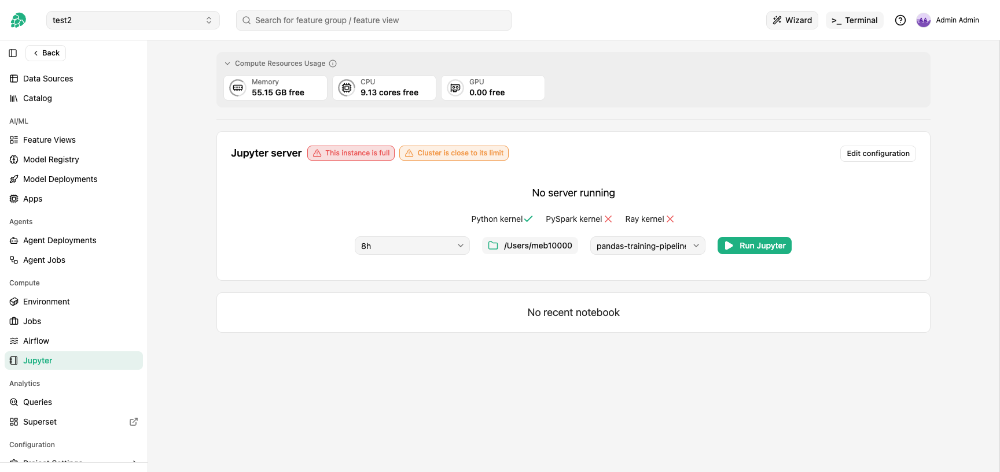
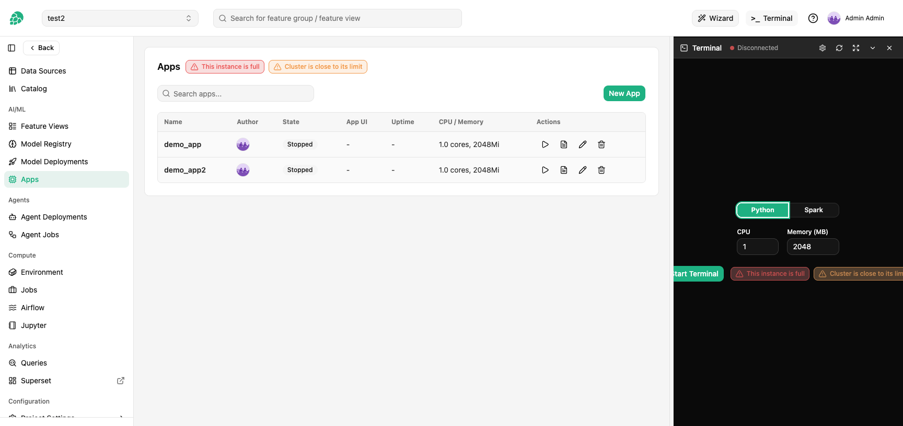
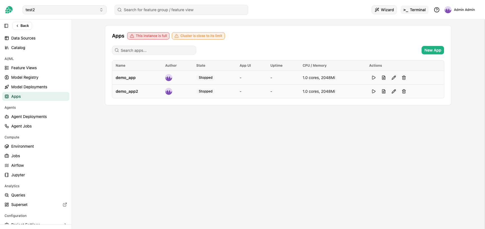

# Session capacity warnings

Hopsworks limits how many interactive sessions (Jupyter notebooks, terminals, Streamlit apps) can run concurrently on each cluster.
When the limit is being approached, you see one or two badges on the Jupyter, Terminal, and Apps pages.
This page explains what the badges mean and what to do when they appear.

## Where the badges appear

The badges sit next to the action button on three pages:

- **Jupyter**: next to the `Jupyter server` card title and the `Run Jupyter` button.

  

- **Terminal**: next to the `Start Terminal` button inside the terminal panel.

  

- **Apps**: next to the Apps card title and the per-row Start button.

  

## What each badge means

There are two badges with two scopes.
Both can appear in orange (warning) or red (critical), independently of each other.

| Scope | Badge text | Color | Meaning |
| --- | --- | --- | --- |
| Instance | `This instance is close to its limit` | Orange | The Hopsworks instance you would be routed to has few free session slots left. New sessions can still start but may fail soon. |
| Instance | `This instance is full` | Red | The Hopsworks instance you would be routed to has no free session slots. New sessions may still start if another instance has capacity; refreshing or signing back in may land you on that pod. See [What happens when a badge turns red][what-happens-when-a-badge-turns-red] for which buttons disable. |
| Cluster | `Cluster is close to its limit` | Orange | All Hopsworks instances together have few free session slots. New sessions may succeed on a less-busy pod, but a refresh or retry might land on a full one. |
| Cluster | `Cluster is full` | Red | All Hopsworks instances together have no free session slots. New sessions are rejected platform-wide. |

The instance badge tracks the pod that your browser session is currently bound to.
The cluster badge sums across every Hopsworks instance pod.
On a single-instance deployment the two badges always agree, since the only instance is the cluster.

## What happens when a badge turns red

- `Run Jupyter`, `Start Terminal`, and per-row `Start App` buttons are disabled while the **cluster** badge is red (no instance has capacity to serve a new session).
  While only the instance badge is red the buttons stay enabled because refreshing or signing back in may land you on a different instance pod that still has capacity.
- An already-running Jupyter server keeps working.
  Opening a new notebook tab inside a running Jupyter server may still fail if the pod that hosts it is at its per-session cap: the new tab's kernel WebSocket upgrade is closed with a `1013 TRY_AGAIN_LATER` close rather than attaching.
  This is distinct from starting a new session (a Jupyter server, terminal, or Streamlit app), which is gated up front and rejected with a `WebSocket pool full` (HTTP 503) error when the pod has no free slot.
- An already-running terminal session keeps working.
  Reconnecting after a network blip while the badge is red surfaces the error rather than silently retrying.

## What to do

- **Orange** is informational.
  Sessions can still be started.
  Save your work and avoid opening more tabs than you need.
- **Red on the instance badge, orange or no cluster badge**: a different pod has capacity.
  Refresh the page or sign out and back in to land on a different instance pod.
- **Red on both badges**: the platform is at capacity.
  Close notebook tabs, terminals, and apps you are no longer using to free sessions, or contact your administrator about raising the platform's session cap.
  By default the proxy does not reap idle sessions, so a slot is only released when its connection actually closes.

## Why the limits exist

Each WebSocket session (a Jupyter kernel connection, a terminal connection, or a Streamlit app connection) counts as one open connection against a per-pod cap inside the Hopsworks instance.
The cap is sized so the platform can stay responsive when many users are active at once.
Letting new sessions queue indefinitely would leave users staring at a loading spinner that never resolves; rejecting cleanly with the badge is the safer behavior.

Administrators can change the pool sizing per cluster.
See [WebSocket Proxy Pool][websocket-proxy-pool] in the admin guide for the Helm values and Grafana panels that drive the limits.
