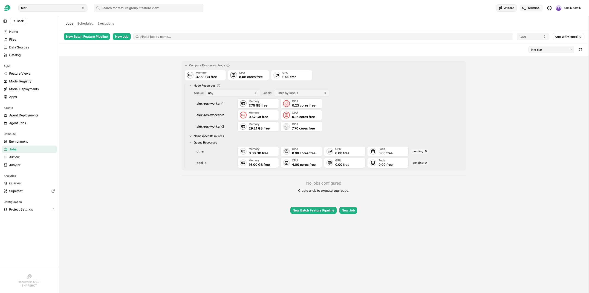
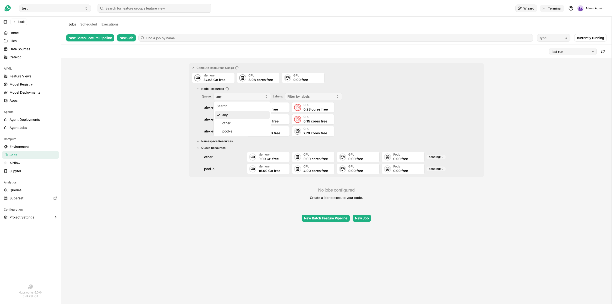
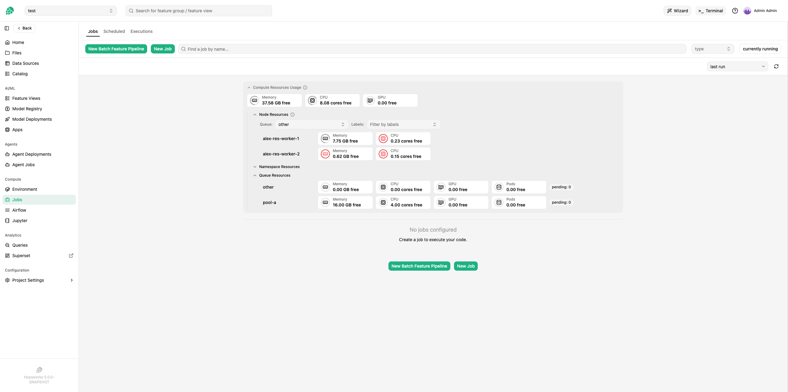

# Compute Resources Usage

## Introduction

The **Compute Resources Usage** card shows you how much capacity is currently available to your project on the cluster.
It is meant as a planning aid before submitting work that will consume cluster resources.
Numbers refresh automatically and reflect the live state of the nodes your project can schedule on.

The same card appears at the top of three pages, so you see it wherever you launch work:

- **Jobs** — above the job list.
- **Jupyter** — on the Jupyter overview, above the server controls.
- **Model Deployments** — above the deployments list.

Expand it to see a breakdown of resources per node, namespace, and queue.

## Reading the summary

The collapsed header shows three totals across all the nodes your project can reach: **Memory free**, **CPU free**, and **GPU free**.
"Free" on each node is its allocatable capacity minus the maximum of utilized and requested resources, and the header is the **sum** of those per-node figures.

These totals give you a sense of the cluster-wide capacity available to your project, but they do not tell you the size of the largest job you can launch.
A job runs on exactly one node, so the biggest job that will fit is bounded by the single node with the most free resources — not by the sum.
Always cross-check the **Node Resources** sub-section before sizing a heavy job: a header that reads *100 GB free* can hide the fact that no individual node has more than, say, 30 GB free, in which case a 50 GB job will not start anywhere.

Expanding the card reveals three sub-sections:

- **Node Resources** — per-node breakdown of free Memory, CPU, and GPU.
- **Namespace Resources** — quotas applied at the project's Kubernetes namespace level.
- **Queue Resources** — per-queue nominal and borrowable capacity from the Kueue queues you have access to.

## Filter nodes

Two filters sit above the node list: **Queue:** on the left, **Labels:** on the right.
By default both are inactive — Queue is set to *any* and Labels is empty — so the node list shows the **union** of every node reachable through any of your project's queues.

Use either filter on its own, or both together.
When both are active, a node is shown only if it passes *both* filters (intersection).

### Queue filter

Choose a queue from the **Queue:** dropdown to narrow the node list to just the nodes reachable through that queue.

The options are:

- **any** (default) — every node reachable through *any* of your queues.
- The name of each queue your project has access to — only the nodes reachable through that one queue.

Picking a specific queue shrinks the node list to just the nodes Kueue would actually dispatch to for jobs submitted to that queue.

The Queue Resources sub-section below is unaffected by this filter — it always lists every queue you have access to.

### Labels filter

Pick one or more labels in the **Labels:** dropdown to narrow the node list to nodes that carry every selected label.
The dropdown is populated from the labels your project administrator has made available; if no labels are configured for the project, the list is empty.

The Queue and Labels filters compose: with Queue set to *pool-a* and Labels set to `tier:workload`, the view shows only nodes that pool-a can reach *and* that carry `tier:workload`.

## The access notice

When Kueue is configured and your project has at least one LocalQueue, an info icon appears next to **Node Resources**.
Hover it to see one of two messages.

- **"Reachable through the queues available in this project.
  See Queue Resources below for the list."**
  This is the normal case — the listed nodes are the ones your queues route work to.
  The Queue Resources sub-section names each queue, so you can cross-check which queue claims which capacity.

- **"None of the queues available in this project currently match any nodes in the cluster."**
  Your project has queues, but none of them currently resolve to any nodes in the cluster.
  This typically means the queue's underlying configuration (resource flavor) is looking for nodes that don't exist, or all matching nodes are unschedulable.
  Ask your administrator to review the queue configuration.

## When Kueue is not in use

If the cluster is not running Kueue, or your project has no LocalQueues at all, the Node Resources sub-section lists every schedulable node in the cluster instead.
There is no Queue filter, no access notice, and no Queue Resources sub-section in that case.
Jobs run through the standard Kubernetes scheduler rather than a queue.

## See also

- Administrators: see [Configure the Compute Resources Usage view][configure-the-compute-resources-usage-view] for the underlying queue → node mapping and the cluster role permissions required for this view to work.
- [Kueue][kueue-details] — overview of Kueue's abstractions (ResourceFlavor, ClusterQueue, LocalQueue) used by Hopsworks.

