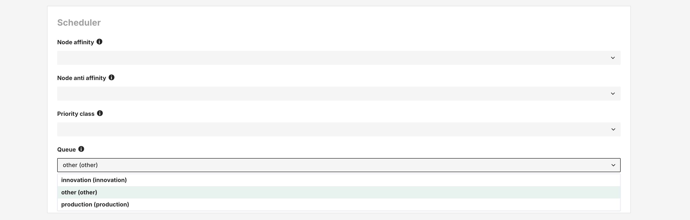

# Scheduler

## Introduction

Hopsworks allows users to configure some Kubernetes scheduler abstractions, such as [Affinity](https://kubernetes.io/docs/tasks/configure-pod-container/assign-pods-nodes-using-node-affinity/) and [Priority Classes](https://kubernetes.io/docs/concepts/scheduling-eviction/pod-priority-preemption/#priorityclass). Hopsworks also supports additional scheduling abstractions backed by Kueue. This includes [Queues](https://kueue.sigs.k8s.io/docs/concepts/cluster_queue/), [Cohorts](https://kueue.sigs.k8s.io/docs/concepts/cohort/) and [Topologies](https://kueue.sigs.k8s.io/docs/concepts/topology_aware_scheduling/). All these scheduling abstractions are supported in jobs, jupyter notebooks and model deployments. Kueue abstractions however, are currently not supported for Spark jobs.

Hopsworks Admins can control which labels and priority classes can be used the cluster (see [Cluster configuration](#cluster-configuration) section) and by which project (see [Default Project configuration](#default-project-configuration) section)

Within a project, data owners can set defaults for jobs and Jupyter notebooks running within that project (see: [Project defaults](#project-defaults) section).

### Node Labels, Node Affinity and Node Anti-Affinity

Labels in Kubernetes are key-value pairs used to organize and select resources. Hopsworks relies on labels applied to nodes for pod-node affinity to determine where the pod can (or cannot) run.
Some uses cases where labels and affinity can be used include:

- Hardware constraints (GPU, SSD)
- Environment separation (prod/dev)
- Co-locating related pods
- Spreading pods for high availability

Hopsworks uses the node affinity `IN` operator for the Hopsworks Node Affinity and the `NOT IN` operator for the Hopsworks Node Anti Affinity.

For more information on Kubernetes Affinity, you can check the Kubernetes [Affinity documentation](https://kubernetes.io/docs/tasks/configure-pod-container/assign-pods-nodes-using-node-affinity/) page.

### Priority Classes

Priority classes in Kubernetes determine the scheduling and eviction priority of pods.

Pods with higher priority:

- Get scheduled first
- Can preempt (evict) lower priority pods
- Less likely to be evicted under resource pressure

Common uses:

- Protecting critical workloads
- Ensuring core services stay running
- Managing resource competition
- Guaranteeing QoS for important applications

For more information on Priority Classes, you can check the Kubernetes [Priority Classes documentation](https://kubernetes.io/docs/concepts/scheduling-eviction/pod-priority-preemption/#priorityclass) page.

## Kueue

Hopsworks adds the integration with Kueue to offer more advanced scheduling abstractions such as queues, cohorts and topologies.

For a more detailed view on how Hopsworks uses the Kueue abstractions you can check the [Kueue details](./kueue_details.md) section.

### Queues, Cohorts

Jobs, notebooks and model deployments are submitted to these queues. Hopsworks administrator can define quotas on how many resources a queue can use. Queues can be grouped together in cohorts in order to add the ability to borrow resources from each other when the other queue does not use its resources.

When creating a new job, the user can select a queue for the job in the `Advance configuration -> Scheduler section`.



### Topologies

The integration of Hopsworks with Kueue, also provides access to the topology abstraction. Topologies can be defined, so that the user can decide for the pods of jobs or model deployments to run somehow grouped together. The user could decide for example, that all pods of a job should run on the same host, because the pods need to transfer a lot of data between each other, and we want to avoid network traffic to lower the latency.

The user can select the topology unit for jobs, notebooks and model deployments in the `Advance configuration -> Scheduler section`.


## Admin configuration

### Affinity and priority classes

Hopsworks admins can control the affinity labels and priority classes available on the Hopsworks cluster from the `Cluster Settings -> Scheduler` page:


Hopsworks Cluster can run within a shared Kubernets Cluster. The first configuration level is to limit the subset of labels and priority classes that can be used within the Hopsworks Cluster. This can be done from the `Available in Hopsworks` sub-section.

!!! note "Permissions"

    In order to be able to list all the Kubernetes Node Labels, Hopsworks requires the following cluster role:

    ```
        - apiGroups: [""]
        resources: ["nodes"]
        verbs: ["get", "list"]
    ```

    In order to be able to list all the Kubernetes Cluster Priority Classes, Hopsworsk requires this cluster role:

    ```
        - apiGroups: ["scheduling.k8s.io"]
        resources: ["priorityclasses"]
        verbs: ["get", "list"]
    ```

    If the roles above are configured properly (default behaviour), admins can only select values from the drop down menu. If the roles are missing, admins would be required to enter them as free text and should be careful about typos. Any typos here will be propagated in the other configuration and use levels leading to errors or missbehaviour when running computation.

### Queues

Every new project gets automatic access to the default Hopsworks queue. An administrator can define the default queue for projects user jobs and system jobs.


## Project Configuration

Hopsworks admins can configure the labels and priority classes that can be used by default within a project. This will be a subset of the ones configured for Hopsworks.
In the figure above, in the sub-section `Available in Project` Hopsworks admins can configure the labels and priority classes available by default in any Hopsworks Project.

Hopsworks admins can also override the default project configuration on a per-project basis. That is, Hopsworks admins can make certain labels and priority classes available only to certain projects. This can be achieved from the `Cluster Settings -> Project -> <ProjectName> -> edit configuration` configuration page:


## Project defaults

Within a project, different jobs, Jupyter notebooks and model deployments can run with different labels and/or priority classes. `Data Owners` in a project can specify the default values from the project settings:
The default Label will be used for the default Node Affinity for jobs, notebooks, and model deployments.


## Configuration of Jobs, Notebooks, and Deployments

In the advanced configuration sections for job, notebook, and model deployments, users can set affinity, anti affinity and priority class. The Affinity and Anti Affinity can be selected from the list of allowed labels.

`Affinity` configures on which nodes this pod can run. If a node has any of the labels present in the Affinity option, the pod can be scheduler to run to run there.

`Anti Affinity` configures on which nodes this pod will not run on. If a node has any of the labels present in the Anti Affinity option, the pod will not be scheduler to run there.

`Priority Class` specifies with which priority a pod will run.


