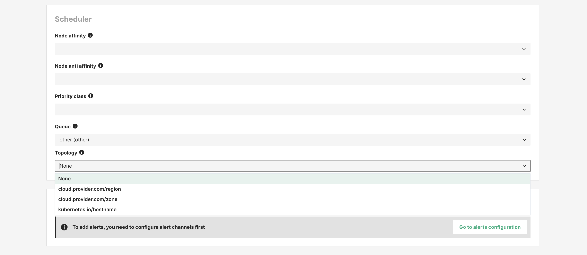

# Kueue

## Introduction

Hopsworks provides the integration with Kueue to provide the aditional scheduling abstractions. Hopsworks currently acts only as a "reader" to the Kueue abstractions and currently does not manage the lifecycle of Kueue abstraction with the exception of the default localqueue for each namespace. All the other abstractions are expected to be managed by the administrators of Hopsworks, directly on the Kubernetes cluster.

However Hopsworks and Kueue integration currently only supports frameworks python and ray for jobs, notebooks and model deployments. The same queues are also used for Hopsworks internal jobs (zipping, git operations, python library installation). Spark is currently not supported, and thus will not be managed by Kueue for scheduling, and instead it will bypass the queues setup (important to note when thinking about queue quotas) and instead are managed directly by the Kubernetes Scheduler.

### Resource flavors

When trying to define queues in Kueue, the first abstraction that needs to be defined is a [Resource Flavor](https://kueue.sigs.k8s.io/docs/concepts/resource_flavor/). The resource flavor defines the resources that a queue will later manage. Hopsworks helm chart installs and uses a default ResourceFlavor

```
apiVersion: kueue.x-k8s.io/v1beta1
kind: ResourceFlavor
metadata:
  name: default-flavor
spec:
  nodeLabels:
    cloud.provider.com/region: europe
  topologyName: default
```

Node labels filter the available nodes to this resource flavor and is required for [topologies](#Topologies)

### Cluster Queues

[Cluster Queues](https://kueue.sigs.k8s.io/docs/concepts/cluster_queue/) are the actual queues for submitting jobs and model deployments to. The default hopsworks queue looks like:

```
apiVersion: kueue.x-k8s.io/v1beta1
kind: ClusterQueue
metadata:
  name: other
spec:
  cohort: cluster
  namespaceSelector: {}
  preemption:
    borrowWithinCohort:
      policy: Never
    reclaimWithinCohort: Never
    withinClusterQueue: Never
  queueingStrategy: BestEffortFIFO
  resourceGroups:
  - coveredResources:
    - cpu
    - memory
    - pods
    - nvidia.com/gpu
    flavors:
    - name: default-flavor
      resources:
      - name: cpu
        nominalQuota: "0"
      - name: memory
        nominalQuota: "0"
      - name: pods
        nominalQuota: "0"
      - name: nvidia.com/gpu
        nominalQuota: "0"
```

The [preemption](https://kueue.sigs.k8s.io/docs/concepts/cluster_queue/#preemption) and [nominal quotas](https://kueue.sigs.k8s.io/docs/concepts/cluster_queue/#flavors-and-resources) are set to the minimal as this queue is designed to have lowest priority in getting resources allocated. If cluster is underutilized and there are resources available, it can still borrow up to the maximum resources present in the parent cohort, but by design this queue has no dedicated resources. The presumption is that other, more important queues, defined by the cluster administrator will have higher preference in getting resources.

### Local Queues

[Local Queues](https://kueue.sigs.k8s.io/docs/concepts/local_queue/) are the mechanism to provide access to a queue (cluster queue) to a specific project in Hopsworks (Kubernetes namespace).

Every new project gets automatic access to the default Hopsworks queue. An administrator can define the default queue for projects user jobs and system jobs.


### Cohorts

[Cohorts](https://kueue.sigs.k8s.io/docs/concepts/cohort/) are groupings of cluster queues that have some meaning together and can share resources. Hopsworks defines a default `cluster` cohort

```
apiVersion: kueue.x-k8s.io/v1alpha1
kind: Cohort
metadata:
  name: cluster
spec:
  resourceGroups:
  - coveredResources:
    - cpu
    - memory
    - pods
    - nvidia.com/gpu
    flavors:
    - name: default-flavor
      resources:
      - name: cpu
        nominalQuota: 100
      - name: memory
        nominalQuota: 200Gi
      - name: pods
        nominalQuota: 100
      - name: nvidia.com/gpu
        nominalQuota: 50
```

Cohorts can contain other cohorts and thus you can create a hierarchy of cohorts. Cohorts can set [fair sharing weight](https://kueue.sigs.k8s.io/docs/concepts/admission_fair_sharing/) where using

```
  fairSharing:
    weight
```

in the definition of a cohort, the user can control a priority towards borowing resources from other cohorts.

### Topologies

[Topologies](https://kueue.sigs.k8s.io/docs/concepts/topology_aware_scheduling/) defines a way of grouping together pods belonging to the same job/deployment so that they are colocated wihtin the same topology unit. Hopsworks defines a default topology:

```
apiVersion: kueue.x-k8s.io/v1alpha1
kind: Topology
metadata:
  name: default
spec:
  levels:
  - nodeLabel: cloud.provider.com/region
  - nodeLabel: cloud.provider.com/zone
  - nodeLabel: kubernetes.io/hostname
```

The topology is defined in the Resource Flavor used by a Cluster Queue.

When creating a new job, the user can select a topology unit for the job to run in and thus decide if all pods of a job should run on the same hostname, in the same zone or in the same region. The user can select the topology for jobs, notebooks and deployments in the `Advance configuration -> Scheduler section`.


